# PCB-form-dat

- [[mini-PCIE-dat]] 

- [[PCB-penalization-dat]] - [[PCB-form-dat]] - [[PCB-stack-dat]]

- [[led-driver-dat]] - [[OC5021-dat]] - [[PCB-form-dat]]

- [[PCB-form-dat]]

### slot board 6 

- [[jieli-dat]]

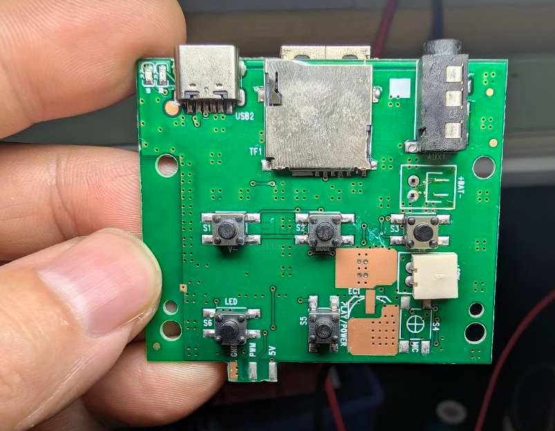

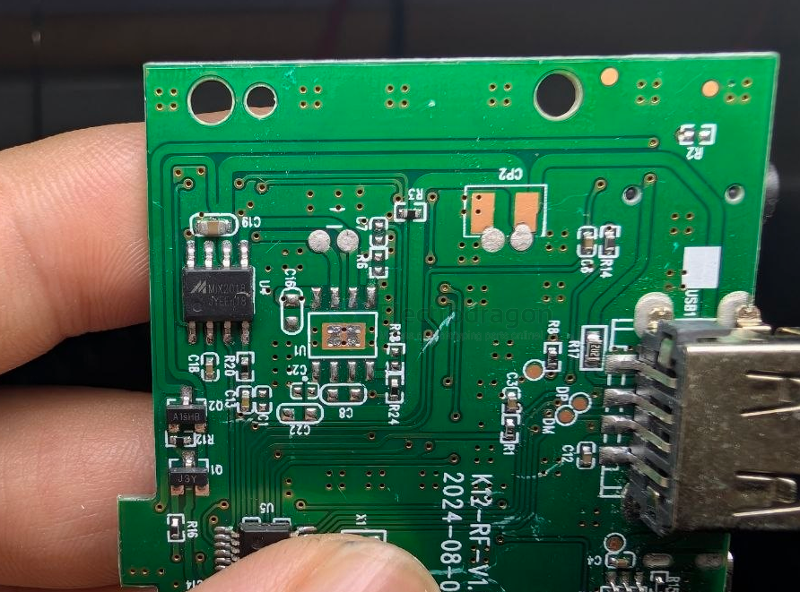

- [[MIX2018A-dat]] - [[TP4054-dat]]

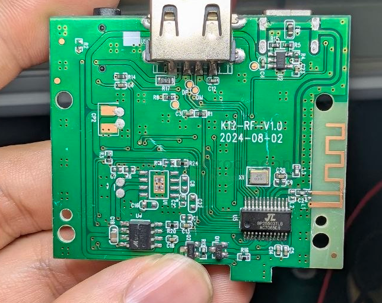

### wired board 1

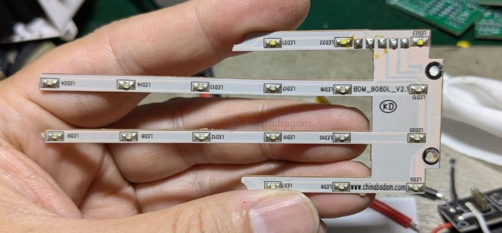

### compact socket 

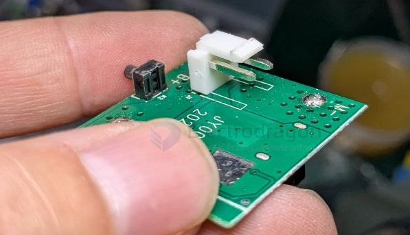

### slot board 5 == -/+ two pins / front and back side 

- [[transistor-dat]]
- 
V+正极接电源V-负极接电源，F+和F-接散风扇，LH-和+接灯

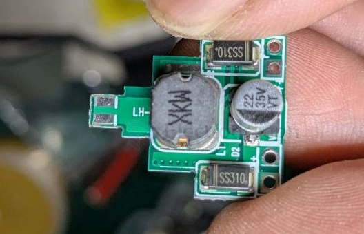

### slot board 4 == -/+ two pins 

- [[led-driver-dat]] - [[LED-dat]]

- [[PCB-form-dat]] - [[LN2566-dat]]

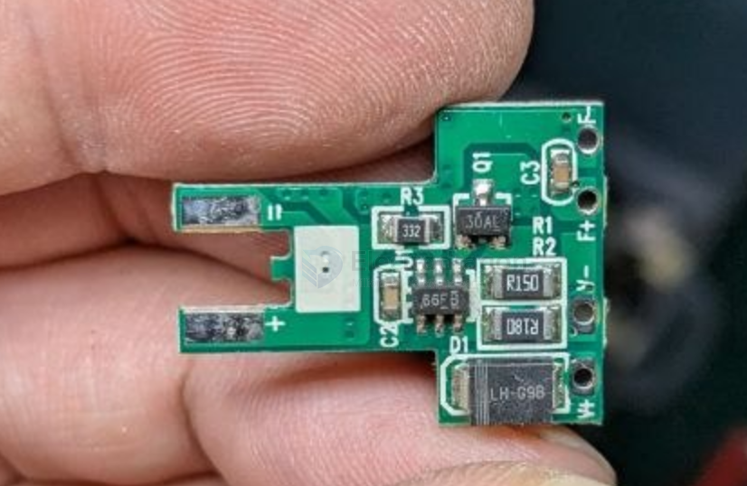

### slot board 3 

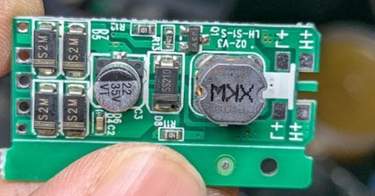

### stack board 

- [[OLED-dat]] - [[portable-soldering-iron-dat]] 是驱动烙铁头的，输出有2~3伏的电压。没有烙铁头。没法实验

这种电烙铁头的电阻值视电池电压和功率而定，一般在零点几欧姆到3欧姆，2.5欧姆正常。

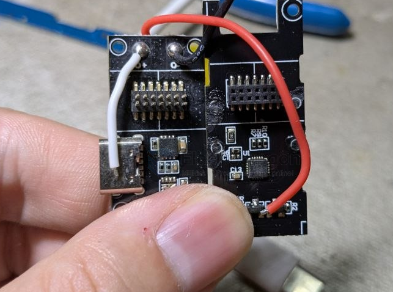

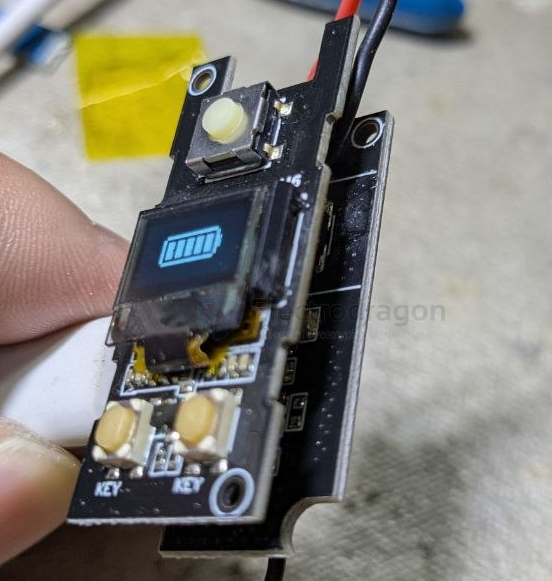

### triangle soldering slot plug board 

- two rows of soldering together 

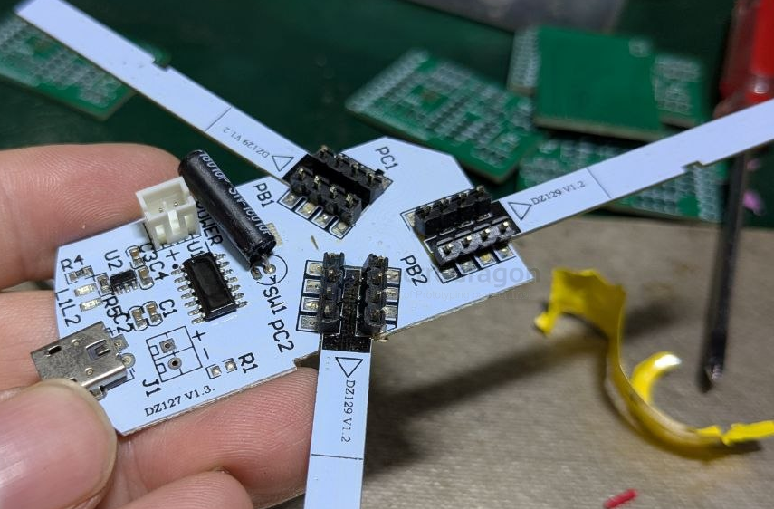

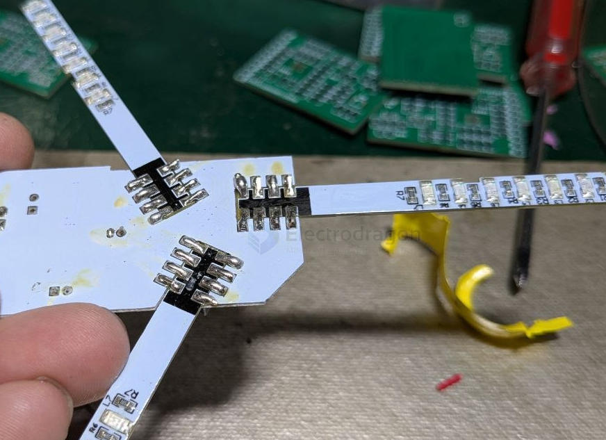

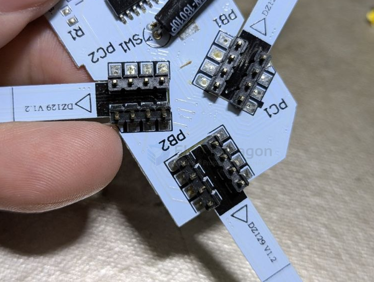

- SW-18010P - [[sensor-tilt-switch-dat]] - [[sensor-dat]]

- [[mosfet-dat]]

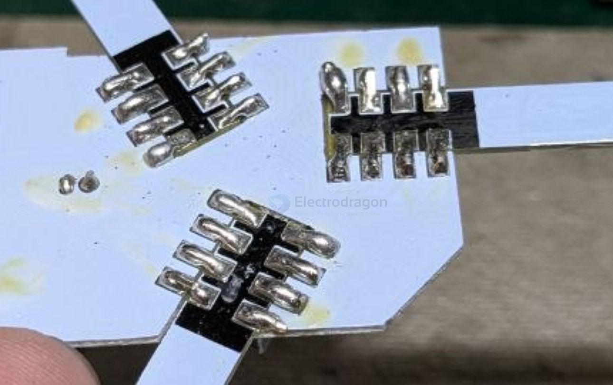

### PCB slot plug board 

== [[weltrend-dat]]

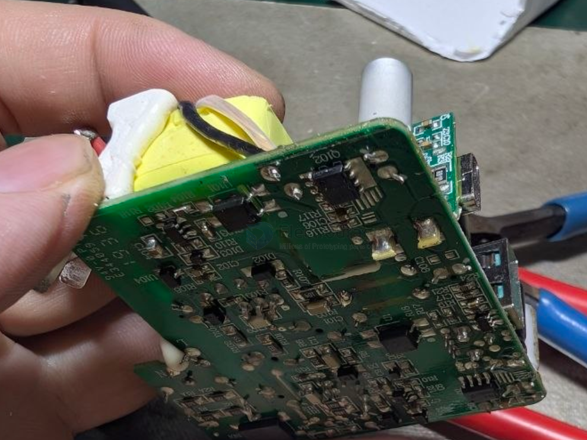

### card 

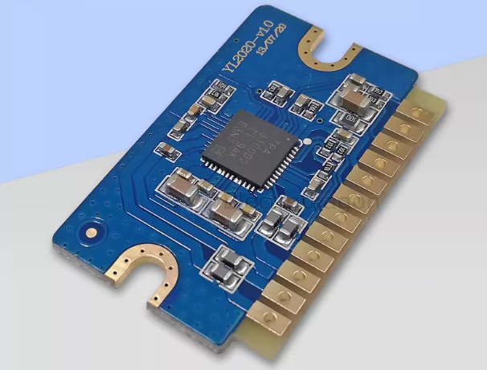

- TPA3100D2

### chained board 

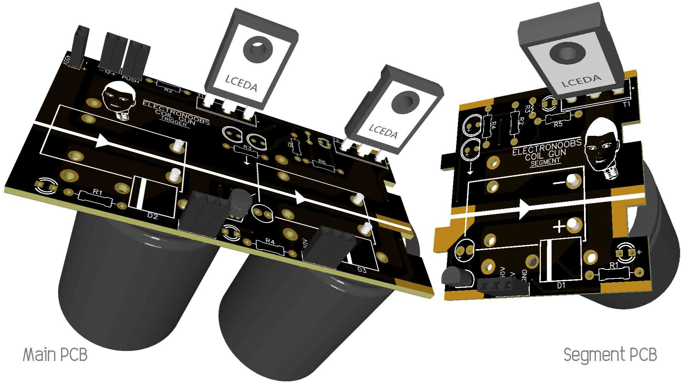

## ref 

- [[PCB-dat]]