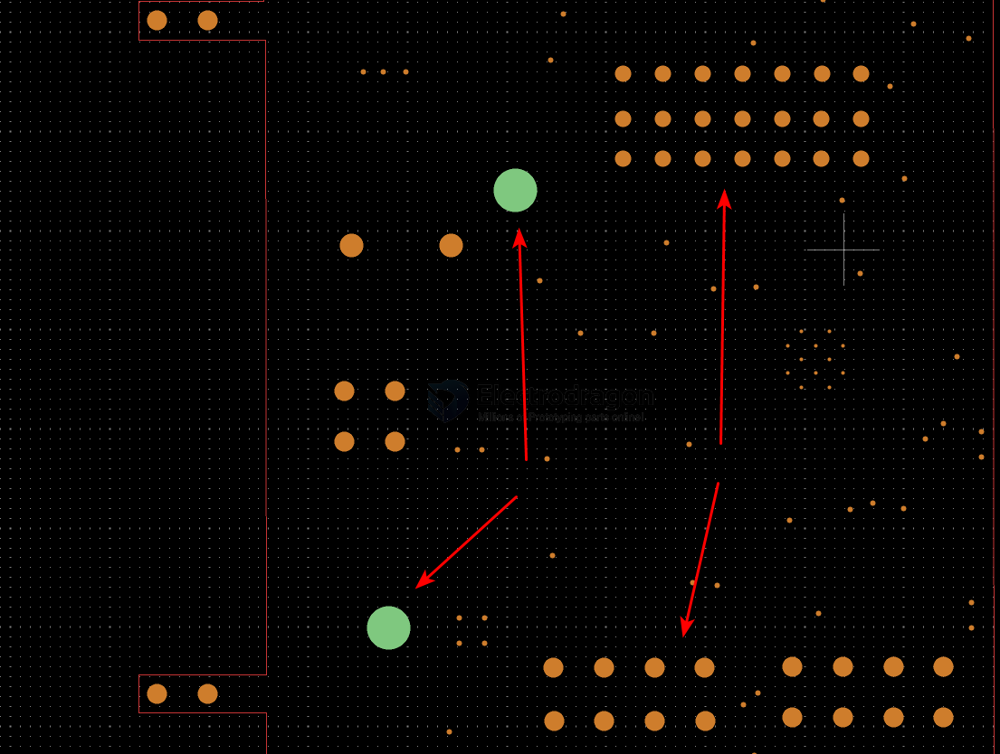
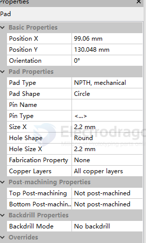

# PCB-pad-dat

- [[PCB-pad-dat]] - [[pcb-design-dat]] - [[PCB-hole-dat]]

## NPTH vs PTH 

## PCB Pad and Hole Types Explained

1. `Through-hole`
- Definition: A pad designed for components with wire leads that are inserted through drilled holes in the printed circuit board and soldered on the opposite side.
- Characteristics: Creates a very strong mechanical bond because the component pins physically pass through the board. Often used for connectors, switches, and heavy components that undergo physical stress.

2. `SMD` (Surface Mount Device)
- Definition: Flat copper pads located on the surface of the PCB. Components are placed directly onto these pads with solder paste and reflowed.
- Characteristics: Does not require drilled holes, allowing components to be placed on both sides of the board. This is the standard for modern, high-density, compact electronic designs.

3. `Edge connector`
- Definition: Specialized, gold-plated copper pads running along the edge of a PCB designed to plug directly into a mating socket or slot on another board or motherboard.
- Characteristics: Commonly found on expansion cards (like graphics cards or RAM modules). The pads are usually chamfered (beveled) at the edge to make insertion and removal smoother without damaging the copper.

4. `NPTH, mechanical` (Non-Plated Through Hole)
- Definition: A hole drilled into the circuit board that has no copper plating on its interior barrel, designated strictly for mechanical purposes.
- Characteristics: Used for mounting screws, bolts, standoffs, or alignment pins. Because it is non-plated, the design software ensures that no copper traces or internal planes accidentally touch the hole edge, preventing short circuits.

## Pad shape

## ref 

