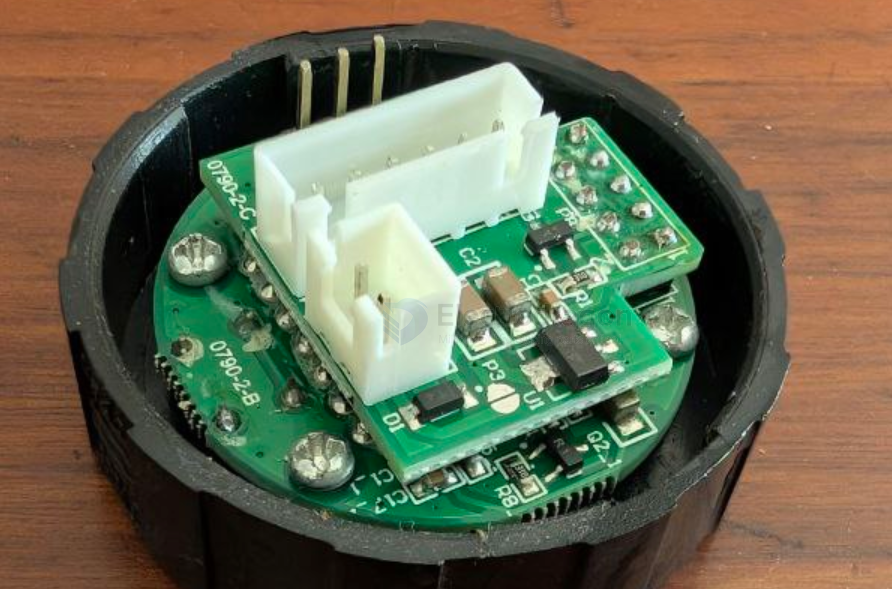
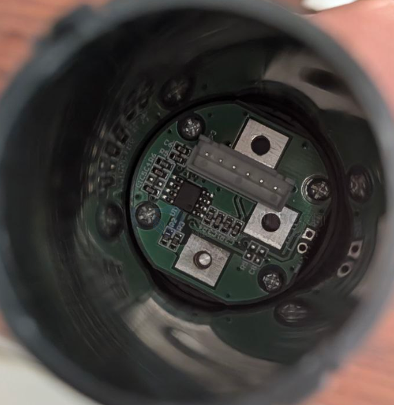
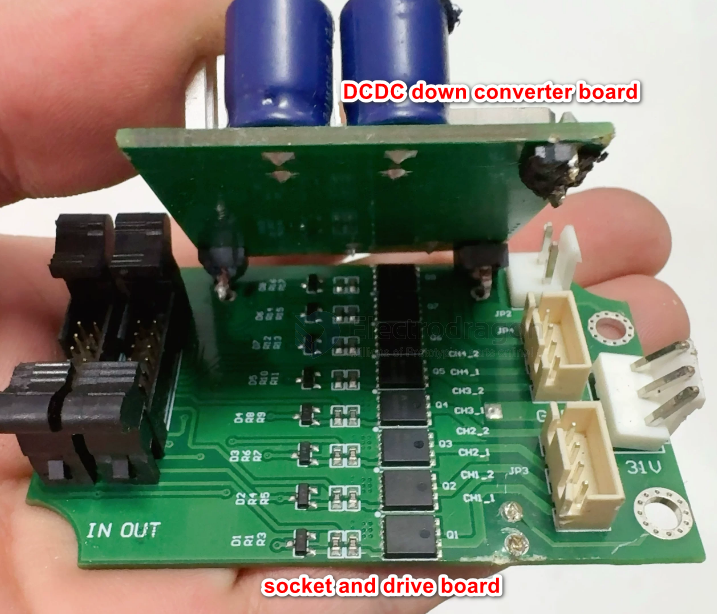
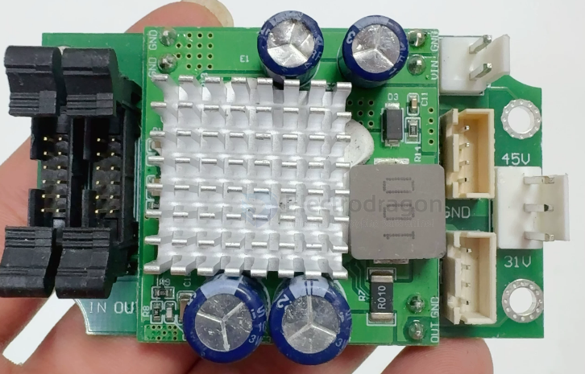

# PCB-stack-dat

- [[PCB-design-basic-dat]] - [[PCB-stack-dat]] - [[PCB-form-dat]] - [[PCB-penalization-dat]]

## purpose 

- for the very limit space, specially the flat surface is limited, but the height is enough

- round PCB 

- [[battery-dat]] - [[battery-holder-dat]]

## build 

### build 1 

## ref 

- [[PCB-dat]]
