# PCB-stack-dat

- [[PCB-design-basic-dat]] - [[PCB-stack-dat]] - [[PCB-form-dat]] - [[PCB-penalization-design-dat]]

- [[fab-PCB-dat]]

## apps 

- [[FC-stack-dat]] - [[PCB-stack-dat]] - [[PCB-design-dat]]

- [[openIPC-dat]]

## tech 

- [[PCB-stack-dat]] - [[cable-dat]] - [[conn-pin-header-dat]] - [[CONN-btb-dat]]

堆叠装配（结构风险）

- BTB 连接器：对位精度、压合、虚接是主要失效模式
- 焊接式堆叠：共面度（coplanarity）要求高，需要治具保证
- 堆叠后无法单独测试 → 必须做分板测试 + 合体测试两道
- 结构固定（螺丝/卡扣/背胶）：振动下连接器会松 → 需要加固 + 防松设计

## flexiable connect - wire 

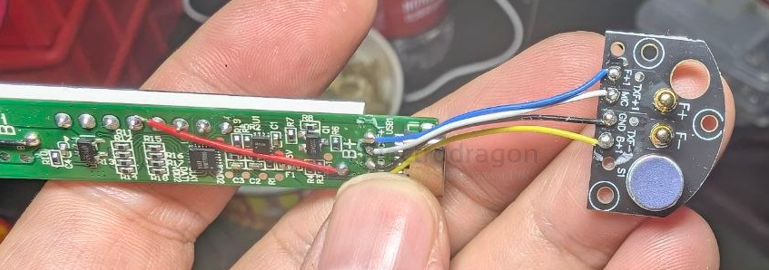

## vertical connect 

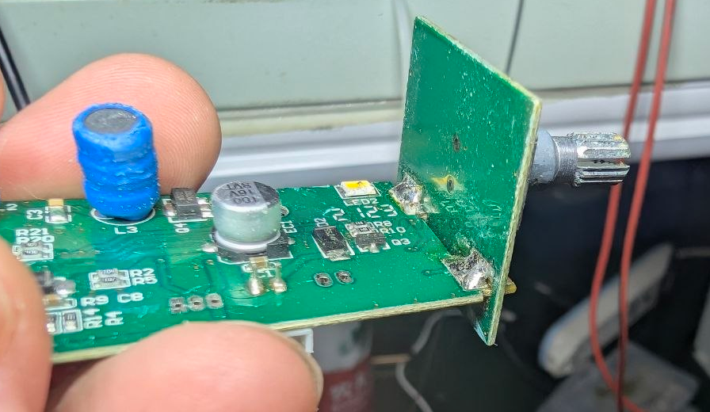

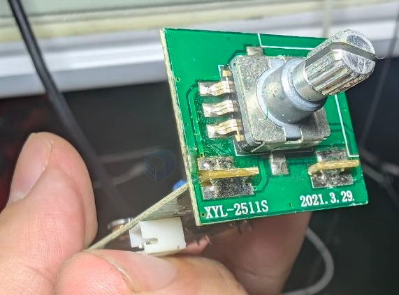

## purpose 

- for the very limit space, specially the flat surface is limited, but the height is enough

- round PCB 

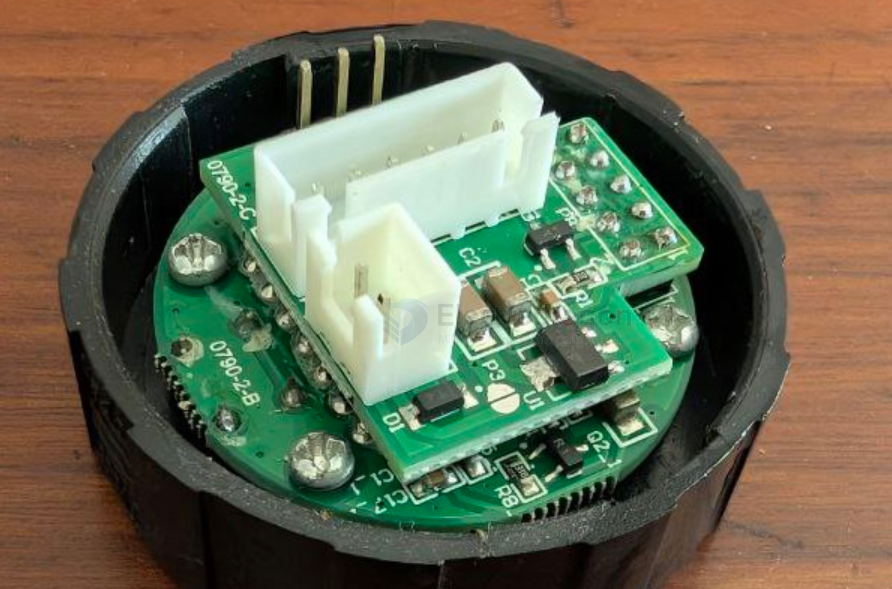

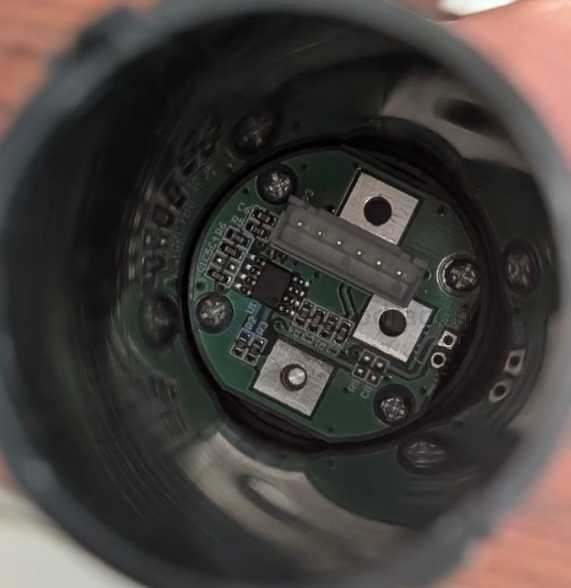

- [[battery-dat]] - [[battery-holder-dat]]

## build 

build 5 

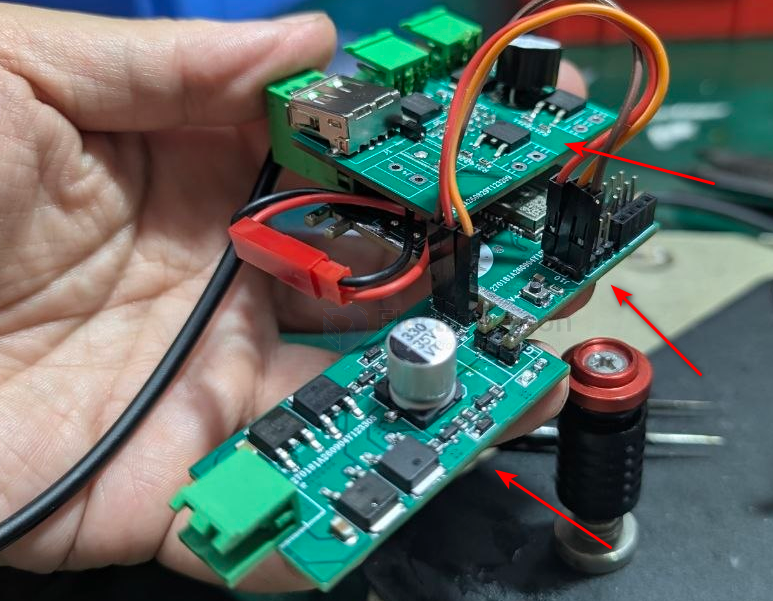

### build 4 == double layer, middle case 

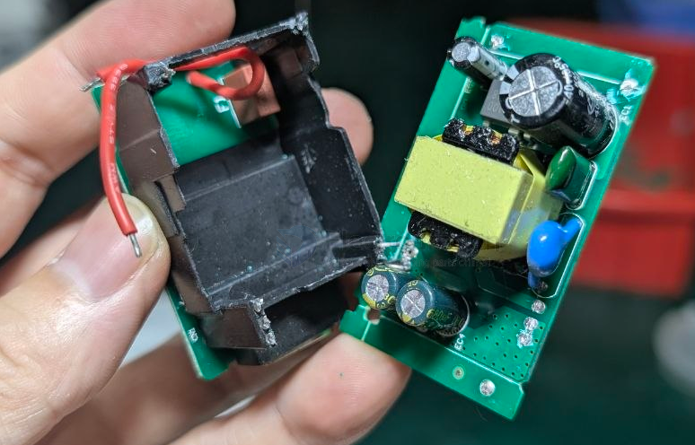

### build 3 == plug and sold 

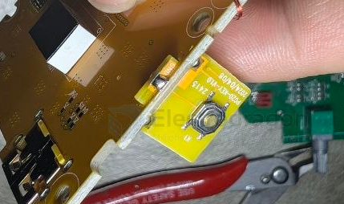

### build 2 

- [[Sytatek-dat]]

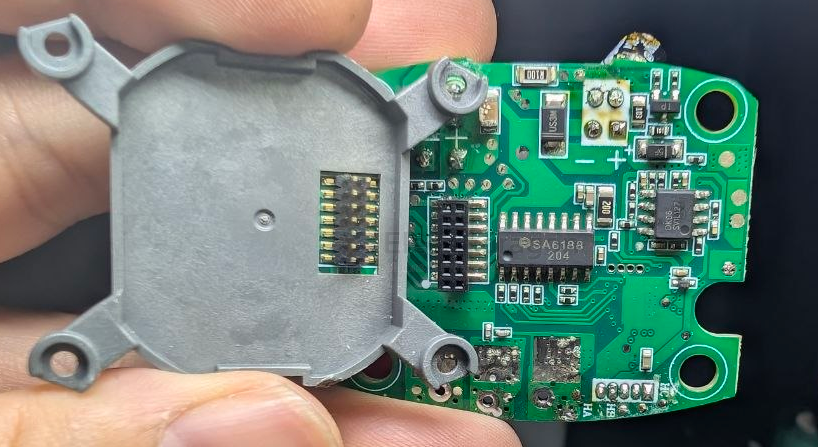

### build 1 

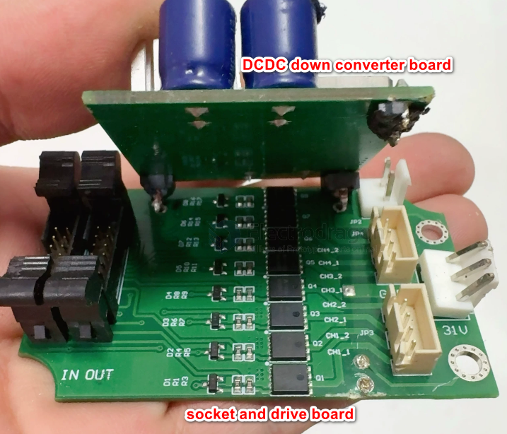

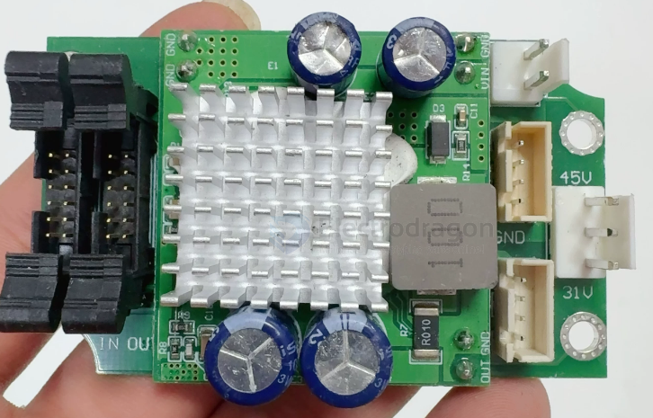

## ref 

- [[PCB-dat]]
