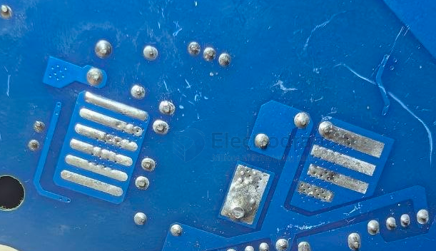

# PCB-trace-dat

- [[PCB-solder-mask-dat]] - [[PCB-vias-dat]] - [[PCB-trace-dat]]

- [[signal-differential-dat]]

### Quick reference table (External trace, 1 oz copper, ΔT = 10°C):

| Current (A) | Trace Width (mil) | Width (mm) |
|-------------|---------------------|------------|
| 1.0         | ~10                 | ~0.25      |
| 2.0         | ~20                 | ~0.50      |
| 3.0         | ~30                 | ~0.76      |
| 4.0         | ~45                 | ~1.14      |

## heat dissipation solutions 

## ref 

- [[PCB-design-dat]]