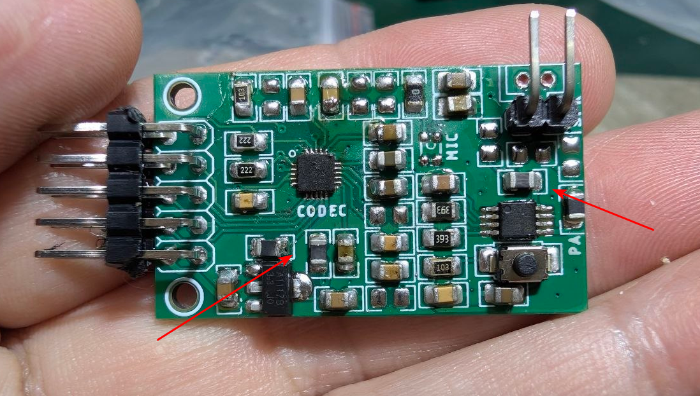

# design-audio-dat

When software is proven to work on a reference board, audio noise on a custom PCB almost always stems from **power supply ripple, improper grounding, high-speed signal crosstalk, or differential-to-single-ended coupling issues**.

Below are the primary hardware design flaws to inspect on your ES8311 layout:

---

### 1. Power Supply & Decoupling (Most Common)

- [[bead-dat]] - [[ES8311-dat]] - [[PCB-design-dat]] - [[capacitor-decoupling-dat]] - [[capacitor-dat]]

* **Shared Power Rails:** If the ES8311’s analog supply pin ($V_{CCA}$ / $V_{DD\_ANA}$) is connected directly to the same 3.3V rail powering an MCU, Wi-Fi/Bluetooth module, or Class-D amplifier, digital switching noise will leak into the audio path.
  * **Fix:** Power the analog supply through a dedicated low-noise LDO, or isolate it using a ferrite bead (e.g., $100\,\Omega \text{ @ } 100\text{ MHz}$) paired with a $10\,\mu\text{F}$ filter capacitor.
* **Missing or Far-Away Decoupling Capacitors:** The ES8311 requires local ceramic decoupling capacitors ($100\text{ nF} + 10\,\mu\text{F}$) placed as close as possible to the $V_{CCA}$, $V_{CCD}$, and $V_{CCP}$ pins.
* **Dirty $V_{MID}$ / $V_{REF}$ / $\text{MICBIAS}$ Caps:** The internal reference voltage pins ($V_{MID}$ / $V_{REF}$) and $\text{MICBIAS}$ set the DC bias point for the analog stage. A missing or poorly grounded bypassing capacitor on these pins will introduce severe buzz, hum, or white noise.

---

### 2. Grounding & PCB Layout Issues

- [[PCB-ground-dat]]

* **Digital Return Currents (Ground Loops):** High-frequency I2S clocks (MCLK, BCLK, LRCK) or switching currents passing under the analog traces create digital noise in the ground plane beneath the codec.
  * **Fix:** Ensure an unbroken ground plane under the ES8311. Route high-speed digital signals away from the analog output traces ($\text{OUTP} / \text{OUTN}$) and bias pins.
* **Amplifier Ground Loop:** If the audio power amplifier shares a high-current ground path back to the main power connector through thin ground traces, the switching currents of the amplifier will pollute the codec’s ground reference.

---

### 3. Digital Clock Ringing & Crosstalk (I2S / MCLK)

- [[resistor-dat]]

- [[I2S-dat]]

* **Missing Series Termination Resistors:** High-frequency clock signals—especially MCLK ($11.2896\text{ MHz}$ to $24.576\text{ MHz}$) and BCLK—can cause sharp edge ringing and RF emissions if driven over traces without impedance matching.
  * **Fix:** Place $22\,\Omega\text{ to }33\,\Omega$ dampening resistors in series on the MCLK, BCLK, LRCK, and I2S data lines near the driving pin (MCU or oscillator).
* **Cross-Coupling:** I2S clock lines routed parallel to or directly over/under $\text{OUTP} / \text{OUTN}$ lines will couple clock tones or harsh buzz directly into the audio output.

---

### 4. Amplifier Interface & Differential Signal Coupling

- [[capacitor-dat]] - [[capacitor-ac-coupling-dat]]

* **Differential vs. Single-Ended Mismatch:** The ES8311 DAC outputs a fully differential signal ($\text{OUTP}$ and $\text{OUTN}$).
  * If your amplifier accepts **differential input** (e.g., NS4168, MAX98357), route $\text{OUTP}$ and $\text{OUTN}$ as a balanced differential pair with AC coupling caps ($1\,\mu\text{F}$ to $10\,\mu\text{F}$).
  * If your amplifier expects a **single-ended input**, tie the unused output ($\text{OUTN}$) to ground via an AC-coupling capacitor, or use a differential-to-single-ended op-amp stage. Driving a single-ended input directly from one side of a differential output without proper DC blocking causes severe distortion and noise.
* **DC Blocking Capacitors:** Ensure proper AC-coupling capacitors are present between the ES8311 outputs and the amplifier inputs to prevent DC bias offset from saturating the amplifier stage.

---

### 5. Floating Inputs

- [[sensor-microphone-dat]]

* If unused analog inputs ($\text{MICP} / \text{MICN}$ or Line-In) are left floating in your schematic, they act as antennas and inject noise into the internal analog multiplexer/PGA. Tie unused inputs to ground through a $100\text{ nF}$ capacitor.

---

### Quick Diagnostic Steps

1. **Check Power Cleanliness:** Probe $V_{CCA}$ and $V_{MID}$ with an oscilloscope (AC coupled, $20\text{ MHz}$ bandwidth limit). If you see ripple $>10\text{ mV}$, your power supply/decoupling is the cause.
2. **Inject Test Signal:** Inject an audio signal directly into the amplifier input (bypassing the ES8311). If the noise vanishes, the problem is around the ES8311 power/grounding/clocking. If the noise remains, the amplifier's power supply or switching design is the issue.
3. **Mute/Clock Test:** Stop sending I2S clocks from the MCU while keeping power applied. If the noise instantly stops, the issue is I2S digital crosstalk or clock ringing.

## ref 