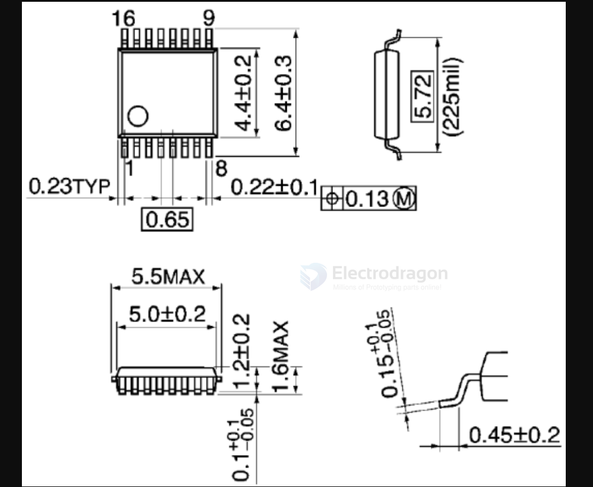

# SSOP-dat

## 0.635 mm Pitch SSOP
- **Pin pitch (e)**: 0.635 mm
- **Lead width (b)**: 0.18 – 0.30 mm
- **Recommended pad width**: ~0.25 mm
- **Recommended pad length**: 1.30 – 1.50 mm

## 0.65 mm Pitch SSOP
- **Pin pitch (e)**: 0.65 mm
- **Lead width (b)**: 0.22 – 0.38 mm
- **Recommended pad width**: 0.30 mm (nominal)
- **Recommended pad length**: 1.40 – 1.60 mm
- **Pad-to-pad spacing**: 0.35 mm (center-to-center 0.65 mm minus pad width 0.30 mm)

## SSOP-16 (0.635 mm pitch) Stop Mask Guidelines

- **Copper pad width**: ~0.25 mm (typical)
- **Solder mask expansion**: +0.05 – 0.07 mm per side
- **Mask opening width**: ~0.35 – 0.39 mm
- **Pad-to-pad spacing (center-to-center)**: 0.635 mm
- **Mask dam (between pads)**:
  - 0.635 – (0.25 + 0.25) – (2 × expansion 0.05–0.07)
  - ≈ 0.08 – 0.10 mm left as mask dam
- **Fabrication note**: Some fabs require **≥0.10 mm mask dam**, so if your fab’s capability is 0.10 mm, you are right at the limit.

