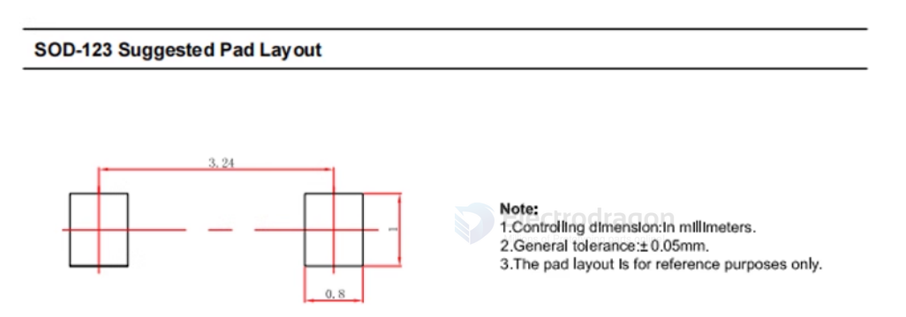

# footprint-dat.md

- [[EDA-dat]] - [[kicad-dat]]

- [[kicad-footprint-dat]]

- [[QFN-dat]] 

- [[QFP-dat]] - [[SSOP-dat]] - [[SOP-dat]]

## common footprint libraries 

- [[nettie-dat]]
- [[test-point-dat]]
- Connector_FFC-FPC
- Connector_PinHeader_1.00mm
- Connector_PinSocket_1.00mm
- Connector_JST
- Connector_Molex
- Jumper 
- Connector_Wire
- Package_CSP 

## general footprint guide

### overal setup 

| Setting       | 1   | 2    | 3     | 4        |
| ------------- | --- | ---- | ----- | -------- |
| Grid Size     | 1.0 | 0.5  | 1.27  | 2.54 mm  |
| Snap Size     | 0.1 | 0.05 | 0.127 | 0.254 mm |
| Alt Snap Size | 0.1 | 0.05 | 0.127 | 0.254 mm |

- units == mm 

### create new footprint 

- pad 
- layer select 
  - for SMD part == top / bottom layer only 
  - for THT part == all layer
      - also check the hole size and shape

## generate footprint descriptions 

CAP 4.7UF, 0805, 10%, MLCC, 50V, X5R, ROHS

RES 1K 5%, 0805, THICK FILM, 150V, 1/8W, ROHS

Here's a breakdown of the structure:

- CAP/RES: Component Type (Capacitor or Resistor)
- 4.7UF/1K: Value (4.7 Microfarads or 1 Kiloohm)
- 0805: Package Size (0805 is a standard SMD package size)
- 10%/5%: Tolerance (10% or 5% variation in value)
- MLCC/THICK FILM: Technology or Type (Multi-Layer Ceramic Capacitor or Thick Film Resistor)
- 50V/150V: Voltage Rating (50 Volts or 150 Volts)
- X5R: Dielectric (Specific to capacitors, defines temperature characteristics)
- 1/8W: Power Rating (1/8 Watt, specific to resistors)
- ROHS: RoHS Compliant (Restriction of Hazardous Substances)

LED SMD VERMELHO, 0805, 2V, 25MA, 624NM, 60MCD, 140°, ROHS

- "VERMELHO" is Portuguese for red.
- 624nm wavelength corresponds to red light on the visible spectrum.
- Other details like 2V, 25mA, and 60mcd just describe electrical and luminous specs.

### Electronic Industries Alliance (EIA)

EIA 3528-21 Meaning

| Section | Description                                                                                                     |
| ------- | --------------------------------------------------------------------------------------------------------------- |
| 3528    | Physical size of the component in hundredths of inches: 3.5 mm x 2.8 mm (i.e., 0.138" x 0.110")                 |
| -21     | Indicates a specific height and pad layout variation within the 3528 size range. Typically means ~2.1 mm height |

CRISTAL 12MHz, SMD, 3.2X2.5MM, 18PF, 20PPM, ROHS

This corresponds to the standard 3225 SMD package (also known as EIA 3225 or 3.2x2.5mm SMD crystal).

## SOD-123

SOD-123 is a small SMD package used for diodes, transistors, and other components. It has a footprint of approximately 1.6mm x 0.8mm (0.063" x 0.031") and is commonly used in low-power applications.

## SOD-323 

## ref 

- [[BOM-dat]]