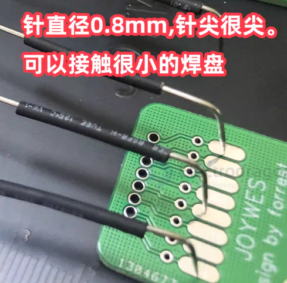
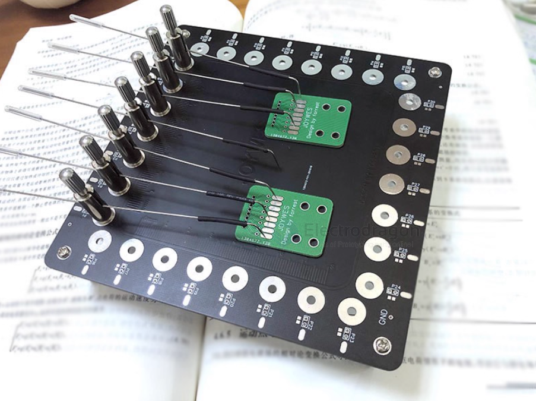
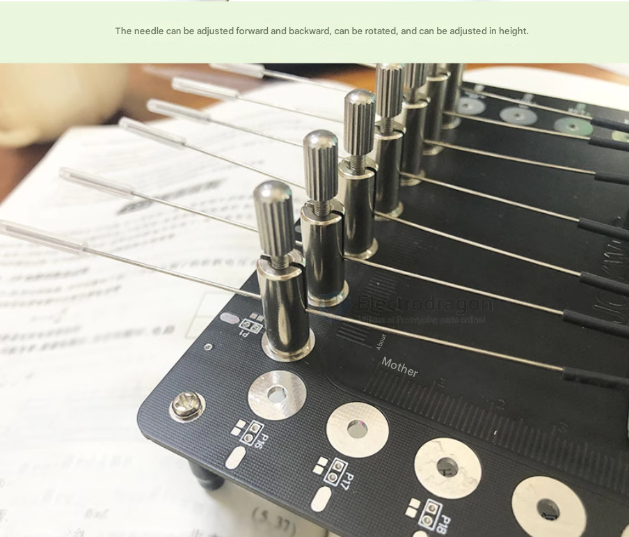
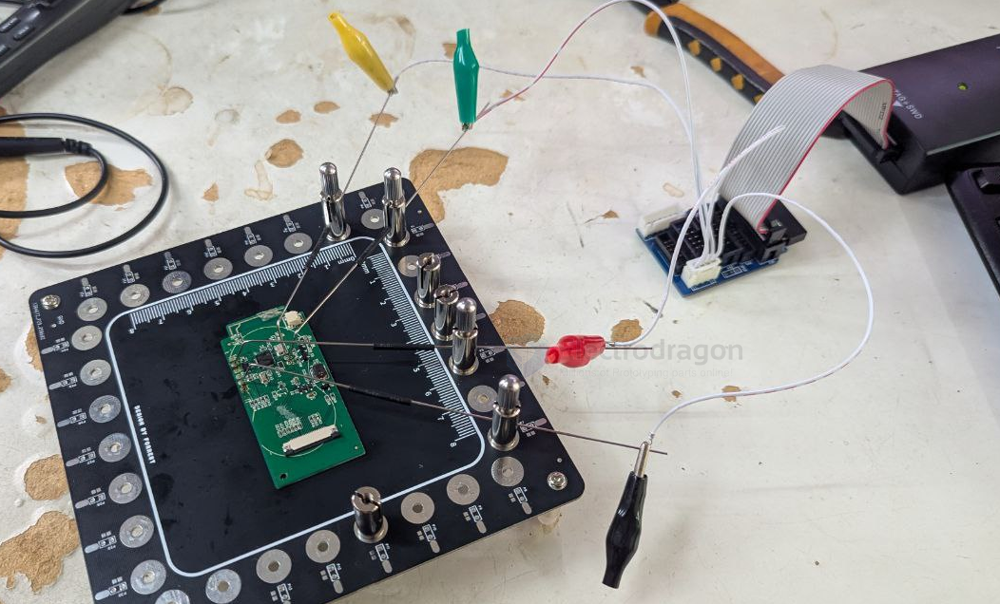
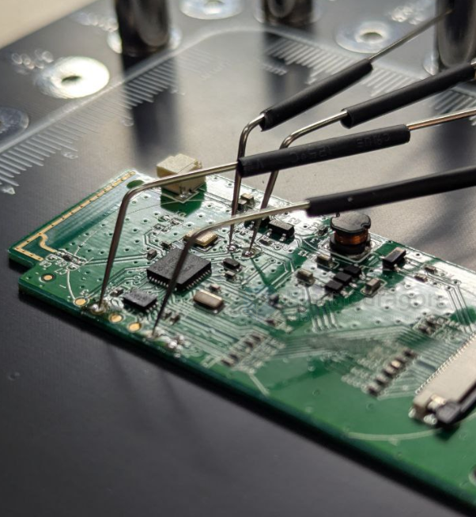
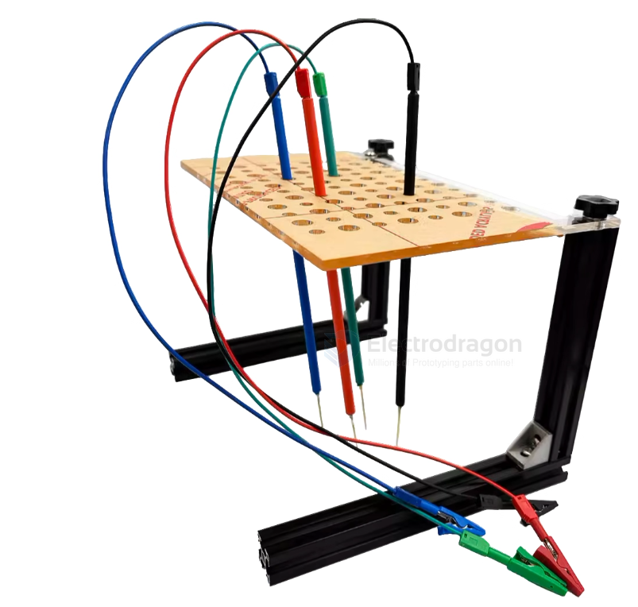
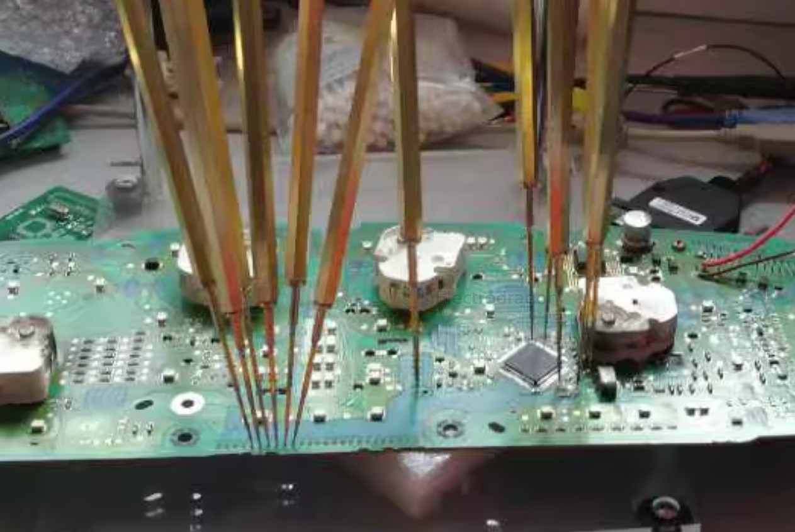
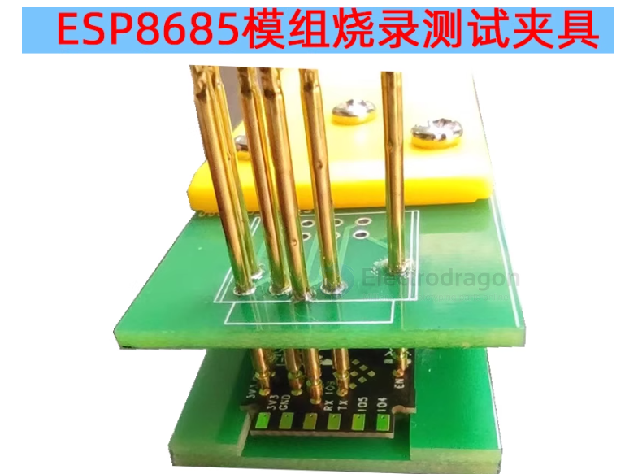

# test-point-dat

- small batch production can use multimeter to do the test 

add points like 

## test rig v2 

0.8mm diameter pin 

## test rig 

## common test point

- [[da14585-dat]]

### power supply

for power supply - [[power-dat]]

- VBUS
- 3V3
- GND

### epaper 

[[epaper-dat]] 

- GDR 
- RESET 
- VCOM 
- PREVGL
- PREVGH

- VCOM: Usually between -2V and -3V (sometimes adjustable, check your module’s datasheet).
- PREVGL: Negative voltage, often around -15V to -20V.
- PREVGH: Positive voltage, often around +15V to +20V.

VOM 

PRE-VGL == -20V

PRE-VGH == 20V 

## custom rig 

## ref 

- [[footprint-dat]] - [[test-point]] - [[PCB-design]]