# test-point-dat

- [[PCB-design-dat]] - [[test-point-dat]]

一、先明确"给什么测试用"

不同测试对测试点的要求完全不同：

- ICT 针床：需要规整、够大、够稀的测试点（探针阵列物理限制）
- 飞针测试：点可以小一些、密一些（单针移动）
- AOI：不需要测试点，需要光学基准点（Fiducial）
- 调试/烧录：SWD/UART 引出，宽松得多
- 示波器/手探：需要能落探头或夹钩的点

二、尺寸与间距（最容易出错的地方）

- 测试点直径：ICT 用 1.0-1.5mm（经典值 1.27mm / 50mil）；飞针可到 0.8-1.0mm
- 中心间距：理想 2.54mm；密集时 1.27mm 是绝对下限，实际别低于 1.5mm
- 距板边：≥3mm（夹具要抓住板边）
- 测试点周围留空：≥1mm 无任何元件/走线 —— 探针下来是有物理尺寸的，撞到元件就会歪
- 远离高元件：电解电容、连接器、电感、屏蔽罩旁边不能放测试点
- 建议单面布置：ICT 双面测试要翻板 + 两套治具 → 成本直接翻倍

三、⭐️⭐️ 阻焊开窗（最常见的翻车点）

- 测试点必须开阻焊（solder mask opening），开窗通常比焊盘大 0.05-0.1mm
- 如果测试点被阻焊盖住 → 探针接触不良/氧化 → 测试良率假低，误杀好板
- 有些 EDA 默认不给测试点开窗，必须手动确认

四、电气与网络要求

- 测试点必须真实连到目标网络（网络名要一致，别只是画了个孤立焊盘）
- 关键网络至少一个点：
  - 所有电源轨（3V3/5V/VBAT…）
  - GND（多放几个，分散受力）
  - RESET、BOOT、时钟
  - 通信总线（I2C/SPI/UART/CAN）
  - 模拟信号（ADC 输入、参考电压）
- 测试点不要直接挂在元件焊盘上（探针压力会顶坏元件）→ 用短线分支出去
- 电源/GND 测试点做大些，能承受探针电流

五、⚠️ 高速信号的例外

测试点 = 一个寄生电容 + 阻抗不连续点。

- USB / HDMI / LVDS / 差分对 / DDR 走线：不要随便加测试点，会破坏阻抗、影响眼图
- 确需调试的：加极小的"仅调试用"焊盘（不装针，只在调试时手焊/探针），或者调完就删
- 高频网络优先用 JTAG 边界扫描验证，而不是物理探针

六、调试/烧录口（另一类，必留）

- SWD/JTAG：SWDIO / SWCLK / RESET / GND / 3V3 —— 建议 2.54mm 间距的 5-6 pin 排针（能用杜邦线，最省事）
- UART：TX / RX / GND / 3V3（4 pin）—— 调试串口的救命名场面
- BOOT/复位按键：留给"变砖后救回来"
- 空间紧张时用小间距（1.27mm）或测试点 + 适配夹

七、机械与治具配合

- 定位孔（Tooling Hole）：2-3 个，直径 2-3mm（3mm 最通用），给治具定位，通常放对角
- 支撑点：针床下压压力很大（几十 kg），板子容易弯 → 留出无元件的支撑区，或在治具上加支撑柱
- 板边留白 ≥3-5mm 给夹具抓取
- Fiducial（光学基准点）：AOI/贴片机对位用，1mm 焊盘 + 2mm 阻焊开窗，板角放 2-3 个

八、文档与交接（容易被忘）

- 丝印标注：测试点编号（TP1/TP2）或直接写网络名（GND/3V3/TX）
- 输出测试点坐标文件（给测试厂/治具厂）
- 导出网表给测试工程师做程序
- 标注哪些是"必测"、哪些是"可选"

九、设计阶段自查清单

- [ ] 关键网络 100% 有测试点
- [ ] 直径 ≥1.0mm，间距 ≥1.5mm（理想 2.54mm）
- [ ] 距板边 ≥3mm
- [ ] 周围 1mm 无元件/无高件
- [ ] 阻焊开窗正确（没被盖住） ← 重点复查
- [ ] 尽量单面集中
- [ ] 定位孔 2-3 个（2-3mm，对角）
- [ ] Fiducial 2-3 个
- [ ] 高速网络未受影响
- [ ] SWD/UART 调试口已留
- [ ] 丝印清晰、坐标文件已导出

十、小批量的现实建议（你的场景）

治具贵（几千到几万），量不大时别做针床，用这些替代：

1. 2.54mm 排针当测试点 —— 最方便，能插杜邦线、能夹钩、能焊针
2. 板边做一圈"调试测试排"（VCC/GND/TX/RX/RESET/BOOT + 关键电源轨），丝印标清楚
3. 飞针测试（不用治具，改程序即可复用）
4. 第一片当黄金板：测好参数记下来，后面逐片对比静态电流/电压
5. 半孔 / 邮票孔引出（模块化时很好用）

---

一句话：测试点 = 直径 ≥1.0mm、间距 ≥1.5mm（理想 2.54mm）、距板边 ≥3mm、周围 1mm 净空、单面集中、阻焊必须开窗、避开高速网络；另外单独留 SWD/UART 调试口和 2-3 个定位孔。小批量就别做治具，用 2.54mm 排针 + 飞针替代。

## build 

app 1 - [[insta360-go2-dat]]

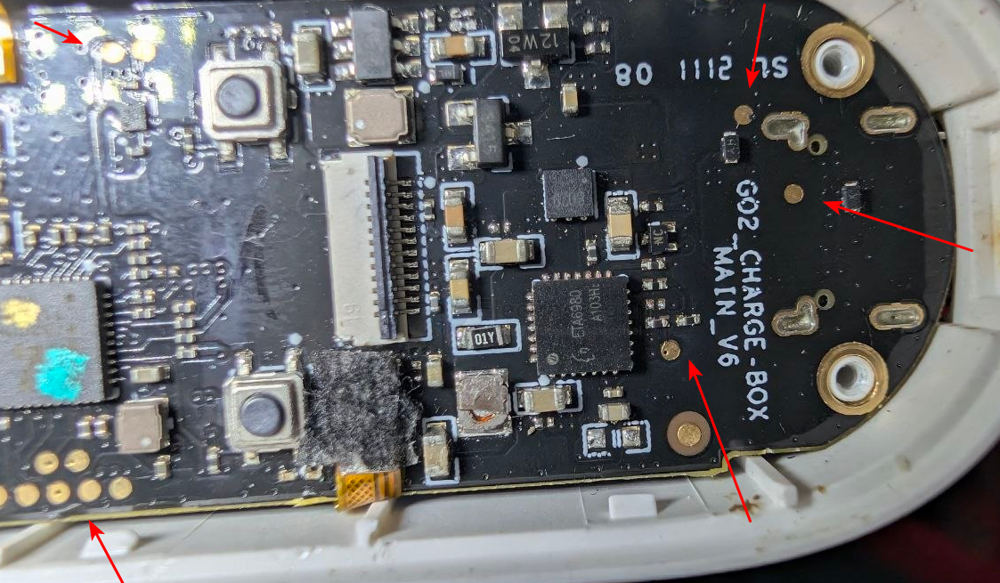

## PCB test point 

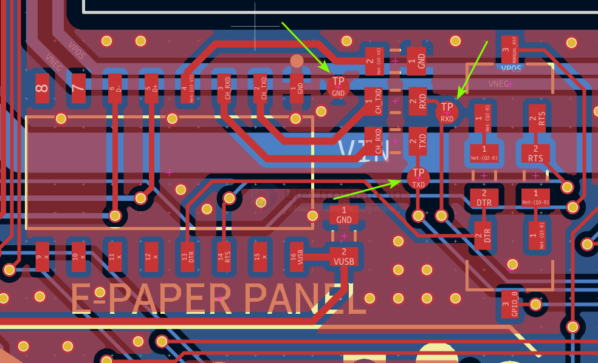

## common test points 

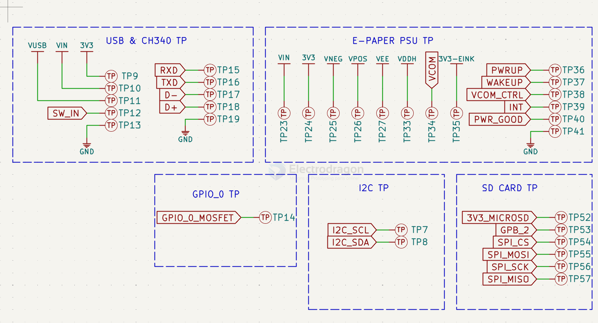

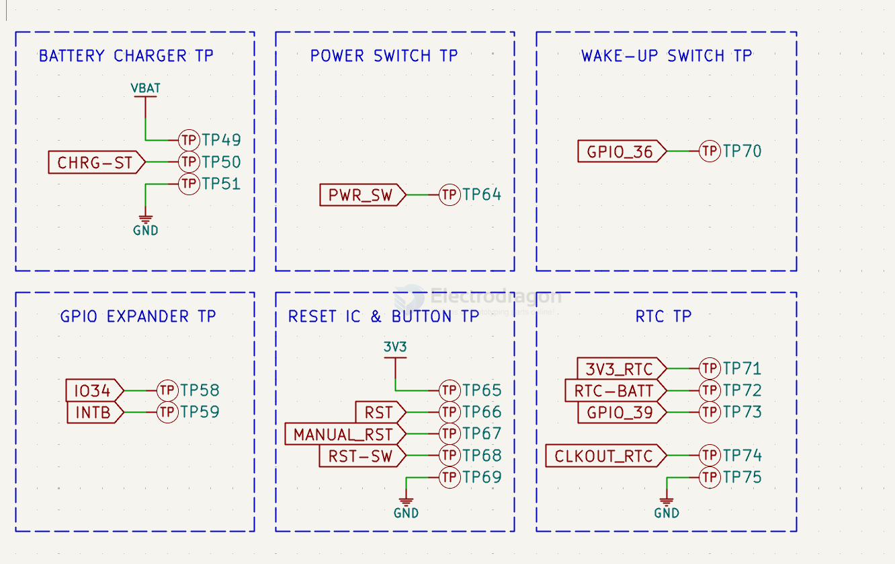

## info 

- small batch production can use multimeter to do the test 

add points like 

## pre-designed test hook 

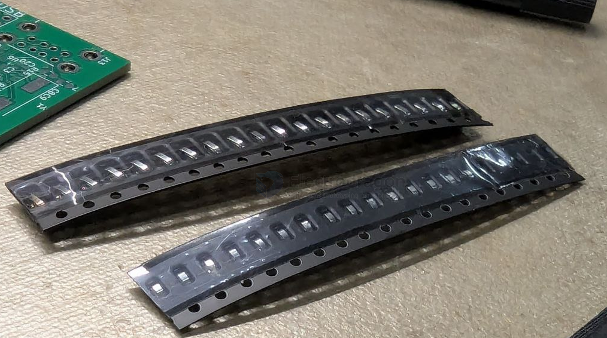

## press test rig V3 

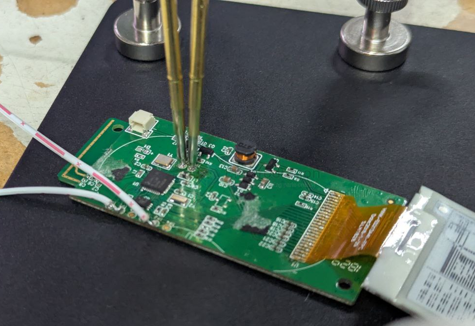

- test OK with [[JLINK-dat]]

## test rig v2 

0.8mm diameter pin 

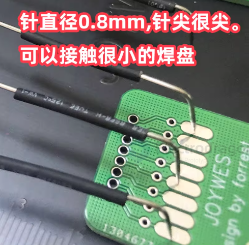

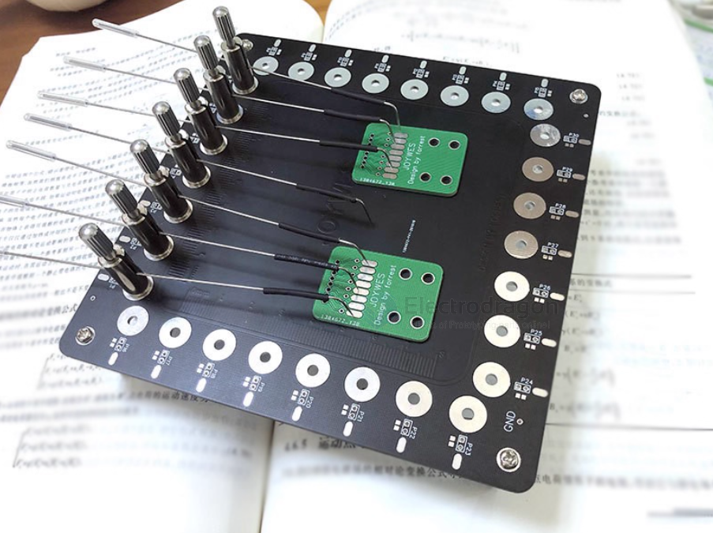

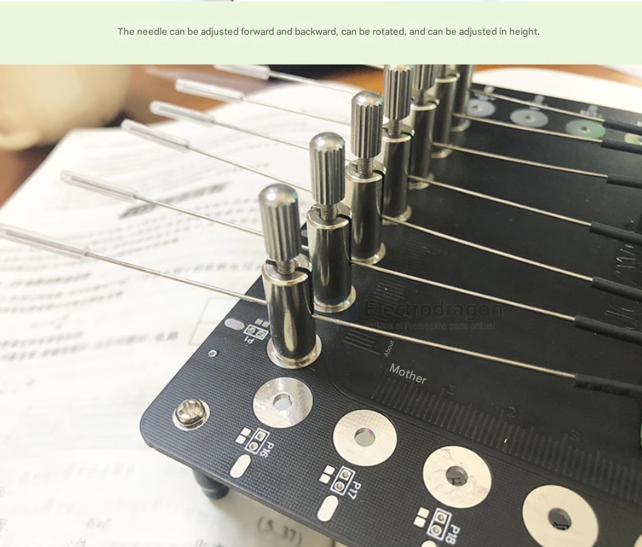

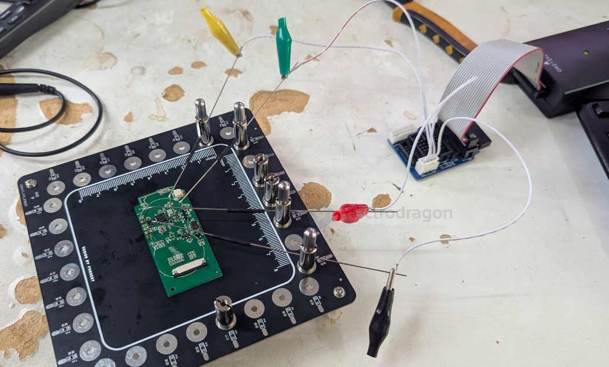

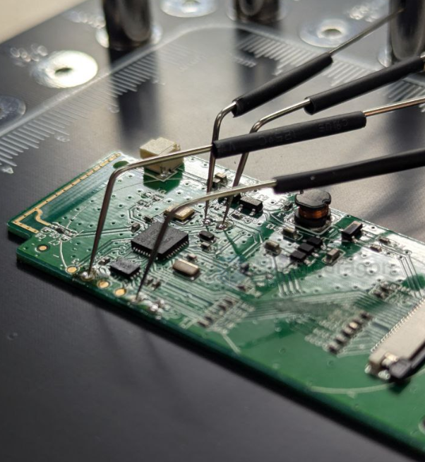

## test rig 

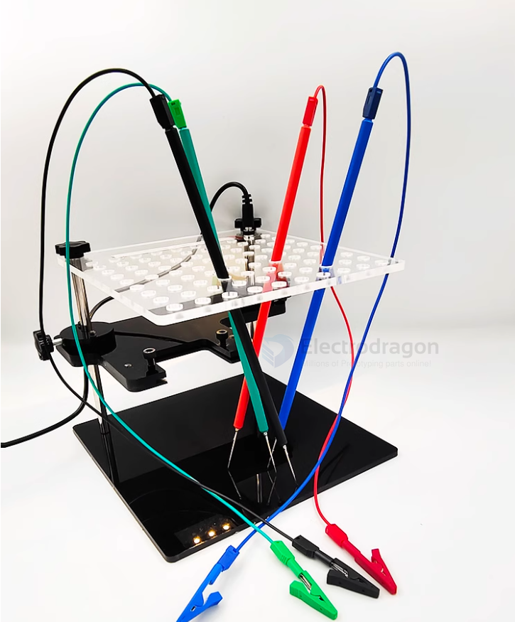

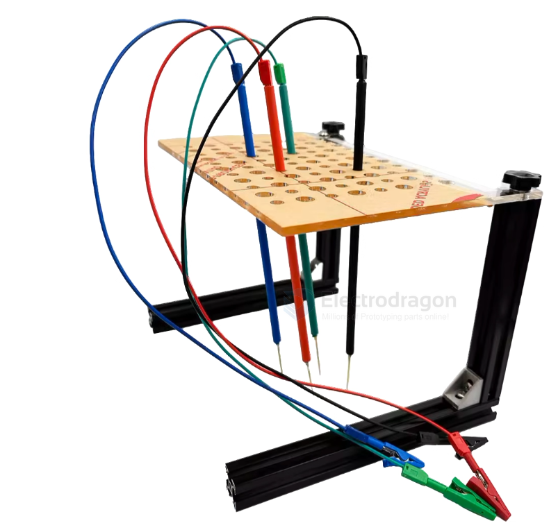

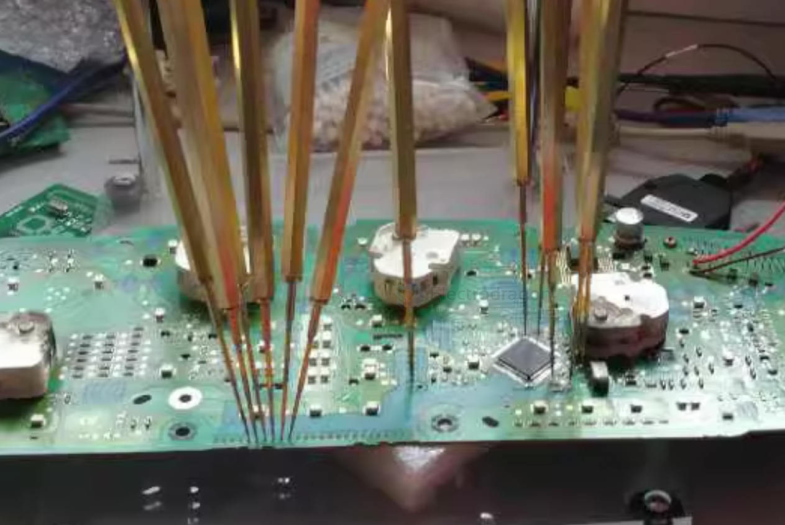

## common test point

- [[da14585-dat]]

### power supply

for power supply - [[power-dat]]

- VBUS
- 3V3
- GND

### epaper 

[[epaper-dat]] 

- GDR 
- RESET 
- VCOM 
- PREVGL
- PREVGH

- VCOM: Usually between -2V and -3V (sometimes adjustable, check your module’s datasheet).
- PREVGL: Negative voltage, often around -15V to -20V.
- PREVGH: Positive voltage, often around +15V to +20V.

VOM 

PRE-VGL == -20V

PRE-VGH == 20V 

## custom rig 

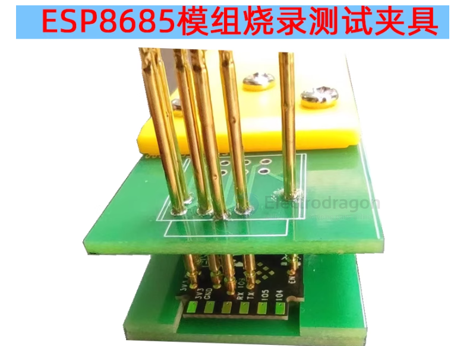

## ref 

- [[footprint-dat]] - [[test-point]] - [[PCB-design]]