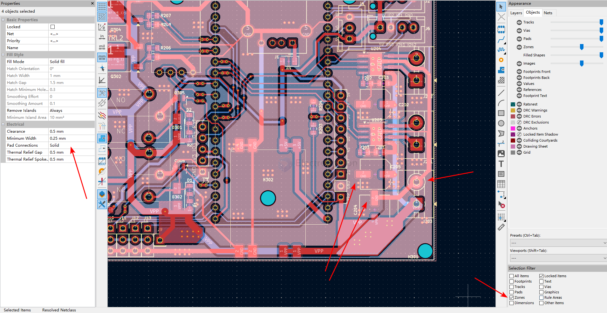

# thermal-relief-dat

- [[thermal-relief-dat]] - [[PCB-zone-dat]] - [[PCB-design-dat]] - [[kicad-PCB-dat]] - [[eagleCAD-PCB-dat]] - [[thermal-relief-dat]]

## setup solid in kicad 

## thermal relief on power design 

you should **never** use thermal isolation (thermal relief) on the power or ground pins of a motor driver like the DRV8871. In fact, you want the exact opposite: **solid, direct connections**.

---

### 1. The Ground Pin is the Heatsink
The DRV8871 relies heavily on its **GND pin (Pin 2)** and the **exposed thermal pad underneath the chip** to pull heat away from the silicon. 

* **The Problem:** Thermal isolation uses thin copper spokes to connect a pin to a copper plane (to make soldering easier). This chokes off the path for heat to escape. At max throttle, the chip will rapidly overheat and trigger its Thermal Shutdown (TSD), causing the motor to stutter.
* **The Fix:** Connect the GND pin and the underside thermal pad directly to a large, solid copper ground plane using **solid copper pouring (no relief spokes)**. Place multiple vias inside the thermal pad area down to the bottom layer ground plane to act as heat pipes.

### 2. Power Pins (VM) Need Maximum Current Flow
At max throttle, the 380 motor demands sharp spikes of current. 

* **The Problem:** Thin spokes add trace resistance and inductance. If the path from your bulk capacitor to the VM pin is constricted by thermal relief spokes, it creates a voltage drop right at the pin during peak draws, which can trip the chip’s Under-Voltage Lockout (UVLO).
* **The Fix:** Connect the VM pin directly to your thick power traces or power plane using solid copper connections. 

---

### PCB Layout / Assembly Tips

* **Disable Thermal Relief:** In your CAD tool (like Onshape, KiCad, etc.), change the pad connection style for the VM, GND, and OUT1/OUT2 nets from "Thermal Relief" to **"Direct" or "Solid"**.
* **Soldering Strategy:** Because these solid connections will suck heat away from your soldering iron quickly, use a wider chisel tip, turn your iron up slightly (around 350°C–380°C), and use plenty of flux to ensure a clean joint.

## ref 

