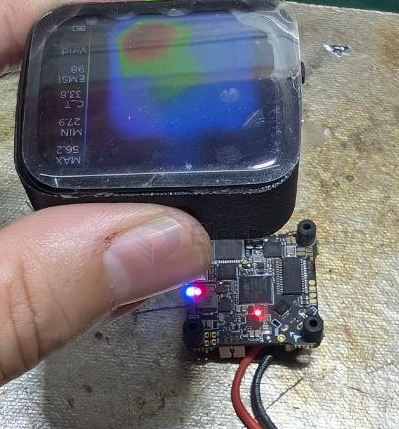

# PCB-thermal-error-dat

- [[PCB-thermal-error-dat]] - [[PCB-dat]] - [[thermal-dat]]

- shorted traces due to thermal stress

## test 1 

## 三、热学类（找短路/过载最有效）⭐️

**手指触摸法**
• 说明: 上电短时，摸哪个元件烫
• 成本: ¥0（注意烫伤）

**红外测温枪**
• 说明: 非接触测各元件温度，快速定位
• 成本: ¥50-100

**热成像仪（手机款）**
• 说明: 一眼看出热点分布 ⭐️ 最直观
• 成本: ¥300-1000

**酒精蒸发法 ⭐️**
• 说明: 涂酒精在板上，发热元件处酒精先蒸发，看得见
• 成本: ¥0

**冷冻喷雾**
• 说明: 反向操作：冷却后看谁先热
• 成本: ¥20-50

**热风枪加热法**
• 说明: 加热后故障变化 = 冷焊/热敏感
• 成本: 已有

## target APP 

### FPV  

"发热严重"是最大线索——用红外测温枪（如有）扫一遍板子：

- 单颗元件异常烫 → 该元件击穿（大概率 MOSFET 或电容）
- 大面积均匀烫 → 公共供电/短路问题
- 如果发热的是电调 MCU → MCU 内部击穿

## ref 

