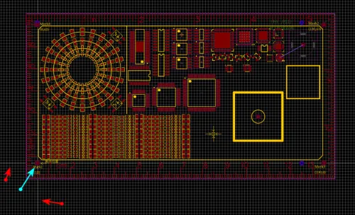
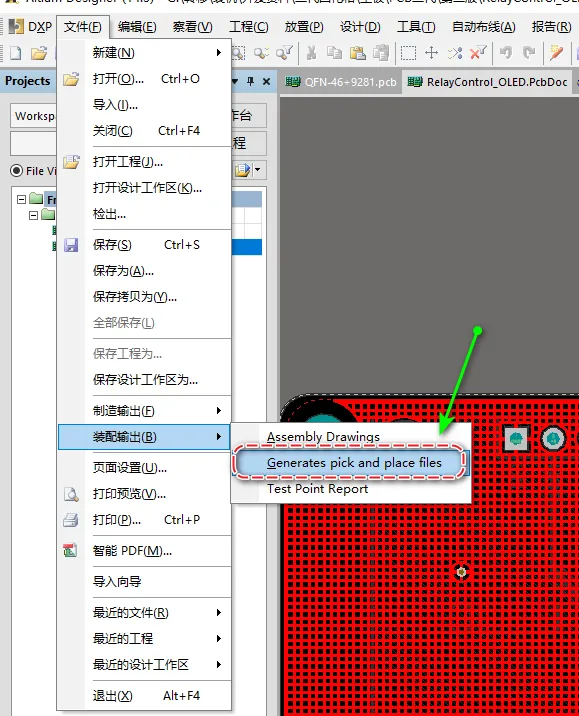
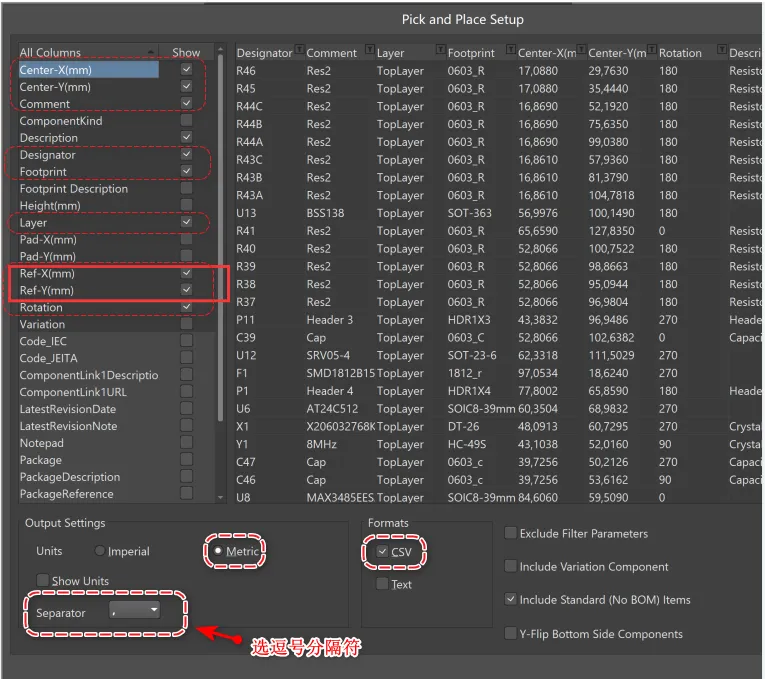

# export-coordinate-dat

- standard coordinate file == [[standard-1.csv]]

## Preparation == CSV coordinate file

1.  The software's default unit is millimeters (mm), so your EDA drawing board software should also be set to millimeters, not mils.
2.  For component drawing packages, try to place the center point at the geometric center rather than at PIN1.
3.  The exported CSV file must contain:

    -   Designator,
    -   Footprint,
    -   Mid X,
    -   Mid Y,
    -   Ref X,
    -   Ref Y,
    -   Layer,
    -   Rotation,
    -   Comment or "Designator,
    -   Footprint,
    -   X,
    -   Y,
    -   Layer,
    -   Rotation,
    -   Comment

### CSV file header like 

shoud be like this:

    Designator,Footprint,Mid X,Mid Y,Ref X,Ref Y,Pad X,Pad Y,Layer,Rotation,Comment

and data line like 

    C1,R0201,14.4mm,46.2mm,14.4mm,46.2mm,14.06mm,46.4mm,T,330,Comment

## PCB Drawing Board Origin

You must set a PCB origin position and understand where that origin is located on the PCB. We will use this in the next step when setting the PCB origin position.

Generally, it is the intersection of two white lines.

## [[altium-design-dat]] export methods 

the following solid-red mark is must-pick

## LC EDA export methods 

## ref 

- [[PCB-dat]]