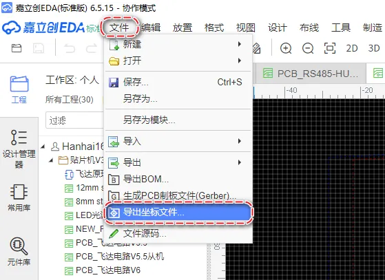

# export-coordinate-dat

- standard coordinate file == [[standard-1.csv]]

## Preparation == CSV coordinate file

1.  The software's default unit is millimeters (mm), so your EDA drawing board software should also be set to millimeters, not mils.
2.  For component drawing packages, try to place the center point at the geometric center rather than at PIN1.
3.  The exported CSV file must contain:

    -   Designator,
    -   Footprint,
    -   Mid X,
    -   Mid Y,
    -   Ref X,
    -   Ref Y,
    -   Layer,
    -   Rotation,
    -   Comment or "Designator,
    -   Footprint,
    -   X,
    -   Y,
    -   Layer,
    -   Rotation,
    -   Comment

### CSV file header like 

shoud be like this:

    Designator,Footprint,Mid X,Mid Y,Ref X,Ref Y,Pad X,Pad Y,Layer,Rotation,Comment

and data line like 

    C1,R0201,14.4mm,46.2mm,14.4mm,46.2mm,14.06mm,46.4mm,T,330,Comment

### PCB Coordinate File Terms

1. **Mid x y**  

This refers to the "midpoint" coordinates of a component or feature on the PCB. It typically marks the central location of the component, where the component is positioned relative to others in the layout.  

- **x** and **y** values specify the exact location on the board.

1. **Ref x y**  

This stands for the "reference" coordinates of a component, marking its reference point (often pin 1 of a component, for example) on the PCB.  

- It's used to define the component's placement or to reference the component for design or testing purposes.

1. **Pad x y**  

A "pad" refers to the physical area on the PCB where components (like resistors, capacitors, or ICs) are soldered.  

- **Pad x y** coordinates specify the location of a pad on the board, often corresponding to the component's footprint.
- These coordinates are essential for defining the connections between components via soldering pads.

## PCB Drawing Board Origin Mark Point

You must set a PCB origin position and understand where that origin is located on the PCB. We will use this in the next step when setting the PCB origin position.

Generally, it is the intersection of two white lines.

## export methods for eagleCAD 

To export component coordinates from Eagle CAD for pick-and-place assembly, go to File > Export > Mount SMD, which will generate two files: 

one for the top side (.mnt) and one for the bottom side (.mnb).

## export methods for kicad (??)

## export methods for allegro (NA)

## export methods for altium designer 

- [[altium-design-dat]] 

the following solid-red mark is must-pick

## export methods for LC EDA 

## ref 

- [[PCB-dat]]