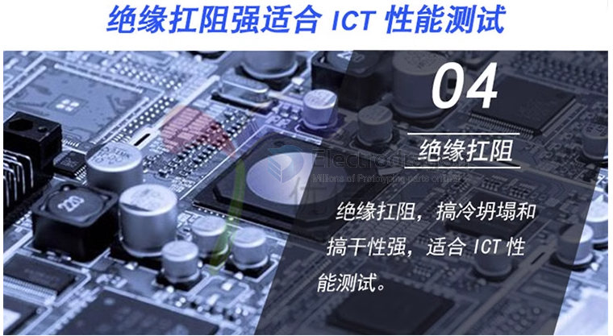

# solder-paste-dat

## Low temperature soldering paste

Low temperature soldering paste is a type of solder paste designed to melt and flow at lower temperatures than standard solder pastes. Here are its main features:

- Melting Point: Typically melts between 130°C and 180°C, compared to standard lead-free solder pastes which melt around 217°C.
- Composition: Often contains bismuth-based alloys (e.g., Sn42/Bi58) instead of traditional tin-silver-copper (SAC) alloys.
- Applications: Ideal for temperature-sensitive components, rework, or double-sided PCB assembly where high heat could dam-Age parts.
- Reduced Thermal Stress: Minimizes risk of warping or dam-Aging PCBs and components.
- Energy Saving: Lower reflow oven temperatures reduce energy consumption.
- Compatibility: Useful for mixed-technology boards or assemblies with plastic connectors and LEDs.

### Solder Paste Types and Applications

| Solder Paste Model   | Composition         | Powder Type | Application/Notes                                   |
| -------------------- | ------------------- | ----------- | --------------------------------------------------- |
| Mobile Repair GY618B | Sn62.8-Pb36.8-Ag0.4 | Type 4      | For mobile phone repair                             |
| A-888                | Sn63-Pb37           | Type 3      | resistors, capacitors, simple IC PCBs               |
| A-888                | Sn63-Pb37           | Type 4      | resistors, capacitors, fine-pitch/multi-pin IC PCBs |
| SMT Chip A-888       | Sn63-Pb37           | Type 5      | resistors, capacitors, dense/multi-pin IC PCBs      |
| GY-626B              | Sn62.9-Pb36.9-Ag0.2 | Type 4      | QFN type PCBs                                       |
| GY-618B-B            | Sn62.8-Pb36.8-Ag0.4 | Type 4      | BGA pack-Age PCBs                                   |
| LED Chip GY361       | Sn55-Pb45           | Type 3      | LED lamps, strips, and tapes                        |
| GY638A               | Sn60-Pb40           | Type 3      | Performance superior to GY361                       |

## target 

- [[FPC-dat]] 

## Common type Solder Paste 

| melting point | tin content | Note                                                                 |
| ------------- | ----------- | -------------------------------------------------------------------- |
| 138 C         | 42%         | ultra-low temperature, bismuth-based, for special low-temp soldering |
| 150 C         | 42%         | low temperature, bismuth-based, for temperature-sensitive components |
| 183 C         | 63%         | best for most common PCB, small spacing, high parts density          |
| 217 C         | 99.3%       | lead-free, SAC305 alloy, standard for RoHS compliant PCBs            |

- [[solder-paste]]

## ref 

- [[soldering-dat]]