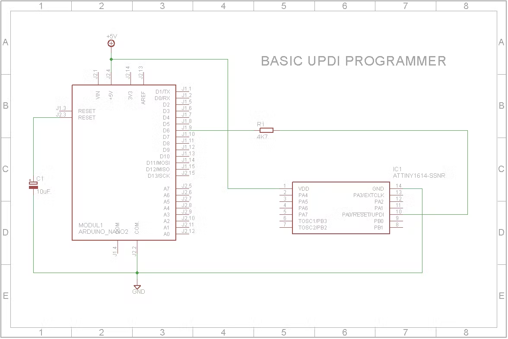
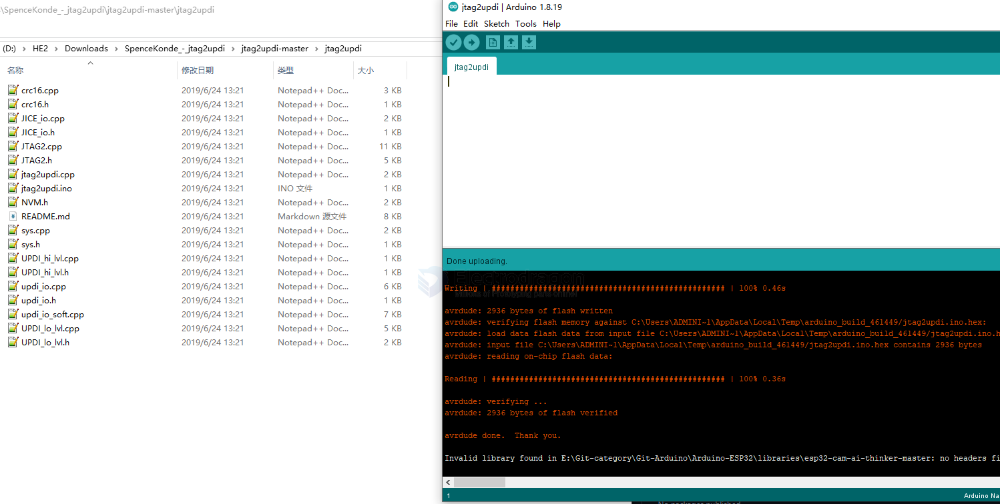
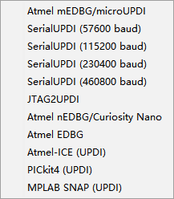

# UPDI-dat

- https://create.arduino.cc/projecthub/john-bradnam/create-your-own-updi-programmer-1e55f1
- https://www.hackster.io/john-bradnam/create-your-own-updi-programmer-1e55f1

The Programmer needs to be set to jtag2updi (megaTinyCore).

power supply setup 

3.3V + 3.3_jump

- [[arduino-nano-dat]]

## Upload firmware to arduino NANO 

## programmers

## atmel ICE 
- official 

### DIY ATtiny HV UPDI Programmer
https://github.com/Dlloydev/jtag2updi/wiki/DIY-ATtiny-HV-UPDI-Programmer

## tuto - self made arduino nano as UPDI programmer 

- https://www.instructables.com/Arduino-Nano-1/

## Common Programmer in Arduino 

## Support 

- [[megaCoreX-dat]]

## command mode 

avrdude -C D:\avrdude.conf -c jtag2updi -P com285 -p avr128db64 -v -v -v -v

avrdude -C D:\avrdude.conf -c jtag2updi -P com285 -p avr128db64 -t -F

## Demo 

- https://t.me/electrodragon3/45

## Boards 

- [[DAR1060-dat]] - [[DAR1064-dat]]

- [[UPDI]]

- [[atmel-ice]]