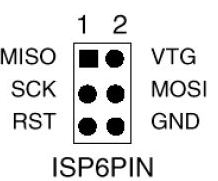

# avr-dat

- [[UPDI-dat]] - [[avrdude-dat]]

- [[arduino-dat]]

## chip 

- [[atmega328-dat]]

## PROG 

- [[DPR1009-dat]] - [[DPR1088-dat]]

converter tools 

- [[DPR1023-dat]] - [[DPR1048-dat]]

legacy wiki page - https://w.electrodragon.com/w/Category:Arduino#Burning_bootloader

## ISP pins 

ICSP 6pins 

