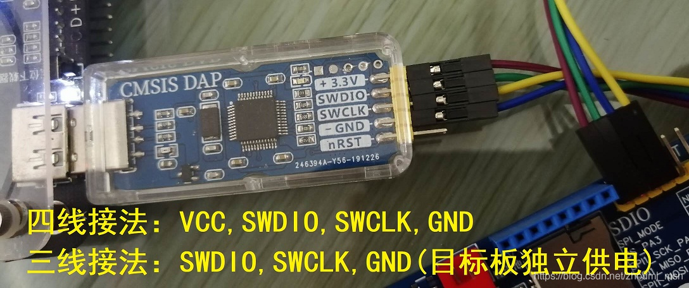
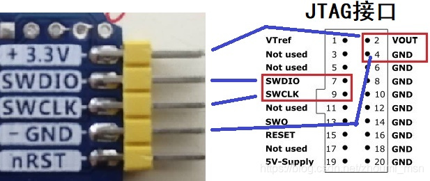

# CMSIS-DAP-dat

matching [[SDK-dat]] - [[MDK-ARM-dat]]

- [[arduino-ide-dat]]

## hardware 

- [[USB-STM32-dat]]

## target board 

- [[NRF51822-dat]] - [[nordic-dat]]

- [[STM32-dat]]

## Wiring 

## Software Setup - Keil 

## repo 

- https://github.com/Edragon/DAPCmdr == https://github.com/XIVN1987/DAPCmdr
- https://github.com/Edragon/CMSIS-DAP == https://github.com/x893/CMSIS-DAP
- https://github.com/Edragon/CMSIS-DAP2

## ref 

- [[CMSIS-dap]] - [[stm32-dat]] - [[daplink-dat]]