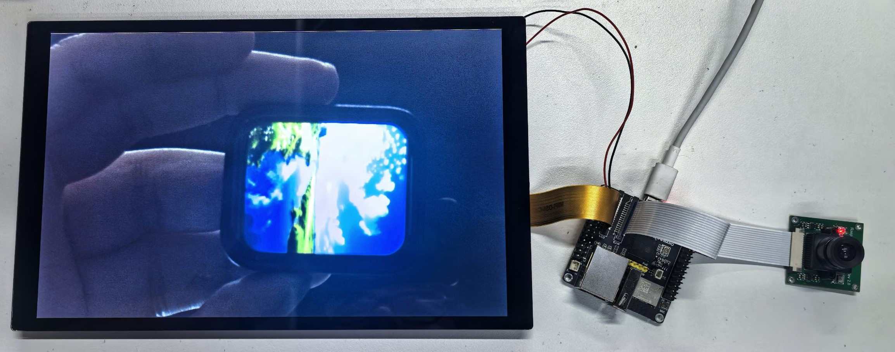
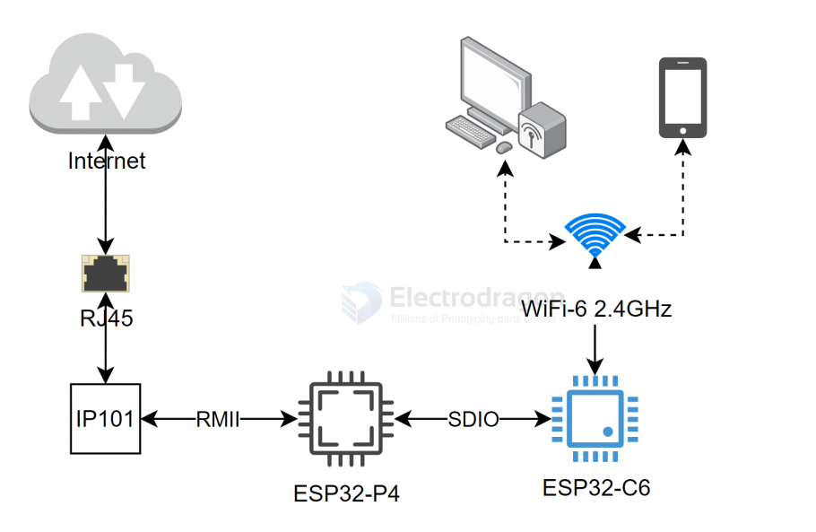
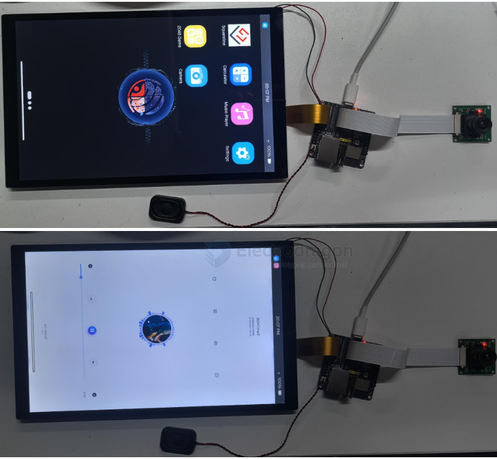

# ESP32-P4-SDK-dat

- [[ESP-IDF-vscode-dat]]

- [[interface-SDK-dat]]

- [[I2C-dat]] - [[I2C-SDK-dat]]

- [[ethernet-dat]] - [[ethernet-SDK-dat]]

- [[memory-dat]] - [[SD-dat]] - [[SD-SDK-dat]]

- [[wifi-dat]] - [[wifi-SDK-dat]]

- [[I2S-dat]] - [[I2S-SDK-dat]]

- [[display-dat]] - [[display-SDK-dat]] - [[MIPI-DSI-SDK-dat]]


## relevant library 

| Library Name              | Description                                 | Version  | Installation Requirement   |
|---------------------------|---------------------------------------------|----------|---------------------------|
| GFX_Library_for_Arduino   | GFX library for SH8601                      | v1.6.0   | Offline installation      |
| lvgl                      | LVGL graphics library                       | v9.3.0   | Recommended offline       |
| displays                  | I2C driver, display and touch definitions   | —        | Offline installation      |
| lv_conf.h                 | LVGL configuration file                     | —        | Offline installation      |


## demos 

| Demo Name            | Description                                                                 | Dependencies                        |
|----------------------|-----------------------------------------------------------------------------|-------------------------------------|
| HelloWorld           | Demonstrates basic graphics library features, tests display performance, random text | GFX_Library_for_Arduino, displays   |
| Drawing_board        | Touch drawing test                                                           | GFX_Library_for_Arduino, displays   |
| AsciiTable           | Prints ASCII characters by row/column based on screen size                    | GFX_Library_for_Arduino, displays   |
| GFX_ESPWiFiAnalyzer  | Draws WiFi band signal strength on screen                                     | GFX_Library_for_Arduino, displays   |
| LVGLV9_Arduino       | LVGL demo                                                                    | LVGL, GFX_Library_for_Arduino, displays |


## advance examples 


### MIPI-CSI To MIPI-DSI (Real-Time Display)

This example demonstrates how to use the `esp_driver_cam` component to capture camera sensor signals and display them via the DSI interface. The ESP camera sensor driver (`esp_cam_sensor`) captures signals through the CSI interface and displays them via DSI.

**Required Hardware:**
- OV5647 camera
- 10.1-inch display and accessories
- ESP32-P4 (host)

**Steps:**
1. Connect the hardware: power the display from ESP32-P4's 5V/GND, connect the camera and display ribbon cables.
2. Use a Type-C to USB cable to connect ESP32-P4 to your PC.
3. Open the project, select the esp32p4 core, then click the 🔥 (build/flash/monitor) button. When complete, you should see the display showing the camera's real-time feed (example shown with ESP32-S3-Touch-AMOLED-1.8):



### ETH To WiFi

This example shows how the onboard ESP32-C6 (slave) on ESP32-P4  enables WiFi AP functionality after ESP32-P4 registers the network via IP101. The workflow is illustrated below:



**Required Hardware:**
- ESP32-P4  (host)
- Switch with PoE and Ethernet cable
- PoE Module (optional)

**Steps:**
1. Open the project, select the esp32p4 core, then click the 🔥 (build/flash/monitor) button.
2. Connect the Ethernet cable and check WiFi connectivity. If you have the Luckfox PoE Module, you can power and connect to the network directly via a PoE switch.

### LVGL

- [[LVGL-SDK-dat]] - [[LVGL-dat]] - [[interface-SDK-dat]]

### ESP-Phone

This example, based on ESP_Brookesia, demonstrates an Android-like interface with many different apps. It uses the board's MIPI-DSI, MIPI-CSI, ESP32-C6, SD card, and audio interfaces. You can use ESP_Brookesia as a template for efficient multimedia application development.

**Required Hardware:**
- 10.1-inch display and accessories
- OV5647 or SC2336 camera and ribbon cable - [[camera-dat]]
- 8Ω 2W speaker
- ESP32-P4  (host)

**Steps:**
1. The driver for the 10.1-inch display is packaged as a component and available in the ESP Component Registry.
2. Add the component to your project:
   ```sh
   idf.py add-dependency "waveshare/esp_lcd_jd9365_10_1"
   ```
3. Open your project, select the esp32p4 core, then click the 🔥 (build/flash/monitor) button. When complete, you should see the screen:



## ref 

- [[ESP32-P4-SDK]]

- [[ESP-SDK-dat]] - [[ESP-SDK]] - [[SDK]]