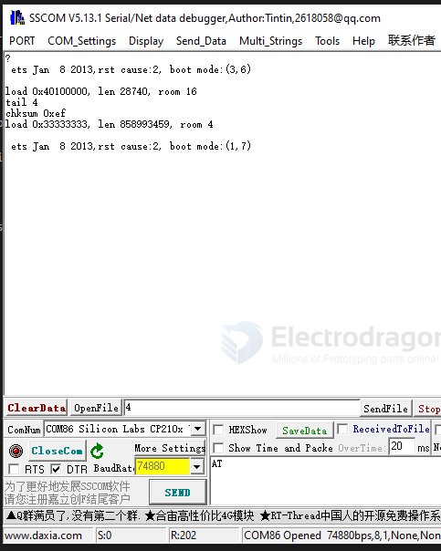

# ESP8266-boot-log-dat

## normal flash boot log 

Baud rate 74880 is what the ESP8266 bootloader uses. The apps on top of the Espressif SDK (e.g. Arduino sketch) talk at 115200 if not specified otherwise.

**the normal reset boot ** == CORRECT

    ets Jan  8 2013,rst cause:2, boot mode:(3,6)

    load 0x40100000, len 28740, room 16 
    tail 4
    chksum 0xef
    load 0x33333333, len 858993459, room 4 

boot mode:(3,6) → GPIO0 is LOW (indicating flash mode, not normal run mode). This means the ESP8266 is still in flashing mode, and won't run user code.

## the prog mode boot 

flash boot mode 

    ets Jan  8 2013,rst cause:2, boot mode:(1,6)

    ets Jan  8 2013,rst cause:2, boot mode:(1,7)

download mode 

    ets Jan  8 2013,rst cause:2, boot mode:(1,6)

    or 
    
    rl\0l湠|\0宭鄚?l?b|巶?抮抌?b岒nn瀕nn溾?bpp寧lrlrl

## module default boot log

    ets Jan  8 2013,rst cause:2, boot mode:(3,6)

    load 0x40100000, len 1856, room 16 
    tail 0
    chksum 0x63
    load 0x3ffe8000, len 776, room 8 
    tail 0
    chksum 0x02
    load 0x3ffe8310, len 552, room 8 
    tail 0
    chksum 0x79
    csum 0x79

    2nd boot version : 1.5
    SPI Speed      : 40MHz
    SPI Mode       : DIO
    SPI Flash Size & Map: 32Mbit(512KB+512KB)
    jump to run user1 @ 1000

## AIT firmware bootload mode 

    rl\0l湠|\0宭鄚?l?b|巶?抮抌?b岒nn瀕nn溾?bp寧lrlrlp騨??lbn鈢ll帋b岒nn頫0l寧l`?nnl`nr帓抧忪l`p騨?r寽溾?bn鈢鞄帋b岒nn頫0l`?nnl`nr帓抧宭`p騨?r寽溾囔lbn鈢l巖?b岒nn頫0l`?nnl`nr帓抧騦l`r拻n騦l`rl寣n湆騨n瀸炩宺nnn?l宐rrl\0?抣?拻??巐ll~rl\0?抣lln溾\0?悓~抈\0?抣寪n鄮n鞉n~寣ll鄝b鞂llpb?br倢靗`nl巔岇l`bl`l拻n瀗寬鈔l瀨bll`rl屸?俷鞉r傭n|?ll鞄l屸r抣宭?l`屸r抣靗?l`屸r抣帪\0?ll`rl巶rl尀鈱bl宐r|巄p`靗靊lr宭b祢n顎nn?宭騪l?l寧???巐?l€n黒0尀鈱bl鞄p尀鈱bl宐prlrl
    Ai-Thinker Technology Co. Ltd.

    ready

or in 74880 baud rate output 

    2nd boot version : 1.5
    SPI Speed      : 40MHz
    SPI Mode       : DIO
    SPI Flash Size & Map: 32Mbit(512KB+512KB)
    jump to run user1 @ 1000

    rf[112] : 03
    rf[113] : 00
    rf[114] : 01

    SDK ver: 1.5.4(baaeaebb) compiled @ May 17 2016 19:23:54
    phy ver: 972, pp ver: 10.1

    mode : softAP(46:17:93:0a:04:4d)
    add if1
    dhcp server start:(ip:192.168.4.1,mask:255.255.255.0,gw:192.168.4.1)
    bcn 100
    @奪-nP隡T'悟w??+?j?!PKT\	)礍U5)nZP権?ERK吷X	)d?	5Y
    鳯ZP楯?RK呏eE@蔜@蛓P
    LZPJJ?E	J?
    ?p-蒠5折^P媕)\07???)i@H?Q\0!m)\07
    %CCMi
    )刏s衠?[篮??藦€5n劳??\0黵f[112] : 03
    rf[113] : 00
    rf[114] : 01

    SDK ver: 1.5.4(baaeaebb) compiled @ May 17 2016 19:23:54
    phy ver: 972, pp ver: 10.1

    ^谡€钍耸顯)嚸
    )蛨?

## custom flash firmware 

for [[esp-relay-board-dat]]

    rl\0l湠|\0宭鄚?l?b|巶?抮抌?b岒nn瀕nn溾?bp寧lrlrlp騨??l寽bn鈢l?巄岒nn頫0l寧l`?nnl`nr帓抧b?lr拻nb?l?l寽?l宭`鼈n?
    mounting FS...
    mounted file system
    read your my_device ID ESP_574524 from json 
    *WM: Adding parameter
    *WM: server
    *WM: Adding parameter
    *WM: port
    *WM: Adding parameter
    *WM: user
    *WM: Adding parameter
    *WM: pass
    *WM: Adding parameter
    *WM: my_device
    *WM: 
    *WM: AutoConnect
    *WM: Connecting as wifi client...
    *WM: Using last saved values, should be faster
    *WM: Connection result: 
    *WM: 0
    *WM: SET AP STA
    *WM: 
    *WM: Configuring access point... 
    *WM: ESP_Relay_Board
    *WM: AP IP address: 
    *WM: 192.168.4.1
    *WM: HTTP server started

## ref 

- [[ESP8266-SDK-dat]]