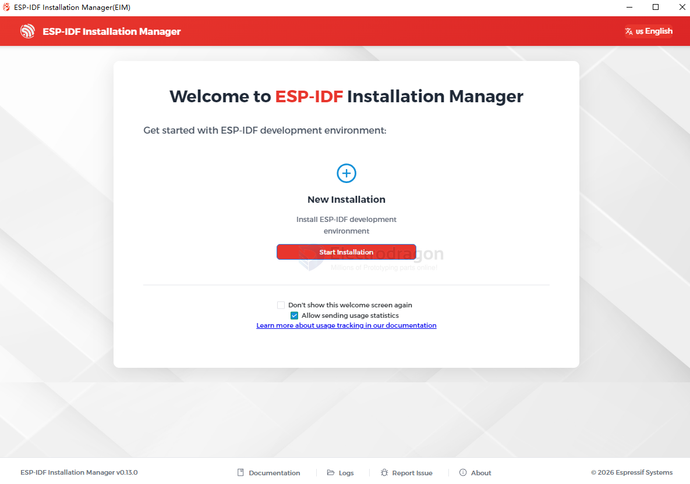

# ESP-IDF-install-dat

## install done 

    Using Python in C:\ESP\python_env\idf5.5_py3.11_env\Scripts
    Python 3.11.2
    Using Git in C:\ESP\tools\idf-git\2.44.0\cmd
    git version 2.44.0.windows.1
    Activating ESP-IDF 5.5
    Setting IDF_PATH to 'C:\ESP\frameworks\esp-idf-v5.5.4'.
    * Checking python version ... 3.11.2
    * Checking python dependencies ... OK
    * Deactivating the current ESP-IDF environment (if any) ... OK
    * Establishing a new ESP-IDF environment ... OK
    * Identifying shell ... powershell.exe
    * Detecting outdated tools in system ... Found tools that are not used by active ESP-IDF version.
    For removing old versions of idf-driver, idf-python-wheels use command 'python.exe C:\ESP\frameworks\esp-idf-v5.5.4\tools\idf_tools.py uninstall'
    To free up even more space, remove installation packages of those tools.
    Use option python.exe C:\ESP\frameworks\esp-idf-v5.5.4\tools\idf_tools.py uninstall --remove-archives.

    Done! You can now compile ESP-IDF projects.
    Go to the project directory and run:

    idf.py build

## install windows 2026 

winget install Espressif.EIM

custom installation path set to `d:\esp`

### offline installer == better

https://dl.espressif.com/dl/idf-installer/esp-idf-tools-setup-offline-5.5.4.exe

https://dl.espressif.com/dl/idf-installer/esp-idf-tools-setup-espressif-ide-3.1.0-with-esp-idf-5.3.1.exe

https://dl.espressif.cn/dl/esp-idf/

## install 

- [[esp-idf-vscode-dat]] - [[vscode-dat]]

* [esp-idf github](https://github.com/espressif/esp-idf)

- https://docs.espressif.com/projects/esp-idf/en/latest/esp32c2/index.html

- https://github.com/espressif/esp-idf

- https://idf.espressif.com/

[windows installation](https://docs.espressif.com/projects/esp-idf/en/stable/esp32/get-started/windows-setup.html)

- [[esp-idf-vscode-dat]]

[Standard Toolchain Setup for Linux and macOS](https://docs.espressif.com/projects/esp-idf/en/latest/esp32c3/get-started/linux-macos-setup.html)

[examples ](https://github.com/espressif/esp-idf/tree/master/examples)

[project tamplate ](https://github.com/espressif/esp-idf-template)

- [[protocols-dat]]

## vscode 

- [[vscode-dat]] - [[vs-cpp-dat]]

ESP32-C3

- install [[vs-cpp-dat]]

Download an archive with submodules included
Attached to this release is an esp-idf-v5.0.zip archive. It includes .git directory and all the submodules, so can be used out of the box. This archive is provided for users who have connectivity issues preventing them from cloning from GitHub.

This archive can also be downloaded from Espressif's download server:
https://dl.espressif.com/github_assets/espressif/esp-idf/releases/download/v5.0/esp-idf-v5.0.zip

- idf install python 3.11
- idf-vs install python 3.8.7

### installer

Espressif-IDE

ESP-IDF

install.bat
Selected targets are: esp32c3, esp32c2, esp32, esp32s3, esp32h2, esp32s2
Installing tools: xtensa-esp-elf-gdb, riscv32-esp-elf-gdb, xtensa-esp32-elf, xtensa-esp32s2-elf, xtensa-esp32s3-elf, riscv32-esp-elf, esp32ulp-elf, cmake, openocd-esp32, ninja, idf-exe, ccache, dfu-util

C:\Users\Administrator\.espressif

Setting up Python environment
Creating a new Python environment in C:\Users\Administrator\.espressif\python_env\idf5.0_py3.10_env

## ref 

- [[powershell-dat]] - [[proxy-dat]]