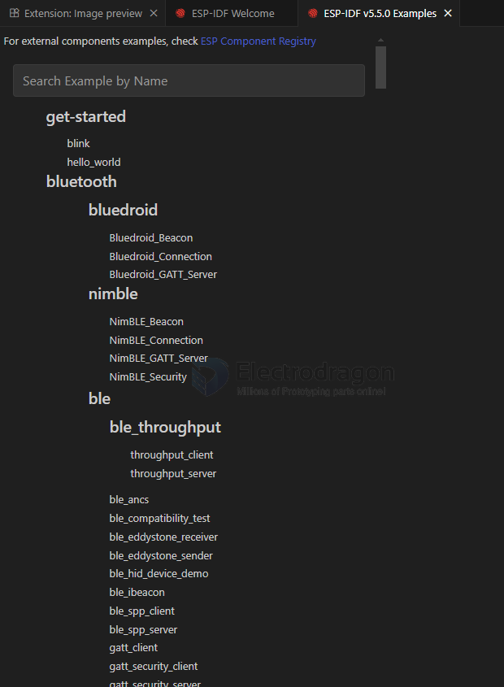

# ESP IDF

- [[esp-idf-vscode-dat]]

* [esp-idf github](https://github.com/espressif/esp-idf)

- https://docs.espressif.com/projects/esp-idf/en/latest/esp32c2/index.html

- https://github.com/espressif/esp-idf

- https://idf.espressif.com/

[windows installation](https://docs.espressif.com/projects/esp-idf/en/stable/esp32/get-started/windows-setup.html)

- [[esp-idf-vscode-dat]]

[Standard Toolchain Setup for Linux and macOS](https://docs.espressif.com/projects/esp-idf/en/latest/esp32c3/get-started/linux-macos-setup.html)

[examples ](https://github.com/espressif/esp-idf/tree/master/examples)

[project tamplate ](https://github.com/espressif/esp-idf-template)

- [[protocols-dat]]

### offline installer 
https://dl.espressif.cn/dl/esp-idf/

ESP32-C3

- install [[vs-cpp-dat]]

Download an archive with submodules included
Attached to this release is an esp-idf-v5.0.zip archive. It includes .git directory and all the submodules, so can be used out of the box. This archive is provided for users who have connectivity issues preventing them from cloning from GitHub.

This archive can also be downloaded from Espressif's download server:
https://dl.espressif.com/github_assets/espressif/esp-idf/releases/download/v5.0/esp-idf-v5.0.zip

### installer

Espressif-IDE

ESP-IDF

install.bat
Selected targets are: esp32c3, esp32c2, esp32, esp32s3, esp32h2, esp32s2
Installing tools: xtensa-esp-elf-gdb, riscv32-esp-elf-gdb, xtensa-esp32-elf, xtensa-esp32s2-elf, xtensa-esp32s3-elf, riscv32-esp-elf, esp32ulp-elf, cmake, openocd-esp32, ninja, idf-exe, ccache, dfu-util

C:\Users\Administrator\.espressif

Setting up Python environment
Creating a new Python environment in C:\Users\Administrator\.espressif\python_env\idf5.0_py3.10_env

## example - blink 

start from example 

## commands 

COMMANDS - build project 

- Select Current Project workspace folder
- **Select current ESP-IDF version ** == UART / JTAG / DFU 
- ESP-IDF: Select Flash Method
- Select Port to Use (COM, tty, usbserial)
- Select Monitor Port to Use (COM, tty, usbserial)
- Select Project Configuration
- Set Espressif Device Target (IDF_TARGET)
- SDK Configuration Editor (menuconfig) 
- Full Clean
- **Build Project**
- Flash Device
- Monitor Device
- Debug
- ESP-IDF: Build, Flash and Monitor
- Open ESP-IDF Terminal
- Execute Custom Task
- Start/Stop QEMU Server
[OpenOCD Server] 

Advanced

## compile 

### compile ninja 

 *  Executing task: e:\work-data\IDF_tools\tools\ninja\1.12.1\ninja.EXE  

    [1/4] C:\WINDOWS\system32\cmd.exe /C "cd /D E:\Git...-Arduino/esp-idf-code/blink/blink/build/blink.bin 
    blink.bin binary size 0x270c0 bytes. Smallest app partition is 0x100000 bytes. 0xd8f40 bytes (85%) free.
    [2/4] Performing build step for 'bootloader'
    [1/1] C:\WINDOWS\system32\cmd.exe /C "cd /D E:\Git-category\Git-Arduino\esp-idf-code\blink\blink\build\bootloader\esp-idf\esptool_py && e:\work-data\IDF_tools\python_env\idf5.5_py3.11_env\Scripts\python.exe E:/work-data/IDF/v5.5/esp-idf/components/partition_table/check_sizes.py --offset 0x8000 bootloader 0x1000 E:/Git-category/Git-Arduino/esp-idf-code/blink/blink/build/bootloader/bootloader.bin"
    Bootloader binary size 0x6680 bytes. 0x980 bytes (8%) free.
    [4/4] Completed 'bootloader'

### compile summary 

                             Memory Type Usage Summary

    ┏━━━━━━━━━━━━━━━━━━━━━━━┳━━━━━━━━━━━━━━┳━━━━━━━━━━┳━━━━━━━━━━━━━━━━┳━━━━━━━━━━━━━━━┓
    ┃ Memory Type/Section   ┃ Used [bytes] ┃ Used [%] ┃ Remain [bytes] ┃ Total [bytes] ┃
    ┡━━━━━━━━━━━━━━━━━━━━━━━╇━━━━━━━━━━━━━━╇━━━━━━━━━━╇━━━━━━━━━━━━━━━━╇━━━━━━━━━━━━━━━┩
    │ Flash Code            │        67126 │          │                │               │
    │    .text              │        67126 │          │                │               │
    │ IRAM                  │        52151 │    39.79 │          78921 │        131072 │
    │    .text              │        51123 │     39.0 │                │               │
    │    .vectors           │         1028 │     0.78 │                │               │
    │ Flash Data            │        31800 │          │                │               │
    │    .rodata            │        31544 │          │                │               │
    │    .appdesc           │          256 │          │                │               │
    │ DRAM                  │        10864 │     6.01 │         169872 │        180736 │
    │    .data              │         8712 │     4.82 │                │               │
    │    .bss               │         2152 │     1.19 │                │               │
    │ RTC FAST              │           32 │     0.39 │           8160 │          8192 │
    │    .force_fast        │           32 │     0.39 │                │               │
    │ RTC SLOW              │           24 │     0.29 │           8168 │          8192 │
    │    .rtc_slow_reserved │           24 │     0.29 │                │               │
    └───────────────────────┴──────────────┴──────────┴────────────────┴───────────────┘

Total image size: 159821 bytes (.bin may be padded larger)

Note: The reported total sizes may be smaller than those in the technical reference manual due to reserved memory and application configuration. The total flash size available for the application is not included by default, as it cannot be reliably determined due to the presence of other data like the bootloader, partition table, and application partition size.

### Flash 

JTAG == [[JTAG-dat]]    

DFU == [[DFU-dat]]

UART == [[serial-dat]]

    *  Executing task: e:\work-data\IDF_tools\python_env\idf5.5_py3.11_env\Scripts\python.exe e:\work-data\IDF\v5.5\esp-idf\components\esptool_py\esptool\esptool.py -p COM1 -b 460800 --before default_reset --after hard_reset --chip esp32 write_flash --flash_mode dio --flash_freq 40m --flash_size 2MB 0x1000 bootloader/bootloader.bin 0x10000 blink.bin 0x8000 partition_table partition-table.bin 

    esptool.py v4.9.0
    Serial port COM1
    Connecting......................................

## monitor devices 

    PS E:\Git-category\Git-Arduino\esp-idf-code\blink\blink>  & 'e:\work-data\IDF_tools\python_env\idf5.5_py3.11_env\Scripts\python.exe' 'e:\work-data\IDF\v5.5\esp-idf\tools\idf_monitor.py' -p COM1 -b 115200 --toolchain-prefix xtensa-esp32-elf- --make '''e:\work-data\IDF_tools\python_env\idf5.5_py3.11_env\Scripts\python.exe'' ''e:\work-data\IDF\v5.5\esp-idf\tools\idf.py''' --target esp32 'e:\Git-category\Git-Arduino\esp-idf-code\blink\blink\build\blink.elf'
    --- Warning: GDB cannot open serial ports accessed as COMx
    --- Using \\.\COM1 instead...
    --- esp-idf-monitor 1.7.0 on \\.\COM1 115200
    --- Quit: Ctrl+] | Menu: Ctrl+T | Help: Ctrl+T followed by Ctrl+H

