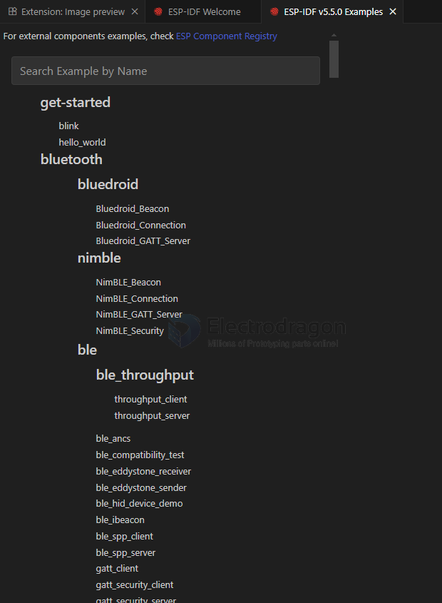

# ESP-IDF-dat

- [[C-dat]] - [[cmake-dat]] - [[esp-CMakelists-dat]] 

- [[sdkconfig-dat]] - [[menuconfig-dat]]

- [[esp-idf-vscode-dat]] 

- [[esp-idf-error-dat]] 

- [[interface-SDK-dat]] - [[I2C-SDK-dat]] - [[ethernet-SDK-dat]]

- [[ESP-IDF-install-dat]]


## CMD 

cmd init. 

    Setting PYTHONNOUSERSITE, was not set
    Using Python in c:\ESP\python_env\idf5.5_py3.11_env\Scripts\
    Python 3.11.2
    Using Git in c:\ESP\tools\idf-git\2.44.0\cmd\
    git version 2.44.0.windows.1
    Activating ESP-IDF 5.5
    warning:  IDF_PATH is changed from 'c:\ESP\frameworks\esp-idf-v5.5.4' to 'C:\ESP\frameworks\esp-idf-v5.5.4'.
    * Checking python version ... 3.11.2
    * Checking python dependencies ... OK
    * Deactivating the current ESP-IDF environment (if any) ... OK
    * Establishing a new ESP-IDF environment ... OK
    * Identifying shell ... cmd.exe
    * Detecting outdated tools in system ... Found tools that are not used by active ESP-IDF version.
    For removing old versions of idf-driver, idf-python-wheels use command 'python.exe C:\ESP\frameworks\esp-idf-v5.5.4\tools\idf_tools.py uninstall'
    To free up even more space, remove installation packages of those tools.
    Use option python.exe C:\ESP\frameworks\esp-idf-v5.5.4\tools\idf_tools.py uninstall --remove-archives.

    Done! You can now compile ESP-IDF projects.
    Go to the project directory and run:

    idf.py build


    c:\ESP\frameworks\esp-idf-v5.5.4>

An ESP-IDF project has a specific directory structure:

    i2s_es8311/                      <-- PROJECT ROOT (Run idf.py build HERE)
    ├── CMakeLists.txt               <-- Includes ESP-IDF build system (include($ENV{IDF_PATH}/tools/cmake/project.cmake))
    ├── main/                        <-- Sub-component
    │   ├── CMakeLists.txt           <-- Registers the main component (idf_component_register(...))
    │   └── main.c

# ESP-IDF Build Workflow

```cmd
:: 1. Navigate to project root
E:
cd E:\git-DL\WeActStudio.ES8311MonoAudioCodecModule\Examples\i2s_es8311

:: 2. Clean invalid build artifacts
rmdir /s /q main\build
idf.py fullclean

:: 3. Set target and build (change esp32 to esp32s3/esp32c3 if needed)
idf.py set-target esp32-s3
idf.py build

:: 4. Flash and monitor (replace COM3 with your actual port)
idf.py -p COM3 flash monitor
```

output 

    Creating esp32s3 image...
    Merged 2 ELF sections
    Successfully created esp32s3 image.
    Generated E:/git-DL/WeActStudio.ES8311MonoAudioCodecModule/Examples/i2s_es8311/build/i2s-es8311-example.bin
    [650/650] C:\WINDOWS\system32\cmd.exe /C "cd /D E:\git-DL\WeAct...ioCodecModule/Examples/i2s_es8311/build/i2s-es8311-example.bin"
    i2s-es8311-example.bin binary size 0xd8030 bytes. Smallest app partition is 0x100000 bytes. 0x27fd0 bytes (16%) free.

    Project build complete. To flash, run:
    idf.py flash
    or
    idf.py -p PORT flash
    or
    python -m esptool --chip esp32s3 -b 460800 --before default_reset --after hard_reset write_flash --flash_mode dio --flash_size 2MB --flash_freq 80m 0x0 build\bootloader\bootloader.bin 0x8000 build\partition_table\partition-table.bin 0x10000 build\i2s-es8311-example.bin
    or from the "E:\git-DL\WeActStudio.ES8311MonoAudioCodecModule\Examples\i2s_es8311\build" directory
    python -m esptool --chip esp32s3 -b 460800 --before default_reset --after hard_reset write_flash "@flash_args"

    E:\git-DL\WeActStudio.ES8311MonoAudioCodecModule\Examples\i2s_es8311>


### supports 

MSys/Mingw is not supported

    Administrator@HC-work MINGW64 /d/git-docs/edragon$ /c/ESP/frameworks/esp-idf-v5.5.4/install.sh
    INFO: Using IDF_PATH '/c/ESP/frameworks/esp-idf-v5.5.4' for installation.
    Detecting the Python interpreter
    Checking "python3" ...
    Python 3.14.5
    "python3" has been detected
    Checking Python compatibility
    Installing ESP-IDF tools
    ERROR: MSys/Mingw is not supported. Please follow the getting started guide of the documentation to set up a supported environment


## demo code 

- https://github.com/Edragon/esp-idf-code

## how to use a downloaded project 

- replace .vscode/settings.json with your own .vscode/settings.json
- optionally replace .vsconde/c_cpp_properties.json with your own .vscode/c_cpp_properties.json


## start a project 

- [[template-app-dat]]


## example - blink 

start from example 




## commands 

COMMANDS - build project 

- Select Current Project workspace folder
- **Select current ESP-IDF version ** == UART / JTAG / DFU 
- ESP-IDF: Select Flash Method
- Select Port to Use (COM, tty, usbserial)
- Select Monitor Port to Use (COM, tty, usbserial)
- Select Project Configuration
- Set Espressif Device Target (IDF_TARGET)
- SDK Configuration Editor (menuconfig) 
- Full Clean
- **Build Project**
- Flash Device
- Monitor Device
- Debug
- ESP-IDF: Build, Flash and Monitor
- Open ESP-IDF Terminal
- Execute Custom Task
- Start/Stop QEMU Server
[OpenOCD Server] 

Advanced


## compile 


    *******************************************************************************
    # ESP-IDF Partition Table
    # Name, Type, SubType, Offset, Size, Flags
    nvs,data,nvs,0x9000,24K,
    phy_init,data,phy,0xf000,4K,
    factory,app,factory,0x10000,1M,
    *******************************************************************************
    [75/1063] Building C object esp-idf/esp_driver_i2s/CMakeFiles/__idf_esp_driver_i2s.dir/i2s_tdm.c.obj


### compile ninja 

 *  Executing task: e:\work-data\IDF_tools\tools\ninja\1.12.1\ninja.EXE  

    [1/4] C:\WINDOWS\system32\cmd.exe /C "cd /D E:\Git...-Arduino/esp-idf-code/blink/blink/build/blink.bin 
    blink.bin binary size 0x270c0 bytes. Smallest app partition is 0x100000 bytes. 0xd8f40 bytes (85%) free.
    [2/4] Performing build step for 'bootloader'
    [1/1] C:\WINDOWS\system32\cmd.exe /C "cd /D E:\Git-category\Git-Arduino\esp-idf-code\blink\blink\build\bootloader\esp-idf\esptool_py && e:\work-data\IDF_tools\python_env\idf5.5_py3.11_env\Scripts\python.exe E:/work-data/IDF/v5.5/esp-idf/components/partition_table/check_sizes.py --offset 0x8000 bootloader 0x1000 E:/Git-category/Git-Arduino/esp-idf-code/blink/blink/build/bootloader/bootloader.bin"
    Bootloader binary size 0x6680 bytes. 0x980 bytes (8%) free.
    [4/4] Completed 'bootloader'


### compile summary 

                             Memory Type Usage Summary

    ┏━━━━━━━━━━━━━━━━━━━━━━━┳━━━━━━━━━━━━━━┳━━━━━━━━━━┳━━━━━━━━━━━━━━━━┳━━━━━━━━━━━━━━━┓
    ┃ Memory Type/Section   ┃ Used [bytes] ┃ Used [%] ┃ Remain [bytes] ┃ Total [bytes] ┃
    ┡━━━━━━━━━━━━━━━━━━━━━━━╇━━━━━━━━━━━━━━╇━━━━━━━━━━╇━━━━━━━━━━━━━━━━╇━━━━━━━━━━━━━━━┩
    │ Flash Code            │        67126 │          │                │               │
    │    .text              │        67126 │          │                │               │
    │ IRAM                  │        52151 │    39.79 │          78921 │        131072 │
    │    .text              │        51123 │     39.0 │                │               │
    │    .vectors           │         1028 │     0.78 │                │               │
    │ Flash Data            │        31800 │          │                │               │
    │    .rodata            │        31544 │          │                │               │
    │    .appdesc           │          256 │          │                │               │
    │ DRAM                  │        10864 │     6.01 │         169872 │        180736 │
    │    .data              │         8712 │     4.82 │                │               │
    │    .bss               │         2152 │     1.19 │                │               │
    │ RTC FAST              │           32 │     0.39 │           8160 │          8192 │
    │    .force_fast        │           32 │     0.39 │                │               │
    │ RTC SLOW              │           24 │     0.29 │           8168 │          8192 │
    │    .rtc_slow_reserved │           24 │     0.29 │                │               │
    └───────────────────────┴──────────────┴──────────┴────────────────┴───────────────┘

Total image size: 159821 bytes (.bin may be padded larger)

Note: The reported total sizes may be smaller than those in the technical reference manual due to reserved memory and application configuration. The total flash size available for the application is not included by default, as it cannot be reliably determined due to the presence of other data like the bootloader, partition table, and application partition size.


### Flash 

JTAG == [[JTAG-dat]]    

DFU == [[DFU-dat]]

UART == [[serial-dat]]

    *  Executing task: e:\work-data\IDF_tools\python_env\idf5.5_py3.11_env\Scripts\python.exe e:\work-data\IDF\v5.5\esp-idf\components\esptool_py\esptool\esptool.py -p COM1 -b 460800 --before default_reset --after hard_reset --chip esp32 write_flash --flash_mode dio --flash_freq 40m --flash_size 2MB 0x1000 bootloader/bootloader.bin 0x10000 blink.bin 0x8000 partition_table partition-table.bin 

    esptool.py v4.9.0
    Serial port COM1
    Connecting......................................


## monitor devices 

    PS E:\Git-category\Git-Arduino\esp-idf-code\blink\blink>  & 'e:\work-data\IDF_tools\python_env\idf5.5_py3.11_env\Scripts\python.exe' 'e:\work-data\IDF\v5.5\esp-idf\tools\idf_monitor.py' -p COM1 -b 115200 --toolchain-prefix xtensa-esp32-elf- --make '''e:\work-data\IDF_tools\python_env\idf5.5_py3.11_env\Scripts\python.exe'' ''e:\work-data\IDF\v5.5\esp-idf\tools\idf.py''' --target esp32 'e:\Git-category\Git-Arduino\esp-idf-code\blink\blink\build\blink.elf'
    --- Warning: GDB cannot open serial ports accessed as COMx
    --- Using \\.\COM1 instead...
    --- esp-idf-monitor 1.7.0 on \\.\COM1 115200
    --- Quit: Ctrl+] | Menu: Ctrl+T | Help: Ctrl+T followed by Ctrl+H


## SDKCONFIG 

- sdkconfig
- sdkconfig.defaults
- sdkconfig.defaults.esp32
- sdkconfig.defaults.esp32c3
- sdkconfig.defaults.esp32c5
- sdkconfig.defaults.esp32c6
- sdkconfig.defaults.esp32c61
- sdkconfig.defaults.esp32h2
- sdkconfig.defaults.esp32p4
- sdkconfig.defaults.esp32s2
- sdkconfig.defaults.esp32s3

### ✅ Required Files (For ESP32-S3 Only)

| File Name                    | Required | Description                                               |
|-----------------------------|----------|-----------------------------------------------------------|
| `sdkconfig.defaults.esp32s3`| ✅       | Default configuration specific to ESP32-S3               |
| `sdkconfig`                 | ✅       | Generated after `idf.py menuconfig` or first build       |


✅ Optional Simplification

If you're only working with ESP32-S3, you can rename:

    mv sdkconfig.defaults.esp32s3 sdkconfig.defaults

Then build normally:

    idf.py build

## IDF.py 


