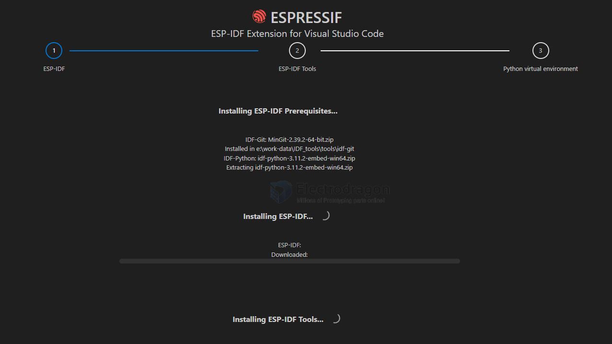
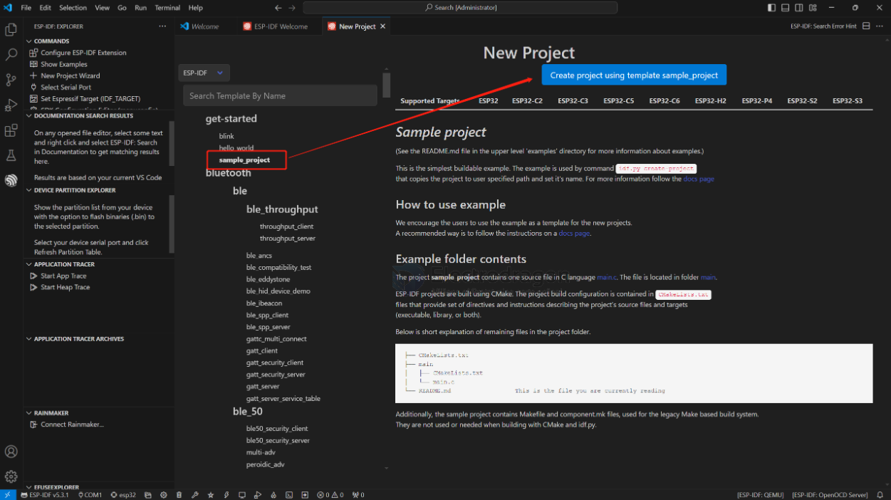
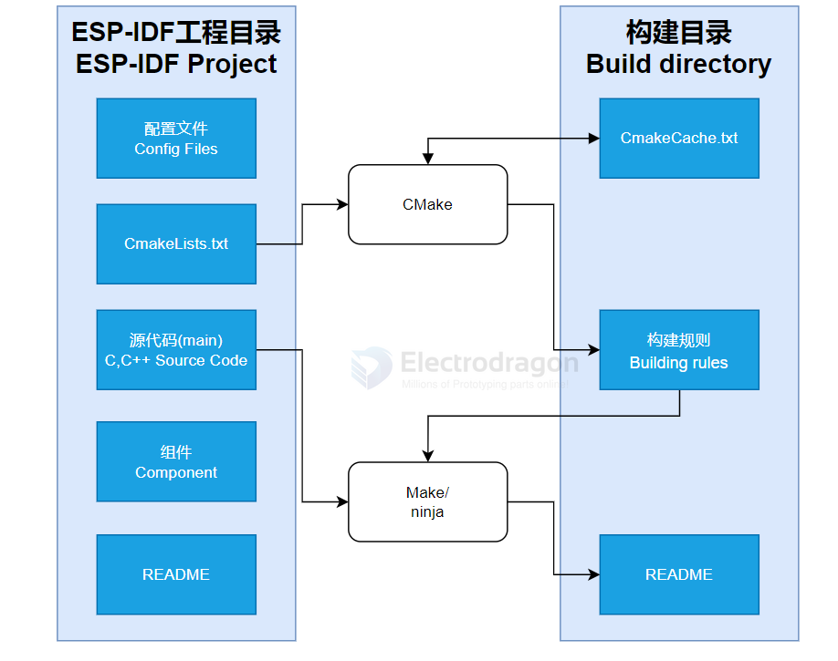
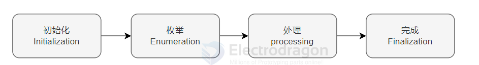
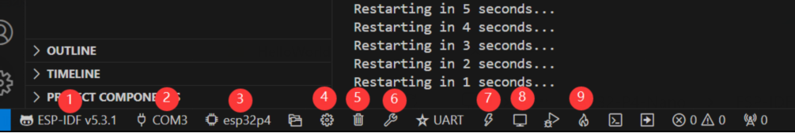
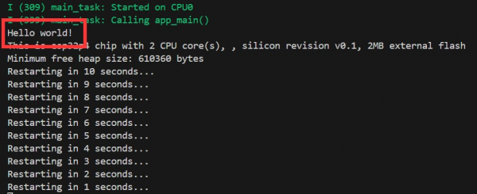

# esp-idf-vscode-dat

- [[esp-idf-vscode-install-dat]] - [[esp-idf-vscode-compile-dat]] 

- [[I2C-dat]] - [[ethernet-dat]]

e:\work-data\IDF

e:\work-data\IDF_tools



## vs-code extension 


- https://github.com/espressif/vscode-esp-idf-extension/blob/master/docs/tutorial/install.md

https://docs.espressif.com/projects/vscode-esp-idf-extension/en/latest/


- [[ESP-IDF-dat]]


## Project Start

Open the ESP-IDF extension in VS Code, click **New Project**, select an ESP-IDF example (such as `sample_project`), and click **Create**.



After creating and opening the project, you will see a typical VS Code project structure:

```
├── CMakeLists.txt
├── main
│   ├── CMakeLists.txt
│   └── main.c
└── README.md
```

## ESP-IDF Project Details

- **Component**: In ESP-IDF, a component is a basic module or library that provides specific functionality. Components are usually independent and reusable, similar to libraries in Python.
- **Component Reference**: In Python, you use `import library_name`. In ESP-IDF (C), you configure and include components via `CMakeLists.txt`.
- **Online Components**: To add an online component, use `idf.py add-dependency <componentName>`. This generates an `idf_component.yml` file for component management.
- **CMakeLists.txt**: The build tool CMake reads the top-level `CMakeLists.txt` to determine build rules and which components to include. When you add components or programs in `CMakeLists.txt`, CMake will import and build the required files accordingly.





## VS Code Bottom Toolbar Overview

When you open an ESP-IDF project, the bottom toolbar in VS Code automatically loads the environment. For ESP32-P4-NANO development, this toolbar is especially important:



- **ESP-IDF Version Manager**: Manage multiple ESP-IDF versions and switch between them as needed for different projects.
- **COM Port Selector**: Choose the port to flash your compiled program onto the chip.
- **Set Target**: Select the chip model (e.g., for ESP32-P4-NANO, choose `esp32p4`).
- **menuconfig**: Edit the `sdkconfig` configuration file.
- **Fullclean**: Clean all build files if you encounter build errors or corrupted files.
- **Build**: Compile the project.
- **Flash**: After building, select the correct COM port and flash the firmware to the chip.
- **Monitor**: After flashing, use this to view logs and debug output from the device.
- **Build Flash Monitor (Fire Icon)**: One-click to build, flash, and monitor in sequence.

## Hello World Example

After learning about the VS Code bottom toolbar, you can quickly get started with the Hello World project. This example demonstrates how to use ESP-IDF to create a basic application and covers the ESP32 development workflow: build, flash, and monitor.

When you open the Hello World example, set the target port and chip type. **Note:** When you select the chip type, the bottom right will show a loading animation—this means ESP-IDF is running `idf.py set-target esp32p4` and downloading the required architecture package. Please wait for this process to finish before building, or you may encounter errors!

Use the bottom toolbar's fire icon to build, flash, and monitor. You should see "Hello World!" output in the terminal.



## Code Explanation

The code contains only one main function, `app_main`, which uses conditional statements to determine what to print. At the end, a loop is added to restart the chip every 10 seconds.

The `app_main` function is the entry point for user applications in the ESP-IDF (Espressif IoT Development Framework). It is the core function of an ESP-IDF project, similar to the `main` function in standard C. In ESP32 development, `app_main` is scheduled as the first task by the real-time operating system (FreeRTOS), marking the start of user code execution.

## ref 

- [[ESP-SDK-dat]]