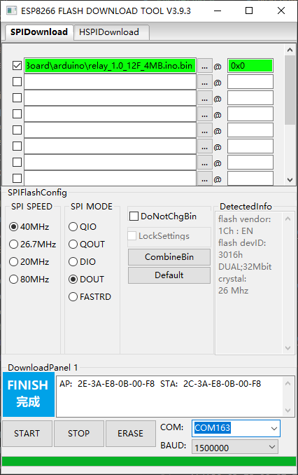
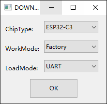
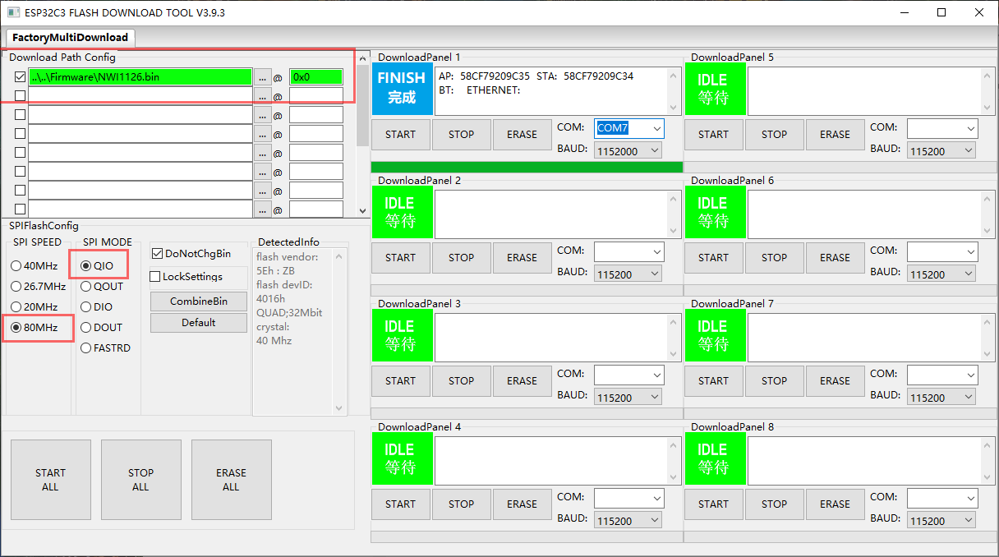
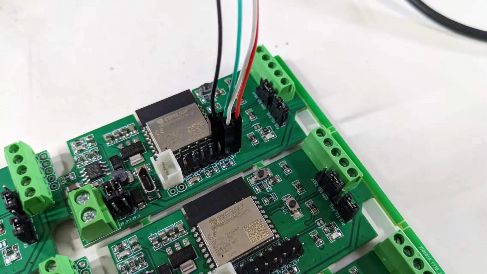
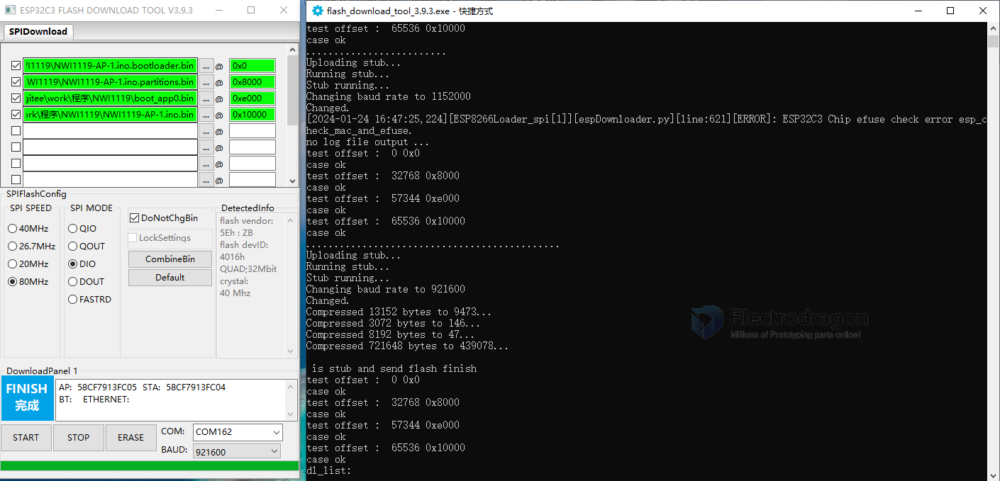
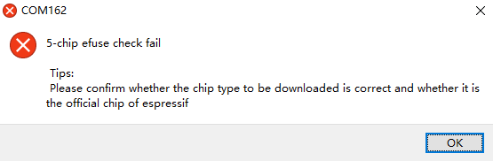
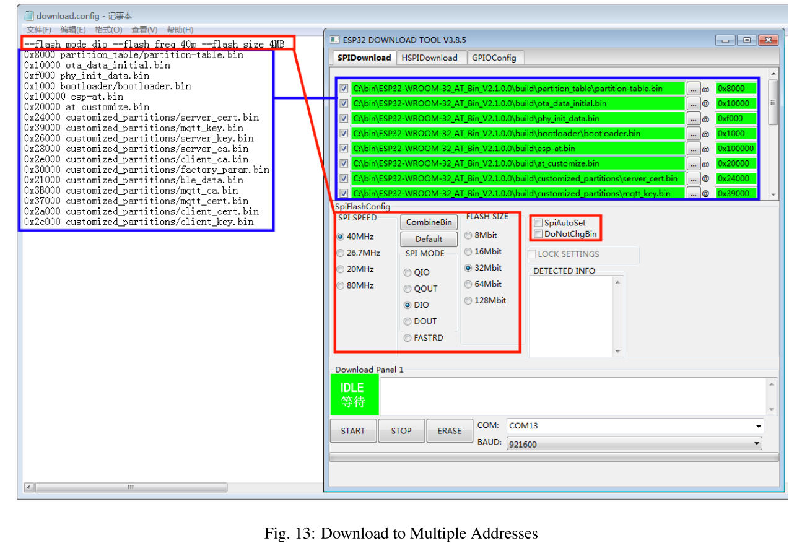

# flash-download-tool-dat

- [download from](https://www.espressif.com.cn/en/support/download/other-tools)

- [[esptool-dat]]

## ESP8266

SPI Speed 
- 40 Mhz
- 80 Mhz  

SPI Mode 

- QIO (Quad I/O): Uses 4 data lines for input/output, allowing faster data transfer between the microcontroller and flash memory.
- DIO (Dual I/O): Uses 2 data lines for input/output, offering a balance between speed and compatibility.
- DOUT (Dual Output): Uses 2 data lines but only for output (reading from flash), typically slower than DIO and QIO.

| Model   | SPI Speed | SPI Mode | Speed     |
| ------- | --------- | -------- | --------- |
| ESP-12F | 40MHz     | QIO      | 1 500 000 |

## NWI1139 

SPI = 40Mhz, SPI Mode = DOUT, speed up to ~1.5M (1 500 000, for CH340)

- [[NWI1139-dat]]

## NWI1126 

- [[NWI1126-dat]] - [[ESP32-C3-dat]]

### ESP32-C3 Factory Mode 

- Chip = ESP32-C3
- Mode = Factory
- LoadMode = UART

setup
- Flash Frequency: 40M or 80M 
- SPI Mode: QIO or DIO 

wiring with USB-TTL cable 
- Red = 5V+ Power Supply = pin1 = +5V or VCC
- Green - TXD
- White - RXD
- GND - Ground

## Upload 

ESP32-C3 
- flash speed 80M 
- flash mode DIO

## Common Error 

5-chip efuse check fail

## download to mulitple addresses

## ref 

- [[ESP8266-dat]]