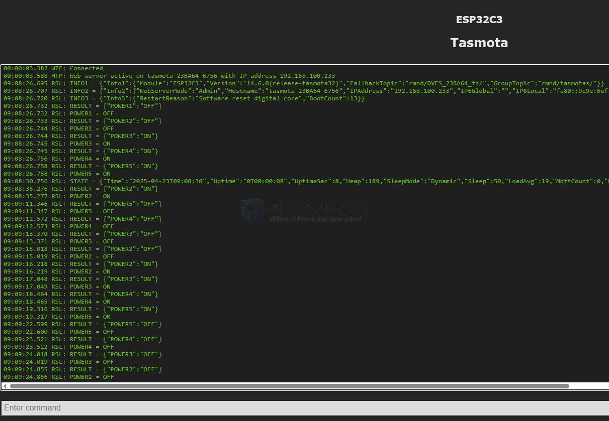

# tasmota-dat

- current release == https://github.com/arendst/Tasmota/releases/tag/v14.6.0

- [[serial-dat]] - [[ESP32-dat]] - [[ESP8266-dat]]

- [[MQTT-dat]]

- [[NWI1126-dat]]

## flashing 

## NWI1126 Log 

ESP32-C3 == after connected 

    00:00:00.251 CMD: Fall back to serial port, no SOF packet detected on USB port
    00:00:00.251 HDW: ESP32-C3 v0.4 
    00:00:00.264 UFS: FlashFS mounted with 304 kB free
    00:00:00.274 CFG: Loaded from File, Count 6
    00:00:00.280 QPC: Count 1
    00:00:00.314 BRY: Berry initialized, RAM used 4276 bytes
    00:00:00.325 Project tasmota - Tasmota Version 14.6.0(release-tasmota32)-3_1_3(2025-04-16T11:21:09)
    00:00:01.002 WIF: Connecting to AP1 111 Channel 11 BSSId 4E:F5:97:B0:C0:46 in mode HT40 as tasmota-23BA64-6756...
    00:00:03.373 WIF: Connected
    00:00:03.579 HTP: Web server active on tasmota-23BA64-6756 with IP address 192.168.100.233
    08:46:13.779 RSL: INFO1 = {"Info1":{"Module":"ESP32C3","Version":"14.6.0(release-tasmota32)","FallbackTopic":"cmnd/DVES_23BA64_fb/","GroupTopic":"cmnd/tasmotas/"}}
    08:46:13.792 RSL: INFO2 = {"Info2":{"WebServerMode":"Admin","Hostname":"tasmota-23BA64-6756","IPAddress":"192.168.100.233","IP6Global":"","IP6Local":"fe80::9e9e:6eff:fe23:ba64%st1"}}
    08:46:13.804 RSL: INFO3 = {"Info3":{"RestartReason":"Vbat power on reset","BootCount":2}}
    08:46:16.741 QPC: Reset
    08:46:18.747 RSL: STATE = {"Time":"2025-04-23T08:46:18","Uptime":"0T00:00:09","UptimeSec":9,"Heap":190,"SleepMode":"Dynamic","Sleep":50,"LoadAvg":19,"MqttCount":0,"Berry":{"HeapUsed":4,"Objects":45},"Wifi":{"AP":1,"SSId":"111","BSSId":"4E:F5:97:B0:C0:46","Channel":11,"Mode":"HT40","RSSI":100,"Signal":-44,"LinkCount":1,"Downtime":"0T00:00:03"}}

RGBW channels on relay 1..4, on board programmable LED on GPIO10 == relay 5

- refer more information at page [[NWI1126-dat]]

## demo video 

This is a first test with tasmota, better use other functionality controller maybe PWM instead relay, we are not good at tasmota, please note.

- [Esp32-c3 rgbw led drive board using tosmota demo #nwi1126](https://t.me/electrodragon3/360)

## ref 

- [[ESP-SDK-dat]]