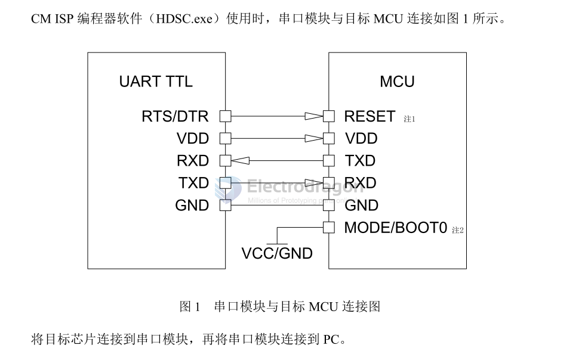

# HDSC-SDK-dat

## HDSC ISP 

1) HC32x00x 和 HC32x11x 系列无 MODE/BOOT0 引脚，串行编程时需将串口模块的 RTS 或者 DTR 连接到目标 MCU 的 RESET 引脚。 
2) 不同型号芯片的 MODE/BOOT0 引脚的连接方式可能不一样，具体请参照表  1。 

## MDK Support 

- HDSC.HC32F003.1.0.1.pack
- HDSC.HC32F005.1.0.1.pack

## SDK Driver and Examples 

- HC32F003 use HC32F005_SDK
- hc32f005_ddl_Rev1.9.0 Lite