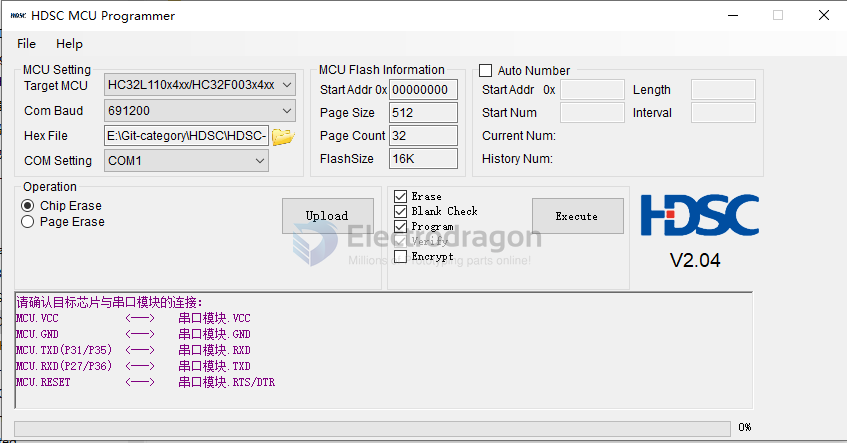
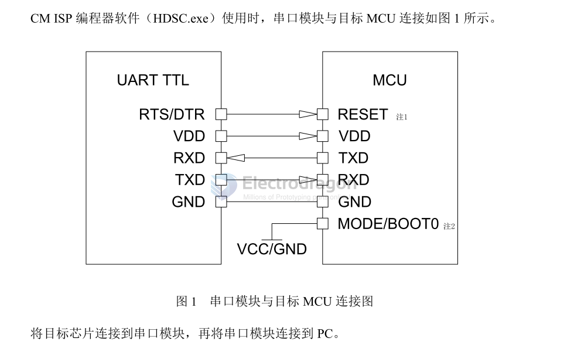
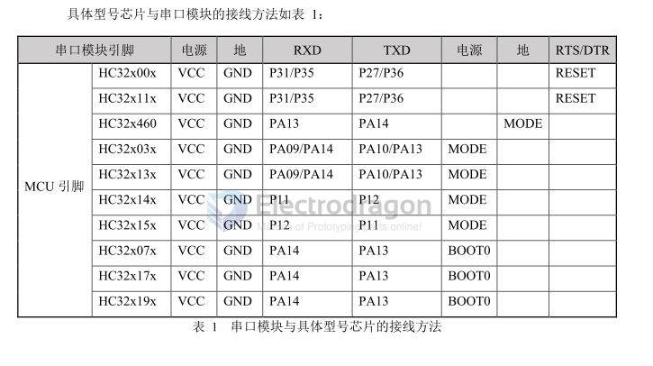
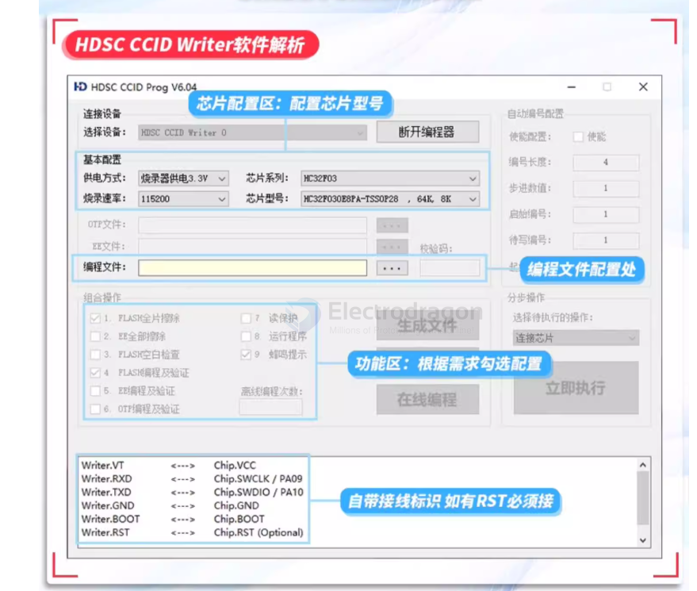

# HDSC-SDK-dat

- [[HDSC-dat]] - [[HDSC-SDK-dat]] - [[HDSC-downloader-dat]] - [[ARM1007-dat]] - [[MDK-ARM-dat]] - [[HC32F003-dat]]

- [[clang-dat]] - [[vscode-dat]] - [[SDK-dat]] - [[C-dat]]

## HDSC ISP == programmer 

1) HC32x00x 和 HC32x11x 系列无 MODE/BOOT0 引脚，串行编程时需将串口模块的 RTS 或者 DTR 连接到目标 MCU 的 RESET 引脚。 
2) 不同型号芯片的 MODE/BOOT0 引脚的连接方式可能不一样，具体请参照表  1。 

### Flash for HC32F003

- better use our [[DPR1029-dat]] board, with DTR pin 
- DTR pin should be connected to MCU's reset pin 
- VDD 3.3V or 5V 
- Serial RXD to UART1_TXD_P35
- Serial TXD to UART1_RXD_P36

请确认目标芯片与串口模块的连接：
    MCU.VCC           <--->    串口模块.VCC
    MCU.GND           <--->    串口模块.GND
    MCU.TXD(P31/P35)  <--->    串口模块.RXD
    MCU.RXD(P27/P36)  <--->    串口模块.TXD
    MCU.RESET         <--->    串口模块.RTS/DTR

## MDK Support 

- HDSC.HC32F003.1.0.1.pack
- HDSC.HC32F005.1.0.1.pack

"https:/raw.githubusercontent.com/hdscmcu/pack/master/HDSC.HC32F003.1.0.1.pack" - download - click - to install 

Destination Folder

d:\Keil_v5VPacks\HDSC\HC32F003V1.0.1

D:\Keil_v5\Packs\HDSC\HC32F003\1.0.1\Device\Include\HC32F003.h

    compiling core_uart0.c...
    compiling core_uart1.c...
    compiling int1.c...
    compiling bsp_GPIO.c...
    compiling ISR-prt.c...
    compiling ddl.c...
    compiling bsp_aht20.c...
    linking...
    Program Size: Code=2392 RO-data=224 RW-data=4 ZI-data=596  
    FromELF: creating hex file...
    ".\output\AHT20.axf" - 0 Error(s), 0 Warning(s).
    Build Time Elapsed:  00:00:02

## SDK Driver and Examples 

- HC32F003 use HC32F005_SDK
- hc32f005_ddl_Rev1.9.0 Lite

- [[HDSC-dat]]

## CCID writer 

## demo 

demo images == - [[HDSC-dat]] - [[HC32F003-dat]] - [[HDSC-SDK-dat]] - [[NBL1107-dat]]

## serial 

UART1 -- core_uart1.c

    void App_PortInit1(void)
    {
        // GPIO struct
    stc_gpio_cfg_t stcGpioCfg;
        
        // DDL zero ?
    DDL_ZERO_STRUCT(stcGpioCfg);
        
        // enable GPIO module clock
    Sysctrl_SetPeripheralGate(SysctrlPeripheralGpio,TRUE); 

    ///<TX
        stcGpioCfg.enDir = GpioDirOut;
        Gpio_Init(GpioPort3, GpioPin5, &stcGpioCfg);
        Gpio_SetAfMode(GpioPort3, GpioPin5, GpioAf1);          //config P02 as URART1_TX

        ///<RX
        stcGpioCfg.enDir = GpioDirIn;
        Gpio_Init(GpioPort3, GpioPin6, &stcGpioCfg);
        Gpio_SetAfMode(GpioPort3, GpioPin6, GpioAf1);          //config P01 as URART1_RX

    }

## repo

- [[HDSC-dat]]

- https://github.com/Edragon/MCU-HDSC-basic
- https://github.com/Edragon/MCU-HDSC-SDK
- https://github.com/Edragon/MCU-HDSC-HC32L110
- https://github.com/Edragon/MCU-HDSC-HC32F00X
- https://github.com/Edragon/MCU-HDSC-SDK-HC32L136
- https://github.com/Edragon/MCU-HDSC-APP
- E:\Git-category\git-MCU-HDSC

## ref 

