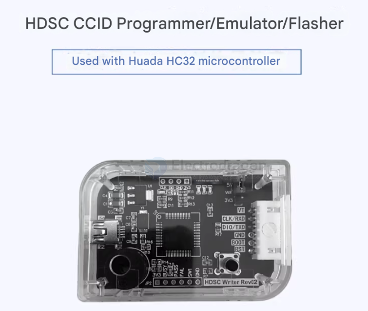
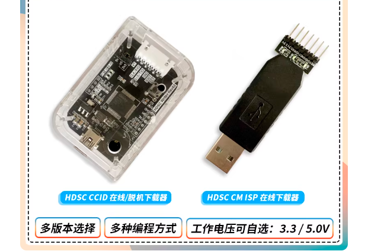
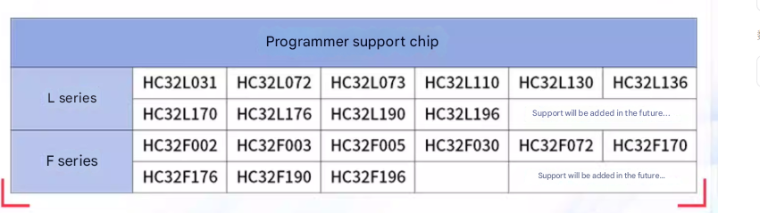

# HDSC-downloader-dat

- [[HDSC-dat]] - [[HDSC-SDK-dat]] - [[HDSC-downloader-dat]] - [[ARM1007-dat]] - [[MDK-ARM-dat]] - [[HC32F003-dat]]

HC32L110怎么烧录不进去,要接好RST BOOT0线

麻烦各位看清支持芯片列表和接线方式，此编程器仅支持ISP模式，RST管脚必须要接，如芯片有BOOT0也必须接！！

## offline downloader == 15

- [[ISP-dat]]

## cheaper online downloader == 5

## supported chips 

## support 

driver use guide in chinese find at https://github.com/Edragon/MCU-HDSC-SDK

## ref 

