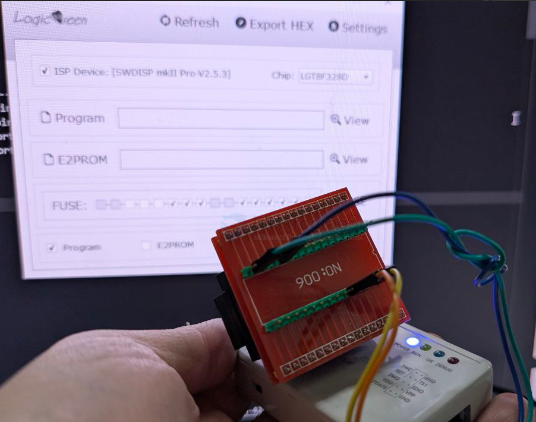
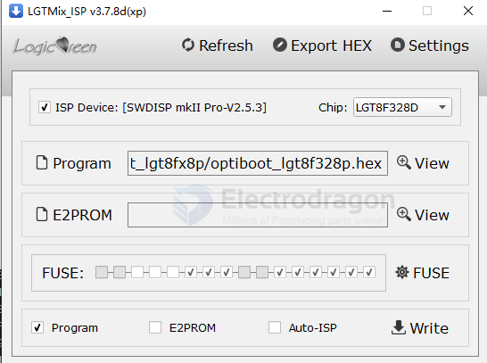
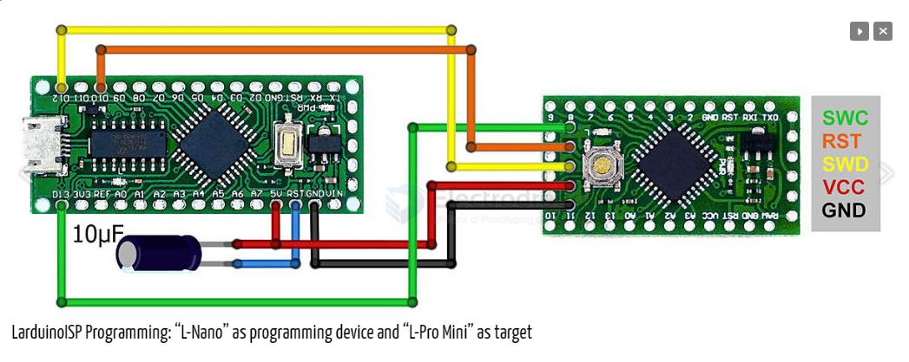
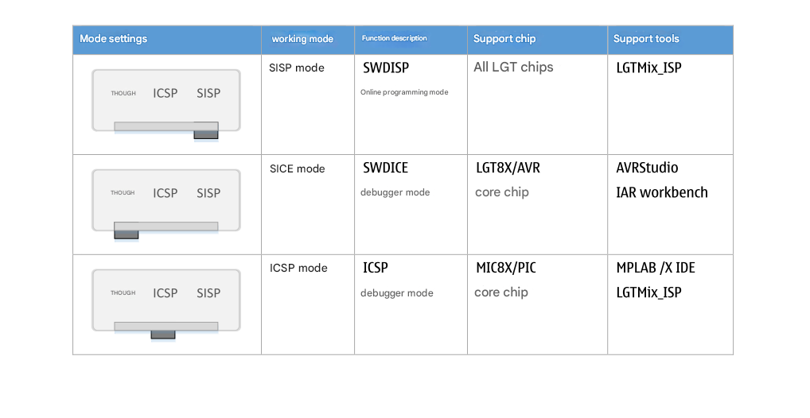
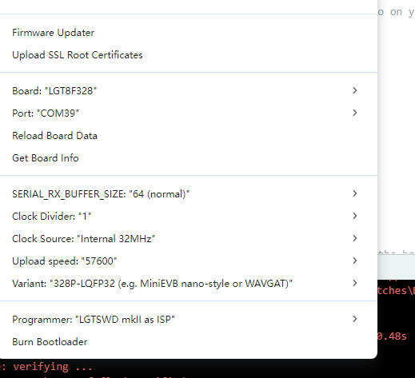
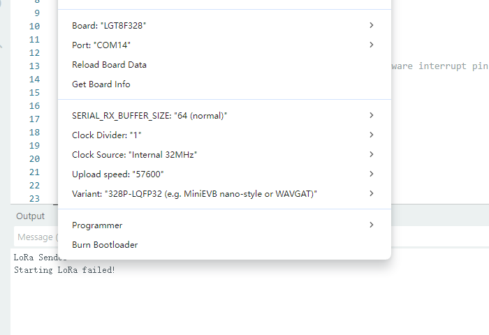
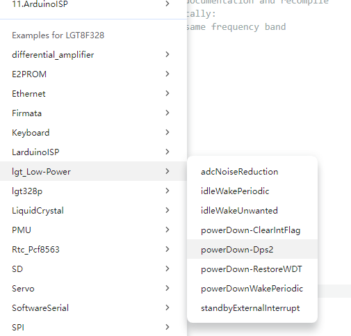
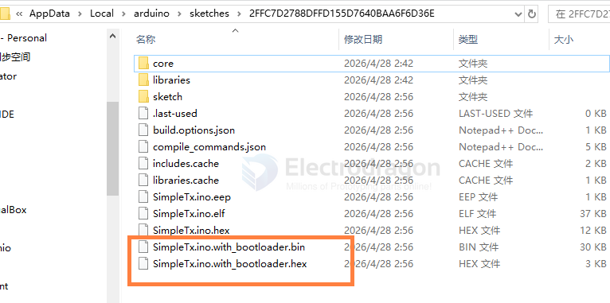
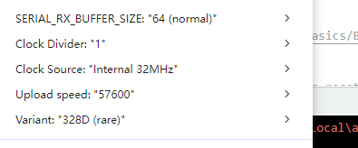

# LGT8F328-SDK-DAT

- [[lgt8f328-dat]]

- [[SWDICE-dat]]

- [[VisualGDB]]

- [[programmer-socket-dat]]

- [[CH55x-dat]]

## lgtmix_isp

- [[DPR1016-dat]]

avrdude -C/etc/avrdude.conf -v -patmega328p -carduino -P/dev/ttyUSB0 -b115200 -D -Uflash:w:LarduinoISP_F328PS20.hex:i 

- [[avrdude-dat]]

## SWDICE / SWDISP 

Connect your new programming device to the board to be programmed (“target”) as follows:

| Programmer   | Target |
| ------------ | ------ |
| GND          | GND    |
| 5V           | VCC    |
| Pin 12 (D12) | SWD    |
| Pin 10 (D10) | RST    |
| Pin 13 (D13) | SWC    |

ISP == https://gitee.com/xfgao0213/nulllab_arduino/blob/master/libraries/Lgt328P_ISP/Lgt328P_ISP.ino

https://github.com/brother-yan/LGTISP

- [[SWDICE-dat]]

### SISP

- connect pin 18 AVCC and pin 21 GND 

SISP 模式为在线烧写模式，  可以支持 LGT 目前除 LGT8F08A 以为的所有芯片，也将
支持 LGT 未来发布的芯片。这种模式下，SWDICE_mkII Pro 为 WinUSB 设备，只能够通过
LGTMix_ISP 工具访问，但需要使用 3.x 以上的版本。 

SISP 模式下，SWDICE_mkII Pro 在 Windows 8/10 系统下无需驱动，操作系统自带 winusb
设备驱动。在 Windows XP/7 系统下，  需要安装 SWDISP_mkII 驱动程序。SWDISP_mkII 驱动
可通过官网下载，  或者与我们联系获得。   
 
另外两种模式为调试器模式。分别用于调试 LGT8X/AVR 内核以及 MIC8X/PIC 内核系列芯
片。调试器模式下，SWDICE_mkII Pro 工作于专用 USB 设备，需要由相应的开发环境以及调
试器驱动支持。一般安装开发环境会同时安装调试器所需驱动，无需单独安装。 

### SICE

SICE 模式用于调试 LGT8X/AVR 内核芯片。包括 LGT8F08A，LGT8F88A/B，LGT8FX8D 系
列芯片，以及未来所有 LGT 基于 LGT8X/AVR 内核的所有芯片。 

SICE 模式下，  SWDICE_mkII Pro 将会被枚举为 JTAGICE_mkII 设备，可以配合 AVRStudio 
4/5/6/7 或者 IAR workbench for AVR 实现芯片的在线调试。安装开发环境后，将同时安装调
试器相关驱动。如果需要单独安装，可以在我们的官网下载 driver-atmel--bundle-7.0.888 驱
动安装程序。 

### ICSP 

ICSP 模式用于调试 MIC8X/PIC 内核芯片。目前 LGT 基于 MIC8X/PIC 内核的芯片包括
LGT8P653A/663A，LGT8F684A。但这些芯片都不支持在线调试。因此此功能暂时不可用。在
LGT 后续发布支持在线调试的 MIC8X 内核芯片，我们将提供固件升级以支持 ICSP 在线调试
功能。因此对于目前的 LGT8P653/663A 以及 LGT8F684A 芯片，请使用 SISP 在线烧写模式。

## programming interface 

- GND2/AREF/`SWD`/PE2
- AVCCI/`SWC`/PEO
- PC6(/RESET)
- +3V3
- GND

| pin | LGT   | extra |
| --- | ----- | ----- |
| 4   | VCC   |       |
| 5   | GND   |       |
| 18  | SWC   | PE0   |
| 21  | SWD   | PE2   |
| 29  | Reset |       |

- [[TQFP-dat]]

## Sketch uploads By Arduino IDE

- Pre-loaded bootloder. Just select corresponding board to upload sketch, refer to bootloader sketch below
- Programming pin port same as FTDI [[FT232-dat]], same as arduino pro mini
- A backup method for without DTR, just hold down RESET button when "compiling", then release when "uploading".

## ISP 

larduino - ISP 

https://github.com/Edragon/LGTISP

https://github.com/LGTMCU/LarduinoISP

## bootloader

### dbuezas/lgt8fx - LGT8fx Boards by dbuezas

https://github.com/dbuezas/lgt8fx

https://raw.githubusercontent.com/dbuezas/lgt8fx/master/package_lgt8fx_index.json

for [[DVA1009-dat]]

firmware - SSOP20 - C:\Users\Administrator\AppData\Local\Arduino15\packages\lgt8fx\hardware\avr\2.0.7\bootloaders\lgt8fx8ps20\optiboot_lgt8f328ps20.hex

#### pin map 

Interfaces

- [x] UART0: ~~RX = D0 = PD0, TX = D1 = PD1~~
- [] SPI: SS = D9 = PB1 on SSOP20, MOSI = D11 = PB3, MISO = D12 = PB4, SCK = D13 = PB5
- [] I2C / Wire: SDA = D18 = PC4 = A4, SCL = D19 = PC5 = A5
- [] External interrupts: INT0 = D2 = PD2, INT1 = D3 = PD3 
- [] PWM pins: D3, D5, D6, D9, D10, D11 
- [] Built-in LED: D13 = PB5 

The key definitions are in lgtx8p.h:615, where:

  RXD5 is bit 0
  TXD6 is bit 1
  PMXCR is the port-mux control register

Then the SSOP20 startup path in main.cpp:93 does:

  GPIOR0 = PMXCR | 0x07;
  PMXCR = 0x80;
  PMXCR = GPIOR0;

0x07 sets:

  bit 0 = RXD5
  bit 1 = TXD6
  bit 2 = SSB1

So for this board, after startup:

  UART0 RX is on PD5 = Arduino D5
  UART0 TX is on PD6 = Arduino D6

### nullab board 

- problem laoding in arduino IDE V2 

https://github.com/nulllaborg/arduino_nulllab

Nulllab_AVR_Compatible_Boards by nullab.org

- most compatible, please use this one
- Nullab Nano/ Maker Nano
- install by this - https://nulllab.coding.net/p/lgt/d/nulllab_lgt_arduino/git/raw/master/package_nulllab_boards_index_zh.json
- link2 == https://raw.githubusercontent.com/nulllaborg/arduino_nulllab/master/package_nulllab_boards_index.json

https://github.com/nulllaborg/arduino_nulllab?tab=readme-ov-file

Failed to install platform: 'Nulllab_AVR_Compatible_Boards:2.0.0'. 13INTERNAL: Cannot install platform: installing platform nullab avr

compatible boards:avr@2.0.0: testing local archive integrity: testing archivechecksum: missing checksum for: master.zip

### old 1

https://github.com/LGTMCU/Larduino_HSP

Installation:

- Unzip master.zip
- Copy the [hardware] directory to Arduino's sketchbook directory (see below to find out where it normally resides)
- Restart Arduino, you will see new board from [Tools]->[Board] menu.

### old 2 bootloader

- Better not used for experiment, your often daily programming learning or testing, although no problem, but if unexpected error cause the board bricked, you need special programmer to re-programme the bootloader.
- Good to migrate to a low cost board instead of original expensive board.
- Same way to upload sketch as pro mini, notice to choose the board
  - 8F328P - original IC bootloader, please use this one
  - 8F328D - compatible, can also upload code, but don't know if any unknow error.
  - Pro mini - also can upload, but active very wired

## Chip Note 

- crystal is not soldered, it can work without crystal, unlike [[atmega328]]

## Programmer

- arduino UNO can pretend as a chip programmer
- please contact us if you need to order original programmer

## programmer SCH 

## bootloader 

C:\Users\Administrator\AppData\Local\Arduino15\packages\lgt8fx\hardware\avr\2.0.7\bootloaders\lgt8fx8e\optiboot_lgt8f328d.hex

C:\Users\Administrator\AppData\Local\Arduino15\packages\lgt8fx\hardware\avr\2.0.7\bootloaders\lgt8fx8p\optiboot_lgt8f328p.hex

## flash with bootloader

- upload sketch with bootloader version first by [[ISP-dat]] or [[programmer-dat]], then upload normally via [[serial-dat]]

## LGT8F328D 

- error blink LED 
- optiboot_lgt8f328d_intosc.hex

## ref 

- [[LGT8F328-dat]] - [[LGT-dat]]

- [[avr-dat]]

- [[fab-dat]]