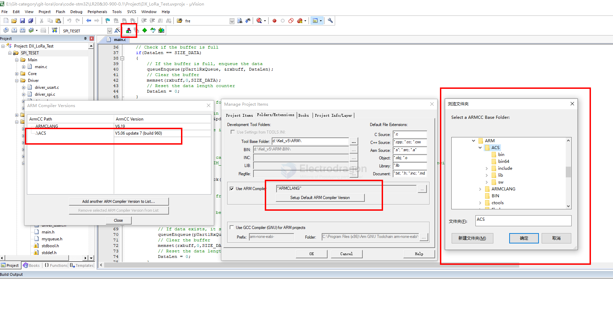

# AC5-dat

### Missing Complier Version 5 

https://developer.arm.com/documentation/ka005198/latest

download 

Arm Compiler 5.06 update 7 (build 960) -- r5p6-07rel1 -- 14 Sep 2020

## install workflow 

- install MDK-ARM 
- install ARM Compilier 5 (optionally) == [[AC5-dat]]
  - create a folder in installation folder, for example "AC5" in D:\MDK\Keil_v5\ARM
  - install into "AC5"

## setup new compiler in KEIL-MDK

management project items - folder extensions - ARM compiler 

## ref 

- [[MDK-ARM-dat]]