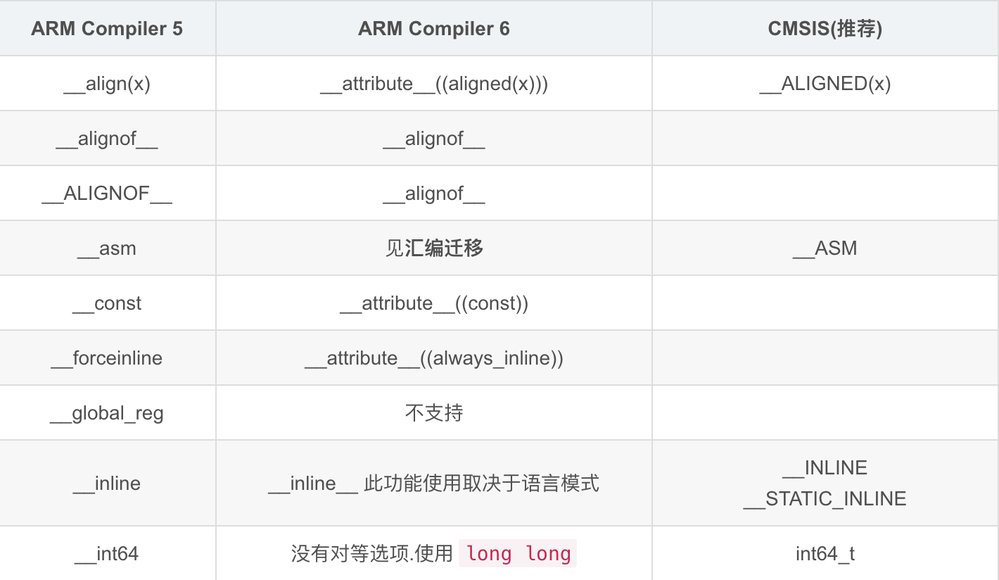
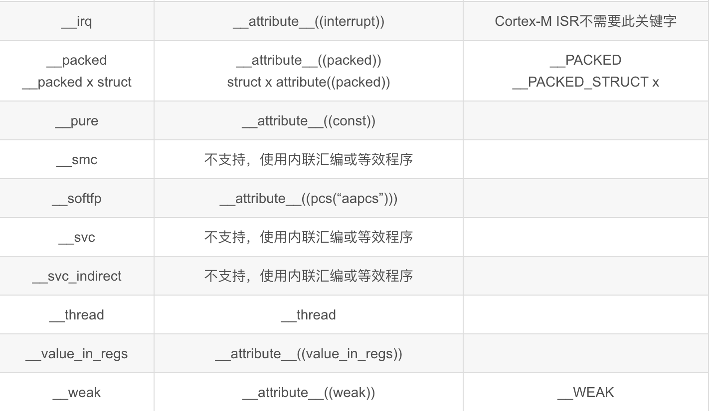

# Migrating from ARM Compiler 5 to ARM Compiler 6 - Complete Tutorial

A comprehensive guide for migrating embedded projects from ARM Compiler 5 to ARM Compiler 6.

## Prerequisites

**⚠️ Important:** Before starting the migration, make sure to backup your project code.

## Migration Requirements

To use ARM Compiler 6, the minimum recommended MDK version is:

- **MDK version 5.23 or higher**

MDK version 5.23 provides two compilers: ARM Compiler 5.06 and ARM Compiler 6.6.

Software packages must also support ARM Compiler 6. The minimum required package versions are:

- **Keil MDK-Middleware package:** Version 7.4.0 and above
- **Keil ARM Compiler Support package:** Version 1.3.0 and above  
- **ARM CMSIS package:** Version 5.0.1 and above

## Step 1: Switching the Compiler

1. Open your project in MDK
2. Select **Project → Options for Target** from the menu
3. Click the **Target** tab and find the **ARM Compiler:** dropdown list
4. Set the ARM compiler to **Version 6**
5. Click **OK** to confirm the changes

> **Note:** After switching, all ARM Compiler 6 settings will be set to default values.

## Step 2: Setting Warning Levels

ARM Compiler 6 provides more warning levels than ARM Compiler 5. If you're accustomed to ARM Compiler 5's warning levels, select **AC5-like Warnings**.

### Disabling Specific Warnings

You can disable warnings for specific diagnostic groups by adding `-Wno-` before the parameter.

**Example:** The option `-Wno-missing-noreturn` disables `–Wmissing-noreturn`.

### Misc Controls Configuration

1. **Initial Migration Step:** Set the level to "No warnings" to focus on error messages first
2. **After Resolving Errors:** Select **AC5-like Warnings** and set the `-Wno-invalid-source-encoding` option to disable source code encoding detection (useful for projects with Chinese characters in LCD and print messages)
3. **Code Quality Testing:** Select **All warnings** to test code compliance

## Step 3: Setting Optimization Levels

### Recommended Options:

- **`-Os balanced`**: Balances code size and performance
- **Speed Optimization**: Use `-O2`, `-O3`, or `-Ofast` for faster execution (increasing optimization levels, but larger code size)
- **Size Optimization**: Use `-Os balanced` or `-Oz image size` for smaller code size

### Real Example Comparison:

- `-Oz image size`: Code size = 103,026 bytes
- `-Os balanced`: Code size = 115,848 bytes  
- `-O3`: Code size = 160,536 bytes

**Note:** 
- `-O0` performs no optimization
- ARM Compiler 5's `-O0` actually has some optimization, so ARM Compiler 6's `-O1` level is most similar to ARM Compiler 5's `-O0`, both providing good debugging experience

## Step 4: Handling Incompatible Language Extensions

The main issues are compiler extension keywords like `__align(x)`, `__packed`, `__weak` in your code. The solution is to use CMSIS-defined macros.

### 4.1 Replace CMSIS Header Files

Use CMSIS version 5.6.0 or newer:

1. Find the appropriate CMSIS version in `.\Keil_v5\ARM\PACK\ARM\CMSIS`
2. Replace files in your project's `code_cm3.h` folder with files from `.\Keil_v5\ARM\PACK\ARM\CMSIS\5.6.0\CMSIS\Core\Include`

### 4.2 Modify lwIP Protocol Stack's cc.h File

lwIP uses compiler extension language for struct alignment optimization. Since ARM Compiler 5 and 6 have different extensions, modify the `cc.h` file:

Include CMSIS's `cmsis_compiler.h` file and modify struct packing and alignment macros:

```c
/* Arm Compiler 4/5 */
#if   defined ( __CC_ARM )
    #define PACK_STRUCT_BEGIN __packed
    #define PACK_STRUCT_STRUCT
    #define PACK_STRUCT_END
    #define PACK_STRUCT_FIELD(fld) fld
    #define ALIGNED(n)  __ALIGNED(n)

  /* Arm Compiler above 6.10.1 (armclang) */
#elif defined (__ARMCC_VERSION) && (__ARMCC_VERSION >= 6100100)
    #define PACK_STRUCT_BEGIN
    #define PACK_STRUCT_STRUCT __PACKED
    #define PACK_STRUCT_END
    #define PACK_STRUCT_FIELD(fld) fld
    #define ALIGNED(n)  __ALIGNED(n)

/* GNU Compiler */
#elif defined ( __GNUC__ )
    #define PACK_STRUCT_BEGIN
    #define PACK_STRUCT_STRUCT __PACKED
    #define PACK_STRUCT_END
    #define PACK_STRUCT_FIELD(fld) fld
    #define ALIGNED(n)  __ALIGNED(n)
    
#else
    #error "Unsupported compiler"
#endif
```

### 4.3 Replace Compiler-Specific Keywords

Replace the following keywords with CMSIS macros:

- `__packed` → `__PACKED`
- `__align(n)` → `__ALIGNED(n)`
- `__inline` → `__INLINE`
- `__weak` → `__WEAK`

### 4.4 Packed Struct Syntax Differences

**ARM Compiler 5:**
```c
typedef __packed struct
{
    char x;           
    int y;
} X; 
```

**ARM Compiler 6:**
```c
typedef struct __attribute__((packed))
{
    char x;                   
    int y;
} X; 
```

### 4.5 Recommended CMSIS Macro Syntax

Use `typedef __PACKED_STRUCT {}X;` instead of `typedef __packed struct {}X;`

- **ARM Compiler 5:** Expands to `typedef __packed struct {}X;`
- **ARM Compiler 6:** Expands to `typedef struct __attribute__((packed)) {}X;`

### 4.6 Inline Functions

Use the following format for inline functions:

```c
__STATIC_INLINE func_name(arg)
{
    // function body
}
```

This prevents undefined symbol errors during linking at `-O0` and `-O1` optimization levels (where `__INLINE` might not actually inline).

> **Tip:** Use uVision IDE's search function to find the above keywords and migrate them accordingly.






## Step 5: Handling Inline Assembly

ARM Compiler 6 completely changed its assembly code handling strategy:

- Assembly syntax is now GNU-style compatible instead of ARM-style
- Assembly is handled by the C compiler, no separate assembler needed

### FreeRTOS Port Layer Changes

Change from:
- `..\FreeRTOS\Source\portable\RVDS\ARM_CM3` directory files

To:
- `..\FreeRTOS\Source\portable\GCC\ARM_CM3` directory files

This affects `port.c` and `portmacro.h` files that involve inline assembly.

### Custom Inline Assembly Functions

**ARM Compiler 5:**
```c
__asm  uint32_t __get_flash_base(void) 
{
   IMPORT |Image$$ER_IROM1$$RO$$Base|;
    
    ldr r0,=|Image$$ER_IROM1$$RO$$Base|;
    bx lr;
}
```

**ARM Compiler 6:** (Assembly-free alternative)
```c
uint32_t get_flash_base(void)
{
    extern uint32_t Image$$ER_IROM1$$RO$$Base;
    
    return (uint32_t)&Image$$ER_IROM1$$RO$$Base;
}
```

## Step 6: Stricter Syntax Requirements

### Example 1: Static Declaration Conflicts

**Problem:** Function previously public, later made static in `.c` file, but declaration not removed from `.h` file.

- **ARM Compiler 5:** No error
- **ARM Compiler 6:** Error: `static declaration of 'func_name' follows non-static declaration`

### Example 2: Integer Constant Syntax

**Problematic code:**
```c
for(i=0; i<0x7E-0x20; i++)
```

**ARM Compiler 6 Error:** `invalid suffix '-0x20' on integer constant`

**Solution:**
```c
for(i=0; i<0x7E - 0x20; i++)  // Add spaces around operator
```

## Step 7: Optimization Issues

### Software Delay Function Problem

The following code works in ARM Compiler 5 but gets optimized away in ARM Compiler 6 (except at `-O0` level):

```c
void delay_us (uint32_t ul_time)
{
    ul_time *= 30; 
    while(--ul_time != 0);  // Empty loop gets optimized away
}
```

**Symptoms:** Software I2C errors, software SPI errors, LCD black screen, etc.

**Solution:**
```c
void delay_us (uint32_t ul_time)
{
    ul_time *= 30; 
    while(--ul_time != 0)
        __nop();  // Prevents compiler optimization
}
```

The Keil compiler guarantees that `__nop()` will insert a NOP instruction, preventing optimization. Adjust the initial delay value accordingly.

## Step 8: Compilation Time and Size Comparison

### ARM Compiler 6 Results:

| Optimization Level | Code Size | RO-data | RW-data | ZI-data | Build Time |
|-------------------|-----------|---------|---------|---------|------------|
| `-O0` | 200,360 | 20,576 | 96 | 76,316 | 00:00:25 |
| `-O1` | 119,328 | 16,824 | 96 | 76,300 | 00:00:25 |
| `-O2` | 153,340 | 17,100 | 96 | 76,300 | 00:00:26 |
| `-O3` | 162,292 | 17,040 | 96 | 76,308 | 00:00:27 |
| `-Ofast` | 161,896 | 17,040 | 96 | 76,308 | 00:00:26 |
| `-Os balanced` | 115,628 | 17,048 | 96 | 76,300 | 00:00:28 |
| `-Oz image size` | 103,784 | 17,020 | 96 | 76,308 | 00:00:25 |
| `-Oz image size LTO` | 85,888 | 17,064 | 40 | 75,960 | 00:00:32 |

### ARM Compiler 5 Comparison:

| Optimization Level | Code Size | RO-data | RW-data | ZI-data | Build Time |
|-------------------|-----------|---------|---------|---------|------------|
| `-O2` | 94,232 | 16,736 | 540 | 75,640 | 00:00:16 |

## Conclusion

This migration guide covers the essential steps for successfully transitioning from ARM Compiler 5 to ARM Compiler 6. The key areas requiring attention are:

1. **Compiler settings and warning levels**
2. **CMSIS macro replacements for language extensions**  
3. **Inline assembly syntax changes**
4. **Stricter syntax requirements**
5. **Optimization behavior differences**

Following these steps systematically will ensure a smooth migration while taking advantage of ARM Compiler 6's improved optimization capabilities.
