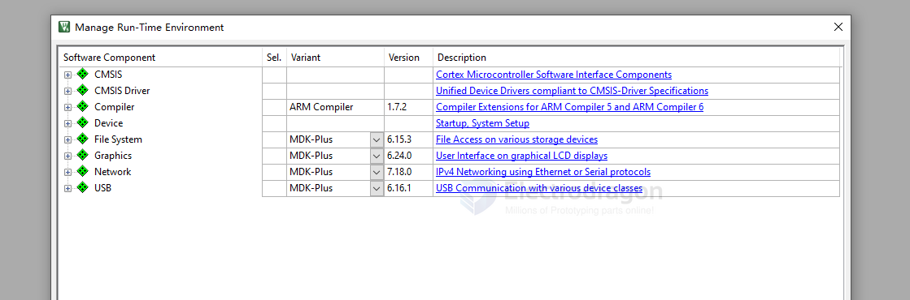

# MDK-ARM-dat

- setup new compiler in KEIL-MDK [[AC5-dat]] - [[AC6-dat]]

- [[ARM-dat]]

## programmer 

- [[Jlink-dat]] - [[MDK-ARM-dat]]

- ULINK2/ME Cortex Debugger
- ULINK Pro Cortex Debugger
- ULINKplus Debugger
- CMSIS-DAP Debugger
- J-LINK/J-TRACE Cortex - [[Jlink-dat]]
- Models Cortex-M Debugger
- ST-Link Debugger
- Pemicro Debugger
- NULink Debugger
- SiLabs UDA Debugger
- Altera Blaster Cortex Debugger
- TI XDS Debugger

## KEIL-MDK

- 5.4 
- 5.3.8
- 5.3.4

install from official websites 

- https://armkeil.blob.core.windows.net/eval/MDK539.EXE
- https://armkeil.blob.core.windows.net/eval/MDK538a.EXE
- https://armkeil.blob.core.windows.net/eval/MDK538.EXE
- https://armkeil.blob.core.windows.net/eval/MDK537.EXE
- https://armkeil.blob.core.windows.net/eval/MDK536.EXE
- https://armkeil.blob.core.windows.net/eval/MDK535.EXE
- https://armkeil.blob.core.windows.net/eval/MDK534.EXE
- https://armkeil.blob.core.windows.net/eval/MDK533.EXE
- https://armkeil.blob.core.windows.net/eval/MDK532.EXE
- https://armkeil.blob.core.windows.net/eval/MDK531.EXE
- https://armkeil.blob.core.windows.net/eval/MDK530.EXE
- https://armkeil.blob.core.windows.net/eval/MDK529.EXE
- https://armkeil.blob.core.windows.net/eval/MDK528.EXE
- https://armkeil.blob.core.windows.net/eval/MDK527.EXE
- https://armkeil.blob.core.windows.net/eval/MDK526.EXE

## install workflow 

- install MDK-ARM - mdk538a.exe
  - core d:\Keil_v5
  - pack d:\Keil_v5\Packs
- install ARM Compilier 5 (optionally) == [[AC5-dat]]
  - create a folder in installation folder, for example "AC5" in 
    - D:\MDK\Keil_v5\ARM
    - D:\Keil_v5\ARM
  - install into "AC5"

## supported device 

- [[STM32-dat]] 

- [[DA14585-dat]] == https://s3.eu-central-1.amazonaws.com/lpccs-docs.renesas.com/CMSIS/DialogSemiconductor.DA1458x_DFP.1.1.3.pack == https://www.keil.arm.com/packs/da1458x_dfp-dialogsemiconductor/devices/

- [[HDSC-SDK-dat]] - [[STM32-SDK-dat]] - [[HDSC-dat]]

Supported Device

* https://w.electrodragon.com/w/WCH - CH579
* https://w.electrodragon.com/w/HDSC - HC32L136
* https://w.electrodragon.com/w/Nordic - NRF52832
* https://w.electrodragon.com/w/ST - STM32F103
* https://w.electrodragon.com/w/NXP - LPC1100, RT1021
* https://w.electrodragon.com/w/ARM - Cortex A5 A7 A9

## usage 

setup run-time enviornment

## path resolve 

1. Close Keil.
2. Open `<project_name>.uvprojx` in a text editor (Notepad++, VSCode, etc.).

3. Search for old path entries like:

lie this 

    .\..\..\..\..\..\\sdk\platform\arch\boot\system_DA14585_586.c

    .\..\..\..\..\..\\sdk\

replace 

    .\..\..\..\..\..\\

    ..\..\

note 
    ..\..\sdk\ == E:\Git-category\git-ARM\MDK-ARM\DA14585\sdk

    simple_beacon.uvprojx == E:\Git-category\git-ARM\MDK-ARM\DA14585\simple_beacon\Keil_5

    E:\Git-category\git-ARM\MDK-ARM\SDK_6.0.22.1401\DA145xx_SDK\6.0.22.1401\sdk\

In the **Options for Target** window, select the **Linker** tab.

    ..\..\..\..\..\sdk\common_project_files\scatterfiles\DA14535_armclang.sct

    ..\..\sdk\common_project_files\scatterfiles\DA14535_armclang.sct

so also replace 

    ..\..\..\..\..  // level 5 to level 2 

    ..\..

## Error log 

### L6236E: No section matches selector - no section to be FIRST/LAST.

- include path imcomplete, include startup files 

### L3900U: Unrecognized option '--cpreproc' | ARMCC 5 option used with ARM Compiler 6 | Remove `--cpreproc` and any ARMCC-specific flags from **Misc Controls** |

delete --cpreproc 

--cpreproc_opts=-I"..\src\config";-I"....\sdk\common_project_files"

--cpreproc_opts=-I"....\sdk\common_project_files"

### L6636E path include error 

'da1458x_stack_config.h' file not found == 

    In file included from C:\Users\ADMINI~1\AppData\Local\Temp\p44ac-2:26:
    .\out_DA14535\Objects\simple_beacon_535.axf: error: 'da1458x_stack_config.h' file not found
    #include "da1458x_stack_config.h"
    .\out_DA14535\Objects\simple_beacon_535.axf: Error: L6636E: Pre-processor step failed for '..\..\sdk\common_project_files\scatterfiles\DA14535_armclang.sct'
    .\out_DA14535\Objects\simple_beacon_535.axf: Error: L6372E: Image needs at least one load region.

| Error                                          | Likely Cause                            | Fix                                            |
| ---------------------------------------------- | --------------------------------------- | ---------------------------------------------- |
| `'da1458x_stack_config.h' file not found`      | Scatter file includes header, not found | Add header path to **Assembler Include Paths** |
| `L6636E: Pre-processor step failed`            | Scatter preprocessing failed            | Fix include paths                              |
| `L6372E: Image needs at least one load region` | Scatter file not processed              | Fix include errors first                       |

solve 

In Keil uVision: Project → Options for Target → Linker → Misc Controls, append: 

  --cpreproc --cpreproc_opts=-I"..\src\config";-I"....\sdk\common_project_files"

Rebuild. This adds include paths for the scatter-file preprocessor.

### .\out_DA14535\Objects\simple_beacon_535.axf: error: L6031U: Could not open scatter description file ..\..\..\..\..\sdk\common_project_files\scatterfiles\DA14535_armclang.sct: No such file or directory

- path in linker setup 

### --locale=english

Cannot read RTE data from project file:RTEis not enabled

Cannot read project file ‘E:\Git-category\git-lora\Lora2\code-stm32\LR20&30-900-0.1\Project\DX_LoRa_Test.uvprojx'!

    assembling startup_stm32f103xe.s...

    ArmClang: error: unsupported option '--locale=english'

### cmsis_armclang.h

    ../SDK/CMSIS/Include\core_cm3.h(115): warning: In file included from...
    ../SDK/CMSIS/Include/cmsis_compiler.h(41): error: 'cmsis_armclang.h' file not found
    #include "cmsis_armclang.h"
            ^~~~~~~~~~~~~~~~~~
    1 error generated.

**resolve**

Verify the specific path within the CMSIS pack.

The path might be something like CMSIS/CMSIS/Include or CMSIS/Core/Include within the pack. 

D:\Users\Administrator\AppData\Local\Arm\Packs\ARM\CMSIS\5.9.0\CMSIS\Core\Include

D:\Users\Administrator\AppData\Local\Arm\Packs\ARM\CMSIS\5.9.0\CMSIS\Core_A\Include

C:\Users\Administrator\STM32Cube\Repository\STM32Cube_FW_F0_V1.11.3\Drivers\CMSIS\Include

- Include (C:\Users\Administrator\STM32Cube\Repository\STM32Cube_FW_F0_V1.11.3\Drivers\CMSIS)
- Include (C:\Users\Administrator\STM32Cube\Repository\STM32Cube_FW_F0_V1.11.3\Drivers\CMSIS\Core_A)
- Include (C:\Users\Administrator\STM32Cube\Repository\STM32Cube_FW_F0_V1.11.3\Drivers\CMSIS\Core)
- Include (C:\Users\Administrator\STM32Cube\Repository\STM32Cube_FW_F1_V1.8.4\Drivers\CMSIS)
- Include (C:\Users\Administrator\STM32Cube\Repository\STM32Cube_FW_F1_V1.8.4\Drivers\CMSIS\Core_A)
- Include (C:\Users\Administrator\STM32Cube\Repository\STM32Cube_FW_F1_V1.8.4\Drivers(CMSIS\Core)
- Include (C:\Users\Administrator(STM32Cube\Repository\STM32Cube_FW_G0_V1.6.1\Drivers\CMSIS)
- Include (C:\Users\Administrator\STM32Cube\Repository\STM32Cube_FW_G0_V1.6.1\Drivers\CMSIS\Core)
- Include (C:\Users\Administrator\STM32Cube\Repository\STM32Cube_FW_G0_V1.6.0\Drivers\CMSIS)
- Include (C:\Users\Administrator\STM32Cube\Repository\STM32Cube_FW_G0_V1.6.0\Drivers\CMSIS\Core)
- Include (C:\Users\Administrator\AppData\Local\Arm\Packs\ARM\CMSIS\5.7.0\CMSIS\Core)
- Include (C:\Users\Administrator\AppData\Local\Arm\Packs\ARM\CMSIS\5.7.0\CMSIS\Core_A)
- Include (C:\Users\Administrator\AppData\Local\Arm\Packs\ARM\CMSIS\5.7.0\CMSIS)

correct file 

D:\MDK\Arm\Packs\ARM\CMSIS\5.9.0\CMSIS\Core\Include

### '#pragma import' is an Arm Compiler 5 extension == install [[AC5-dat]]

    ../Driver/driver_usart.c(137): error: '#pragma import' is an Arm Compiler 5 extension, and is not supported by Arm Compiler for Embedded 6 [-Warmcc-pragma-import]
    #pragma import(__use_no_semihosting)
            ^
    ../Driver/driver_usart.c(139): error: redefinition of '__FILE'
    struct __FILE
        ^
    d:\Keil_v5\ARM\ARMCLANG\Bin\..\include\stdio.h(119): note: previous definition is here
    struct __FILE {
        ^
    2 errors generated.

### static uint8_t remove static

../Main/main.c(14): error: static declaration of 'rxbuff' follows non-static declaration
static uint8_t rxbuff[SIZE_DATA] = {0};
               ^

#### select complier for project 

## DIR 

- D:\Keil_v5\UV4\UV4.exe
- D:\KEIL\Keil_v5\UV4\UV4.exe

Destination Folders
- Core:d:\Keil_v5
- Pack:C:\Users\Administrator\AppData\Local\Arm\Packs

## Config 

### Options for Target..

Configure target options

#### C/C(AC6)

Misc Controls: "--locale=english"

#### Target 

**Code Generation**

ARM Compiler:

- V6.19

ARM Compiler 5.06 update 7 Setup

D:\MDK\Complier\

## License

## packs 

Packs -> STM32F1xx_DFP == Version 2.4.1: May 12, 2023

    https://www.keil.arm.com/packs/stm32f1xx_dfp-keil/versions/

Destination Folder: d:\MDK\Arm\Packs\KeilSTM32F1xx_DFP\2.4.1

## ref 

- [[keil]] - [[MDK-ARM]]

