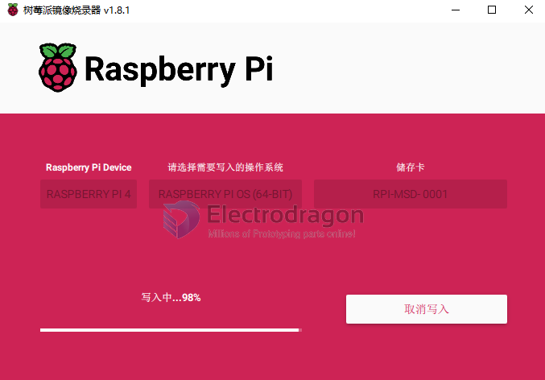
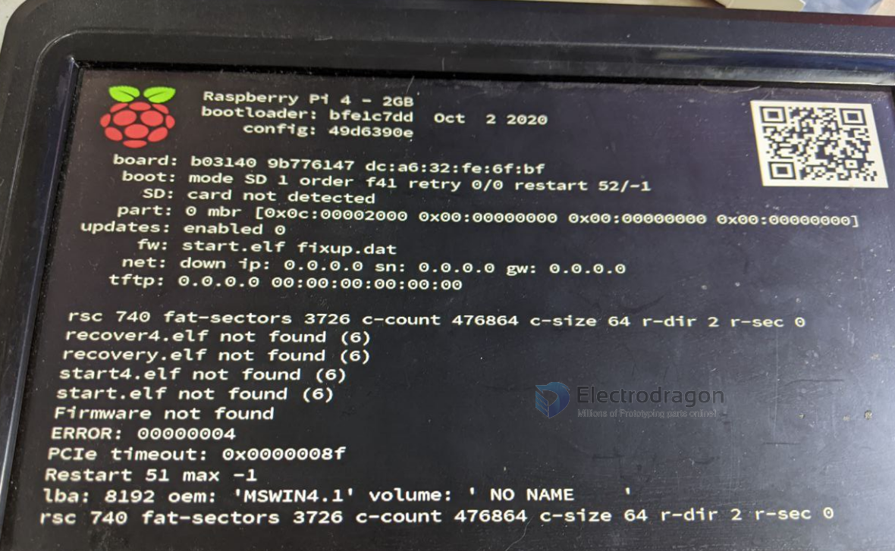

# RPI-OS-dat 

## Raspberry Pi Imager

https://downloads.raspberrypi.org/imager/imager_latest.exe

- flash into sd card 

## Raspberry Pi OS

https://www.raspberrypi.com/software/operating-systems/

https://www.raspberrypi.com/software/

Raspberry Pi OS (64-bit): 3B 3B+ 3A+ 4B 400 5 CM3 CM3+ CM4 CM4S Zero 2 W

- login user "admin", should set password for it, prbably another "admin"

## CM4 - Step by Step flash into eMMC (on CM4 module )

- use imager tool 
- setup jumper and use USB - https://www.raspberrypi.com/documentation/computers/compute-module.html#set-up-the-io-board
  - refer to [[RPI-CM4-expansion-board-dat]] - J2 pin1/2
- follow guide here - https://www.raspberrypi.com/documentation/computers/compute-module.html#steps-to-flash-the-emmc
- ref - https://www.jeffgeerling.com/blog/2020/how-flash-raspberry-pi-os-compute-module-4-emmc-usbboot

- [[RPI-CM4-dat]]

## Common Error 

### after flash, recover4.elf not found 

- possible error - https://forums.raspberrypi.com/viewtopic.php?t=293400

## ref 

- USB Boot and flash - https://www.youtube.com/watch?v=wSRByPaS-Zc&ab_channel=ShotokuTech
- CM4 step by step - https://www.raspberrypi.com/documentation/computers/compute-module.html#steps-to-flash-the-emmc