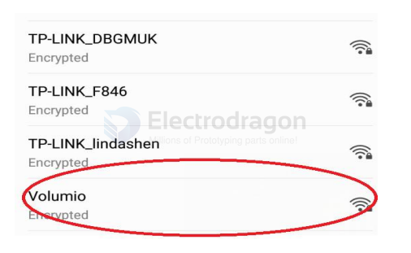
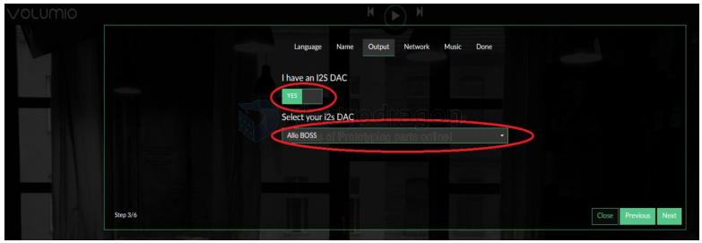
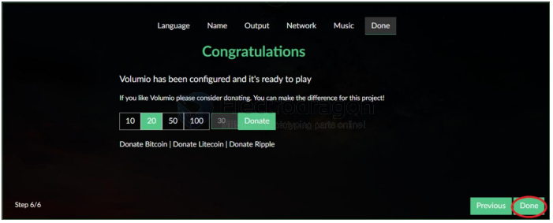
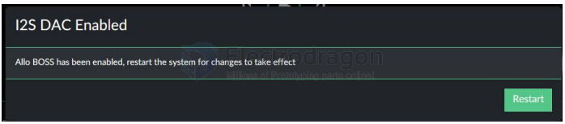

# volumio-dat

## Basic setup and enable for [[MPC1083-dat]]

Volumio is an entirely new music system. It is designed to play all your music, whether is an Hi-Res file or a Web Radio, with the highest quality. Control it with your favourite device,a smartphone, PC or tablet, and enjoy your music as you never did before.

Volumio is a Free and Open Source Linux Distribution, designed and fine-tuned exclusively for music playback.I supports allfiletypes: FLAC, Alac, Aac, Vorbis, Mp3, DSD etc. and support

By flashing (installing) Volumio on any platforms, it will then become a headless Audiophile Music Player. Headless means that the only way to control it will be with another device, such as a Smartphone, Tablet, PC or anything that has a browser.

For more detail please refer to https://volumio.org/discover/.

STEP:

- 1) Insert the TF card with volumio image into the Raspberry pi then power on.
- 2) By using your smart phone, tablet or any device with Wifl and browser search for WIFl hotpots. You can see a 'Volumio' name in the search list. Connect this hotspot with password 'volumio2'.You can change your password after login. You alson can connect a Raspberry Pi to your router using an Ethernet cable,find the IP address of Volumio on the router, and open this IP address from a computer connected to the same router.

- 3) The browser will automatically eject playback software UI which is based on web interface ( if you connect the hotspot successfully but for some reason browser can’t pop up the playbackpage automatically, you can using http://192.168.211.1 to login. You can see belowwizardof Volumio. We only need to set “Language” , “Name” “Output” and “Done” for simple application.

- 4) It should be noted that ‘Output’ page must set as below. This is an essential step, otherwiseyou can't hear anything.

- 5)In ‘Done’ Page, you can see a request for donations from Volumio. It’s depand on you. You cangive them some help if you like this application. Gifts of roses, hand a fragrance.

- 6)Click ‘Done’ to finish initialization of Volumio. And then restart Volumio.

7)In this restart process, “Volumio” hotpot will turn off for a moment. Sometimes your mobilephone , Tablet or PC will automatic reconnect to your wifi nearly. You need to set back to‘Volumio’ hotpot. After restart you can see the main page of Volumio

8)If you can't play music properly, please Click ‘Setting’ → PLAYBACK OPTION, check the output setting as below picture. This is an essential step, otherwise you can't hear anything.

9)You can insert the USB Disk or mobile hard disk with your own audio file into Raspberry Pi USBconnector, and find the music list of your USD disk in “Music Library”.