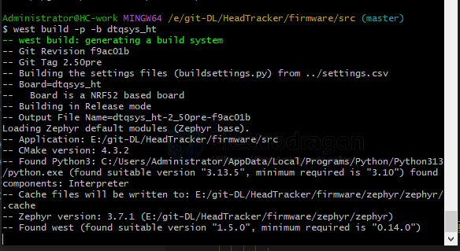
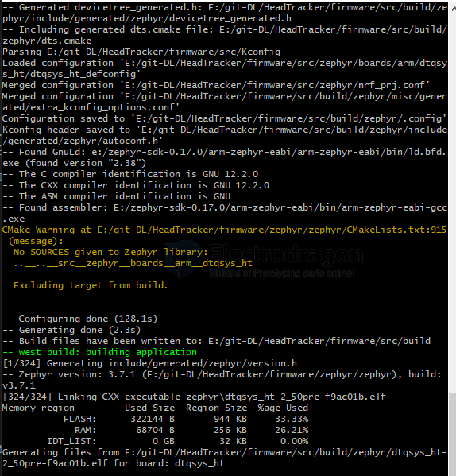

# Zephyr-dat

- [[git-dat]] - [[bash-dat]] - [[shell-dat]]

## final build 

    -- Including generated dts.cmake file: E:/git-DL/HeadTracker/firmware/src/build/
    zephyr/dts.cmake
    Parsing E:/git-DL/HeadTracker/firmware/src/Kconfig
    Loaded configuration 'E:/git-DL/HeadTracker/firmware/src/zephyr/boards/arm/dtqsy
    s_ht/dtqsys_ht_defconfig'
    Merged configuration 'E:/git-DL/HeadTracker/firmware/src/zephyr/nrf_prj.conf'
    Merged configuration 'E:/git-DL/HeadTracker/firmware/src/build/zephyr/misc/gener
    ated/extra_kconfig_options.conf'
    Configuration saved to 'E:/git-DL/HeadTracker/firmware/src/build/zephyr/.config'
    Kconfig header saved to 'E:/git-DL/HeadTracker/firmware/src/build/zephyr/include
    /generated/zephyr/autoconf.h'
    -- Found GnuLd: e:/zephyr-sdk-0.17.0/arm-zephyr-eabi/arm-zephyr-eabi/bin/ld.bfd.
    exe (found version "2.38")
    -- The C compiler identification is GNU 12.2.0
    -- The CXX compiler identification is GNU 12.2.0
    -- The ASM compiler identification is GNU
    -- Found assembler: E:/zephyr-sdk-0.17.0/arm-zephyr-eabi/bin/arm-zephyr-eabi-gcc
    .exe
    CMake Warning at E:/git-DL/HeadTracker/firmware/zephyr/zephyr/CMakeLists.txt:915
    (message):
    No SOURCES given to Zephyr library:
    ..__..__src__zephyr__boards__arm__dtqsys_ht

    Excluding target from build.

    -- Configuring done (128.1s)
    -- Generating done (2.3s)
    -- Build files have been written to: E:/git-DL/HeadTracker/firmware/src/build
    -- west build: building application
    [1/324] Generating include/generated/zephyr/version.h
    -- Zephyr version: 3.7.1 (E:/git-DL/HeadTracker/firmware/zephyr/zephyr), build:
    v3.7.1
    [324/324] Linking CXX executable zephyr\dtqsys_ht-2_50pre-f9ac01b.elf
    Memory region         Used Size  Region Size  %age Used
            FLASH:      322144 B       944 KB     33.33%
                RAM:       68704 B       256 KB     26.21%
            IDT_LIST:          0 GB        32 KB      0.00%
    Generating files from E:/git-DL/HeadTracker/firmware/src/build/zephyr/dtqsys_ht-
    2_50pre-f9ac01b.elf for board: dtqsys_ht

The warning about the DTQSYS board library having no sources is not fatal here; Zephyr continued, linked successfully, and generated the board output. The earlier missing Ninja issue is resolved.

## DTQSYS 

Your custom board directory (dtqsys_ht) likely contains a CMakeLists.txt file that calls zephyr_library(), but you haven't actually listed any .c or .cpp source files inside that specific folder (or the zephyr_library_sources() call is missing files).

Should you worry?

- **If your board works**: Probably not. Zephyr is just letting you know that the "library" it created for your board is empty and will be ignored.
- **If you intended to have board-specific code**: Check your boards/arm/dtqsys_ht/CMakeLists.txt and ensure your source files are correctly linked.

## install 

Download the Windows SDK package for v0.17.0 from the Zephyr SDK releases page:
https://github.com/zephyrproject-rtos/sdk-ng/releases/tag/v0.17.0

Pick the Windows x86_64 package, install or extract it to a permanent location such as:

    E:\zephyr-sdk-0.17.0

## global install 

In your Windows bash terminal, from the firmware folder:

    cd /e/git-DL/HeadTracker/firmware
    python -m pip install --upgrade pip
    python -m pip install west
    west init zephyr // long time 
    cd zephyr/zephyr
    git checkout v3.7.1

    cd ..
    west update --narrow  // long time 
    west -z "$PWD" zephyr-export
    python -m pip install -r zephyr/scripts/requirements.txt
    west blobs fetch hal_espressif

Then install Zephyr SDK 0.17.0 globally to a fixed path such as E:\zephyr-sdk-0.17.0 or E:\git-DL\HeadTracker\firmware\zephyr-sdk, and run:

    E:\zephyr-sdk-0.17.0\setup.cmd -t arm-zephyr-eabi -t xtensa-espressif_esp32_zephyr-elf -t riscv64-zephyr-elf -h

## venv 

From your bash terminal:

    cd /e/git-DL/HeadTracker/firmware
    python -m venv .venv
    source .venv/Scripts/activate
    python -m pip install --upgrade pip
    pip install west
    west init zephyr
    cd zephyr/zephyr
    git checkout v3.7.1
    cd ..
    west update --narrow
    west -z "$PWD" zephyr-export
    pip install -r zephyr/scripts/requirements.txt
    west blobs fetch hal_espressif

Then install Zephyr SDK 0.17.0 for Windows into E:/git-DL/HeadTracker/firmware/zephyr-sdk. After extracting or installing it there, run its setup command from Command Prompt or PowerShell:

    E:\git-DL\HeadTracker\firmware\zephyr-sdk\setup.cmd -t arm-zephyr-eabi -t xtensa-espressif_esp32_zephyr-elf -t riscv64-zephyr-elf -h

For your current bash session, set Zephyr base before building:

    export ZEPHYR_BASE=/e/git-DL/HeadTracker/firmware/zephyr/zephyr

After that, build from the app directory:

    cd /e/git-DL/HeadTracker/firmware/src
    source ../.venv/Scripts/activate
    export ZEPHYR_BASE=/e/git-DL/HeadTracker/firmware/zephyr/zephyr
    west build -p -b dtqsys_ht

.github\workflows\build-firmware.yml

        run: |
          cd /src/firmware/src
          west build -p -b dtqsys_ht
          cp ./build/zephyr/*.bin build_bins/

## build 

    export ZEPHYR_BASE=/e/git-DL/HeadTracker/firmware/zephyr/zephyr
    cd /e/git-DL/HeadTracker/firmware/src
    west build -p -b dtqsys_ht