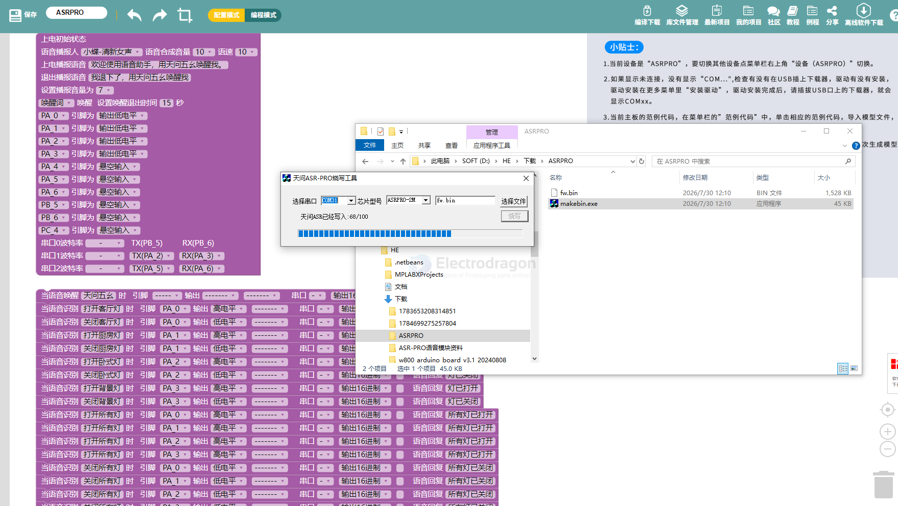

# SDK-twen51-dat

- [[SDK-twen51-dat]] - [[SDK-dat]]

http://twen51.com/new/twen51/adminmoban.php

support 

- [[ESP32-C3-dat]]
- [[ASRPRO-dat]]
- TW32F003
- [[C51-dat]]
- 可以通过图形化快速入门，在线字符编程
- 天问ASR人工智能语音识別芯片
- TW32F003芯片
- ESP32C3
- STC12
- STC15
- STC8
- STC16
- STC12
- STC15
- STC8
- STC16
- STC12单片机
- 2015年STC15单片机
- 带USB的STC51全功能开发板
- STC首款16位单片机
- CH32V103
- STC32G12K
- HAODAUSB
- CH32V003
- STC32G
- TWEN32
- CH32V003
- CH32V103
- STC32单片机
- 定制的 32 位 ARM Cotext-M0 芯片
- CH32V003芯片
- CH32V103芯片
- CH32V208
- TWEN-ASR
- ASR-MCU
- 天问ASR人工智能语音识別芯片
- CH32V208芯片
- 天问ASR人工智能语音识別模块

## online compile

### 软件下载安装

第一步：天问Block编程软件下载安装

1.	使用浏览器打开天问官方网站

http://twen51.com/

https://www.haohaodada.com/video/new/zipfiles/twenBlock.zip

[天问Block介绍视频。](http://twen51.com/new/twen51/coursePlayCloud.php?id=11)天问Block无缝对接在线平台，支持账号管理，支持ASRPRO、TW32F003、ESP32C3、Air001、C51、STC12、STC15、STC8、STC16、STC32G、CH32V003、CH32V103、CH57X、ASRONE、ASR-MCU、TWEN32等硬件芯片离线环境下编程，并可以查看案例、上传作品，轻松保存程序。适用win7以上32位、64位操作系统。

2.	下载软件
 
第二步：安装天问Block软件

从官网获取安装包解压后运行exe文件进行安装，根据提示默认安装，安装过程中会自动安装驱动。

第三步：运行天问Block软件
1.	第一次打开软件，会让你选择主板，请选择ASRPRO。
2.	使用Type-C数据线连接ASRPRO开发板到电脑。

### 二．新建项目
 
1. 双击打开天问Block软件，选择设备为“ASRPRO”。
 
 
2. 选择开发模式
 
根据自己专业水平和喜好选择对应的开发模式。

3. 生成模型及编译下载
程序写好后需要先生成模型。生成模型及编译时请先注册用户，注册后登录即可生成模型，每次修改识别词和语音都需要重新生成模型。
 
 
模型生成后点击“2M编译下载”即可将程序下载到开发板。
 
 
下载完成后开发板会播报欢迎词。点击范例或者更多栏目，可以查看各种应用案例、编程手册、视频资料等。

### flash 

## ref 