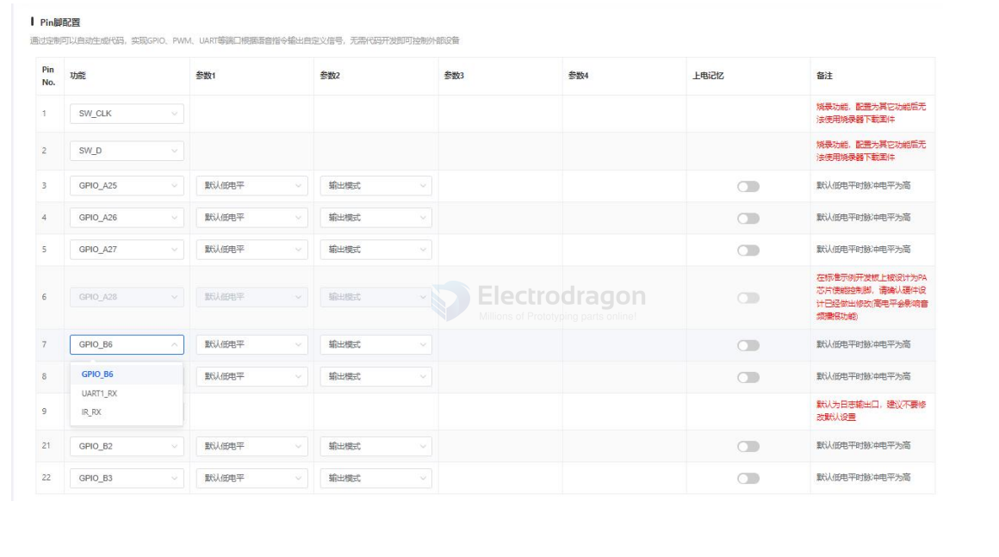
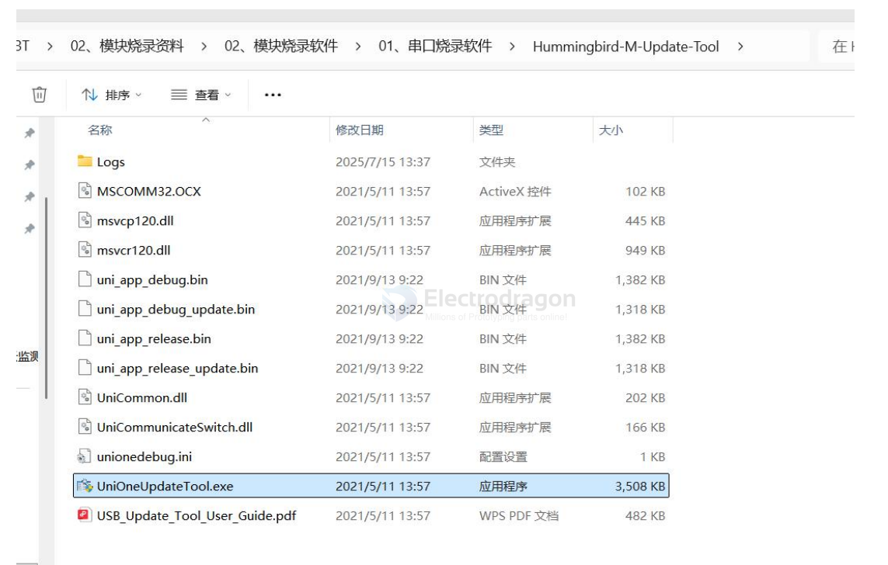
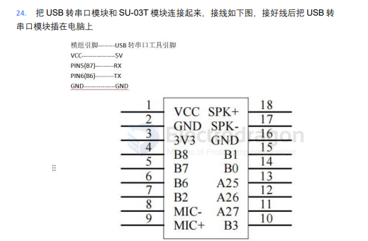

# SDK-unisound-dat

- [[SDK-dat]] - [[SDK-unisound-dat]]

http://www.smartpi.cn

和用户相关的目录有以下几个：
-  \bin ： 用户存放 bin/mva 文件的目录
-  \flash_downloader : flash downloader 存放目录，需要提取相应芯片 SDK 中提供的 downloader.exe
-  \ice\libusb-AICE-driver ： 仿真器驱动

根目录有以下用户相关的文件：

图4 根目录文件

- UniOneDownloadTool_x64.exe ：烧录工具启动 exe
- run_download.bat ： 批量执行脚本例程

## default firmware 

SU-03T模块出货已经烧录好出厂固件（上电接上喇叭麦克风，会有一段开机播报，用于测试语音识别灵敏度的，没有添加IO输出等功能），收到货可以直接进行以下指令测试

开机播报：欢迎使用机芯智能语音识别产品，请说你好小智或小智精灵唤醒我

唤醒词：你好小智/小智精灵

回复语：你好主人

命令词：
- OpenKT=打开空调@空调已打开
- CloseKT=关闭空调@空调已关闭
- OpenCZ=打开插座@插座已打开
- CloseCZ=关闭插座@插座已关闭
- OpenKG=打开开关@已打开开关
- CloseKG=关闭开关@已关闭开关
- OpenFS=打开风扇@已打开风扇
- CloseFS=关闭风扇@已关闭风扇
- High1=调高一档@已调高一档
- Low1=调低一档@已调低一档
- OpenDG=打开灯光开灯@已打开灯光
- CloseDG=关闭灯光关灯@已关闭灯光
- Up1=调亮一点@已调亮一点
- Down1=调暗一点@已调暗一点
- PlusYL=增大音量@已增大音量
- MinusYL=减小音量@已减小音量
- MaxYL=最大音量@已调到最大音量
- MidYL=中等音量@已调到中等音量
- MinYL=最小音量@已调到最小音量
- PlayBB=当前版本@当前固件版本是一点五版本

## SDK 

1. 首先下载 SU-03T 语音模块资料，下载链接如下：

SU-03T 开发包（原理图，模块+芯片技术手册，接线+烧录软件+烧录资料）：https://help.aimachip.com/docs/offline_su03t/offline_su03t-1gbc6oj0b6e1l

2. 首先在浏览器中输入文字“智能公元”进入智能公元/AI 产品零代码平台，也可以通过下面网址进入

智能公元网址：https://smartpi.cn/#/

config 

9. Pin 脚配置参考模块规格书对应的引脚来选 GPIO，PWM，UART 等

### serial flash 

打开串口烧录软件，一个小扳手图标的软件“UniOneUpdateTool.exe ”点击打开

23. 选择固件压缩包解压后的文件夹中的 jx_su_03t_release_update.bin 文件，然后点击打开

## ref 

