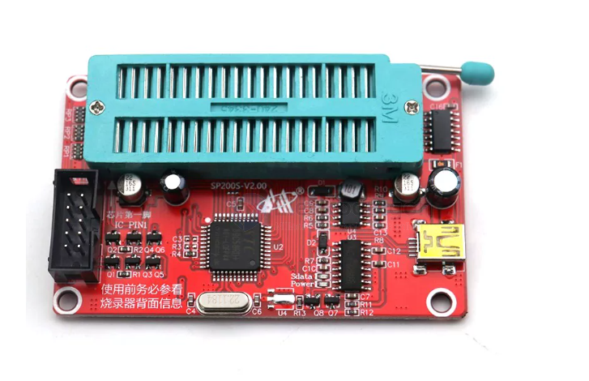
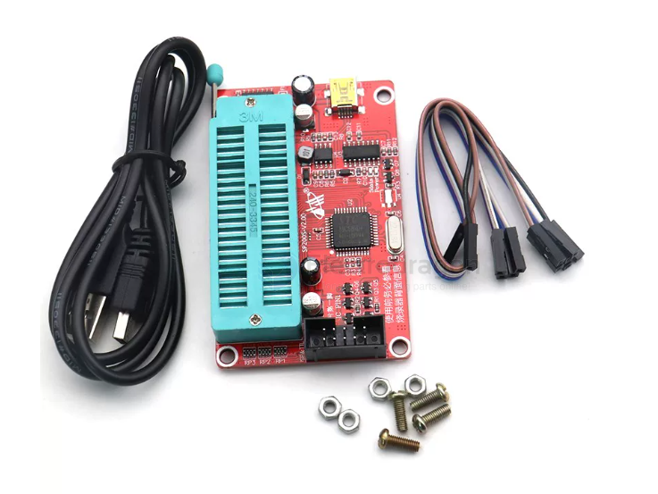
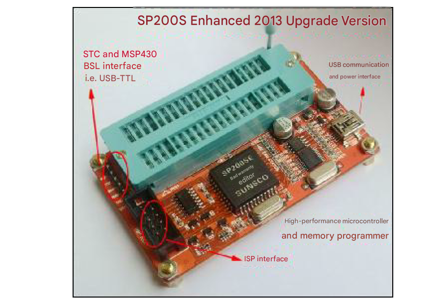
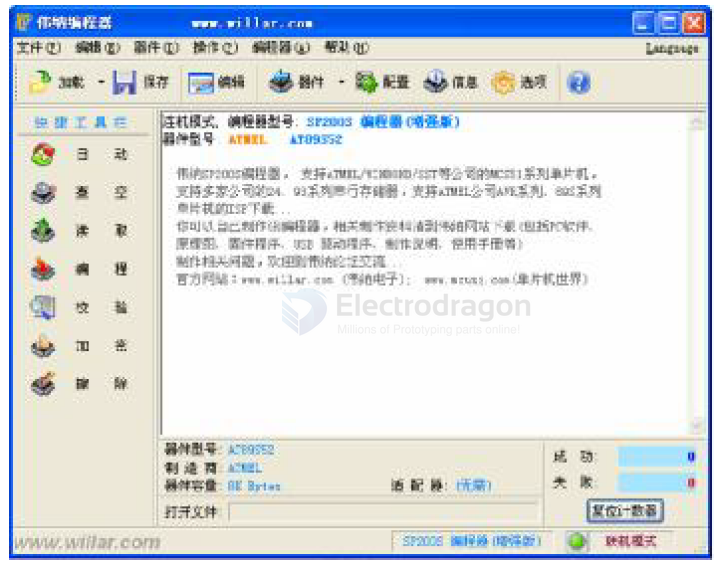
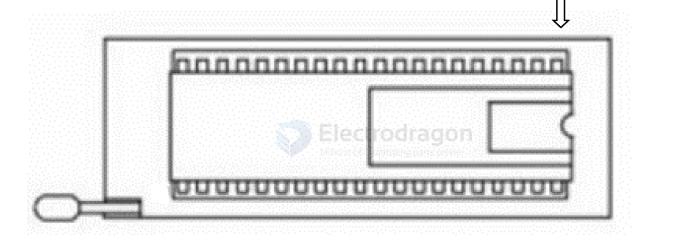
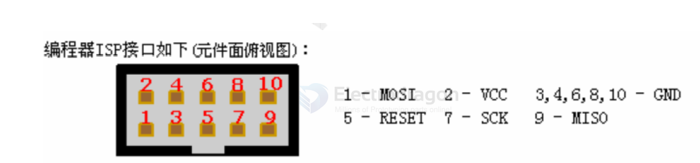
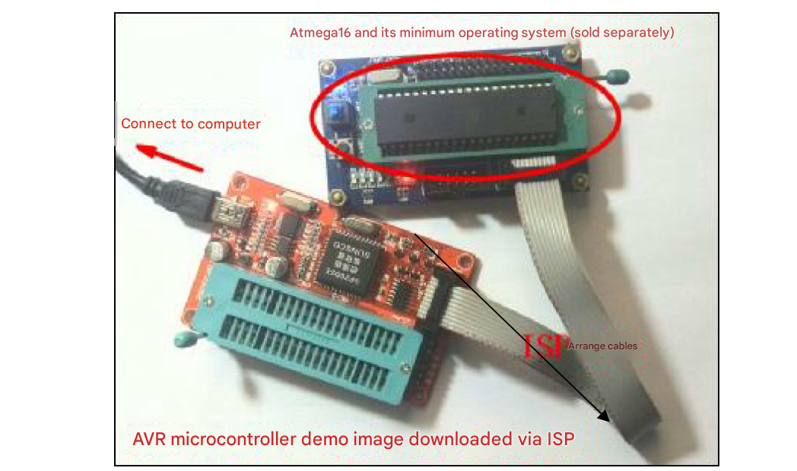
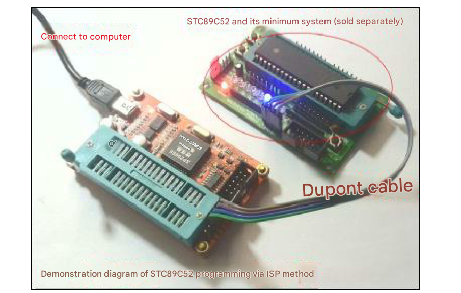
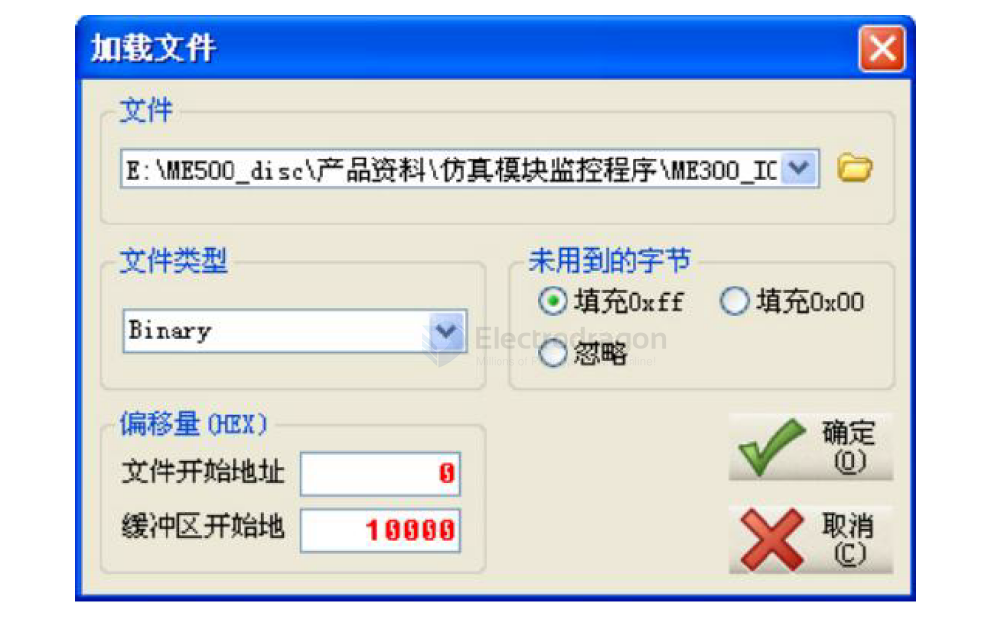

# SP200-dat

- [[ISP-dat]] - [[AVR-SDK-dat]]

legacy wiki page == https://www.electrodragon.com/w/SP200S%2B_USB_ISP_Programmer_(For_Microcontroller,_EEPROM,_ICs,_MCUs)

**Applications:** Supports programming of Atmel, Microchip, SST, ST, WINBOND series MCUs and EEPROMs (see the supported model list below).

software - [[WLPRO_V220.zip]] password electrodragon.com

- [[MSP430-dat]] - [[STC-SDK-dat]]

- [[AVR-SDK-dat]]

- [[serial-dat]] driver - [[CH340-dat]]

**Features:**
1. Supports USB 1.1 or USB 2.0 communication.
2. Fully supports Windows 98, ME, 2000, XP, Vista, Windows 7, and newer operating systems.
3. Supports 336 models of microcontrollers and EEPROMs from 5 manufacturers: Atmel, Microchip, SST, ST, and WINBOND.
4. USB bus-powered; data and power over a single cable, convenient for laptop users.
5. ISP interface uses the Atmel-recommended standard IDC 10-pin interface.
6. Shipped in anti-static sealed packaging to ensure quality before use.
7. Perfect SP200SE programmer compatibility, using the SP200SE software interface.

**Packing List:**
- 1x Programmer
- 4x 20cm Dupont wires
- 1x USB data cable (53cm)
- 4x Sets of standoffs
*Programming software, drivers, and manuals are sent via email.*

**Tips:**
1. Pricing is per unit. Bulk discounts are available upon inquiry.
2. Large stock ready for shipment within 24 hours of payment.
3. The color of the ZIF socket (Blue or Black) is random but functionality is identical.
4. Please request relevant documentation after purchase.
5. Technical support is available for product operation; however, general technical inquiries outside the product's scope are not covered.

**Update (July 2019):** Added STC auto-programming support!

**Brand New**

**Model:** Compatible with SP200SE Enhanced Version USB/51 Programmer

The SP200S programmer is an improved design based on the popular SP180S. It uses a USB interface for communication and power, featuring a compact size and a mature software/hardware design. It is currently one of the most convenient free professional programming tools available. It supports common MCS51 series MCUs from Atmel/Winbond/SST and 24/93 series serial EEPROMs from Atmel/Microchip/ST. The enhanced version uniquely includes a standard ISP interface for online programming of Atmel MCS51 and AVR series MCUs. It is ideal for hobbyists, developers, and appliance repair technicians.

---

### Hardware and Software Features

#### Hardware Features
- Compact and portable.
- USB powered and high-speed communication; no external power required.
- Single 40-pin ZIF socket supports 8-pin, 20-pin, and 40-pin chips.
- Built-in CPU for fast and precise timing, unaffected by computer performance.
- Powerful and easy to use; no manual hardware configuration required.
- Supports Atmel/Winbond/SST MCS51 series MCUs and Atmel/Microchip/ST 24/93 series serial EEPROMs.
- Supports ISP online programming for Atmel MCS51 and AVR series (Enhanced version only).

#### Software Features
- User-friendly, professional interface.
- Powerful buffer editing: supports copy, fill, logic operations, and 8-bit/16-bit data display.
- Multilingual support (available in English).
- Supports Windows 98SE/ME/2K/XP and newer.
- Low system requirements and stable operation.
- Rich command set: Program, Read, Erase, Blank Check, Verify, Encryption (Lock bits), Read/Write Fuses, Read/Write Config bits...
- Statistics feature: automatically tracks successful and failed programming counts.
- Auto-serialization: useful for writing unique IDs to products.
- Batch programming: supports customizable batch operation flows.
- History lists: quick access to recently used files and devices.
- Audible notifications for programming operations.
- Auto-reload: automatically reloads modified files for fast development cycles.

---

### 1. Introduction
The SP200SE programmer uses a USB interface for communication and power supply. It features a compact design with mature software and hardware. It supports common MCS51 series microcontrollers from companies like Atmel, Winbond, SST, and STC, as well as 24 and 93 series serial memory from Atmel, Microchip, and ST. It also includes a standard ISP interface for in-system programming (ISP) of Atmel MCS51 and AVR series microcontrollers.

The SP200SE programmer is suitable for MCU enthusiasts and developers for learning and development, as well as for appliance repair technicians who need to program 93 and 24 series EEPROMs.

### 2. Hardware and Software Features

#### Hardware Features
- Compact size, very convenient to carry.
- USB interface for communication and power; high speed with no need for an external power supply.
- Built-in CPU for fast programming and precise timing, unaffected by computer configuration.
- Comprehensive functions and simple operation; no manual hardware settings required.
- Single 40-pin ZIF socket supports 8-pin, 20-pin, and 40-pin chips.
- Features a standard 10-pin ISP interface for easy in-system programming on target boards.

**Photo of the SP200SE Enhanced Version:**

#### Software Features
- Friendly interface with a professional, full-featured design.
- Powerful buffer editing functions, supporting copy, fill, logic operations, and 8-bit/16-bit display.
- Multilingual user interface (supports English).
- Supports Windows 98SE/ME/2K/XP/Vista/Win7 and newer operating systems.
- Low system requirements and stable operation.
- Rich set of programming commands: Program, Read, Erase, Blank Check, Verify, Encrypt (Lock bits), Read/Write Fuses, Read/Write Configuration bits, etc.
- Statistics function to track successful and failed programming attempts.
- Automatic serialization for writing unique IDs to products.
- Supports batch programming with customizable operation sequences.
- "Recent Files" list for quick loading of previously used files.
- "Recent Devices" list for quick switching between recently programmed chips.
- Audible operation prompts.
- Automatic file reloading when file changes are detected, ideal for rapid prototyping.

### 3. Supported Devices
Supports hundreds of models, including Atmel/Winbond/SST/STC MCS51 microcontrollers and Atmel/Microchip/ST 24/93 series serial memory. It also supports ISP online programming for the following devices via the standard ISP interface:
AT89S51, AT89S52, AT89LS51, AT89LS52, ATmega8515, ATmega48, ATmega88, ATmega168, ATmega16, ATmega8, ATmega8535, ATmega8535L, ATtiny2313, ATtiny2313V, ATtiny26, ATtiny26L.

### 4. User Guide

**Step 1: Install USB Drivers and SP200SE Software**
*(Do NOT connect the SP200SE to the USB port yet)*
The SP200SE uses the CH340 USB chip. First, run `CH341SER.EXE` to install the USB driver, then run `WLPRO_SETUP.exe` to install the programming software.

**Step 2: Connect the Hardware and Configure COM Port**
Plug in the USB cable. Windows will detect the device and complete the driver installation. Open **Device Manager** and identify the COM port number assigned to the programmer. It is recommended to use a port number between **COM1 and COM5** (maximum COM9). If it is assigned a higher number, right-click -> Properties -> Advanced and change the COM port to an unused number below COM5. **Restart your computer** after changing the COM port or installing drivers.

**Step 3: Run the Software**
After restarting (no need to unplug the programmer), run the SP200SE software. It will automatically search for the programmer. If successful, the main interface will open. If the interface is in Chinese, click the **Language** menu in the top right to switch to English.

#### Programming Methods:

**1. Using the ZIF Socket**

- [[AVR-dat]]

The programmer features a single 40-pin zero-insertion-force (ZIF) socket. It correctly accommodates 8-pin, 20-pin, and 40-pin chips.

*Note: The arrow indicates Pin 1. There is also a triangle mark on the PCB for reference.*

**Example: Programming an AT89S52**
- Place the AT89S52 into the ZIF socket and lock the handle.
- Click the **Device** button in the software and select the model `AT89S52` (ensure the correct suffix).
- Click the **Load** button and select the file you wish to program.
- Click **Program**. In the popup options, click **Run** to start.
*Important: Always select the chip model BEFORE loading the file.*

To encrypt the chip, click **Config**, set the encryption options (usually "Mode 4" for AT89S52), and execute the **Encrypt** command. You can use the **Verify** command to ensure the program was written correctly before encrypting.
All these steps can be automated using the **Auto** button after configuring the "Operation Options" (Menu: Operation -> Operation Options).

**Programming and Copying 24C Series EEPROM**
Operation is similar to the AT89S52. If using "Auto" mode, uncheck the "Blank Check" option as it may cause errors. 24C series chips do not have a dedicated "Erase" command; to clear them, load a blank buffer (filled with `FF`) and program it. To copy a chip, select the model, click **Read**, then click **Save** to store the data to your hard drive.

**2. Using the ISP Interface (for AVR Chips)**
The SP200SE features an industry-standard 10-pin ISP interface compatible with Atmel's definition.

Reserve a 2x5 (10-pin) header on your target board. Connect the corresponding pins (MOSI, SCK, RESET, MISO, VCC, GND). Programming via ISP is identical to using the socket, but you must select device models with the **"@ISP"** suffix. Ensure the target board is powered and functional.

**Reference: AT89S52 Pin Definition for ISP**
- MOSI: P1.5 (Pin 6)
- SCK: P1.7 (Pin 8)
- RESET: (Pin 9)
- MISO: P1.6 (Pin 7)
- VCC: (Pin 40)
- GND: (Pin 20)

**3. Using USB-TTL for STC Microcontrollers**

- [[STC-dat]]

The SP200SE includes a USB-to-TTL interface (CH340). The interface provides VCC, TXD, RXD, and GND pins. It can be used to program most STC microcontrollers using the STC-ISP software.
- Connect VCC, TXD, RXD, and GND to the target system.
- In STC-ISP software, set parameters and click Download.
- When prompted to power on, perform a "Cold Start" by disconnecting and reconnecting the VCC wire.
- If it fails to respond, try swapping the TXD and RXD wires.

**4. Using USB-BSL & TTL for MSP430**
The programmer supports BSL mode for MSP430 microcontrollers using the `MspFet` software. Connect VCC, RST, TCK, TXD, RXD, and GND pins.

### 5. Troubleshooting (FAQ)

**1. "Device ID Error" during programming?**
- **Hardware check:** For DIY kits, check for soldering shorts, cold joints, or damaged components. Use the "Programmer -> Hardware Test" feature in the software to diagnose specific faults.
- **Wrong Model:** Ensure the selected model in the software matches the chip exactly.
- **Incorrect Placement:** Check that the chip is oriented correctly (notch toward the USB port) and securely locked in the ZIF socket.
- **Poor Contact:** Clean oxidized pins on older chips and ensure they are straight.
- **Chip Life/Fault:** Some chips lose their ID readability after many cycles. You can try disabling "ID Check" in software settings, though successful programming is not guaranteed.
- **Encrypted Chip:** Some chips (like AT90S1200) block ID reading when encrypted. Try performing an "Erase" first.

**2. ISP Download Fails?**
- Ensure the target board is powered correctly.
- Check for large reset capacitors on the target board that might interfere with timing; try disconnecting them.
- Verify ISP wiring with a multimeter.
- Ensure you selected a model ending in **"@ISP"**.

**3. Programming SST89E516RD for Emulators?**
SST89E516RD is the replacement for SST89E564RD. Use the SST89E564 monitoring program. When loading the file, change the buffer start address to `10000`.

### Supported Devices

| Programmer Model           | Number of Manufacturers | Number of Devices |
| :------------------------- | :---------------------- | :---------------- |
| SP200SE (Enhanced Version) | 5                       | 336               |

#### ATMEL [MCU/MPU]
|                 |                   |                   |                  |
| :-------------- | :---------------- | :---------------- | :--------------- |
| AT89LS51        | AT89LS51@PLCC44   | AT89LS51@TQFP44   | AT89LS52         |
| AT89LS52@PLCC44 | AT89LS52@TQFP44   | AT89LS53          | AT89LS53@PLCC44  |
| AT89LS53@TQFP44 | AT89LS8252        | AT89LS8252@PLCC44 | AT89C51          |
| AT89C51@PLCC44  | AT89C51@TQFP44    | AT89C52           | AT89C52@PLCC44   |
| AT89C52@TQFP44  | AT89C51-5         | AT89C51-5@PLCC44  | AT89C51-5@TQFP44 |
| AT89C52-5       | AT89C52-5@PLCC44  | AT89C52-5@TQFP44  | AT89S52          |
| AT89S52@PLCC44  | AT89S52@TQFP44    | AT89S53           | AT89S53@PLCC44   |
| AT89S8252       | AT89S8252@PLCC44  | AT89C1051         | AT89C1051@SOIC20 |
| AT89C1051U      | AT89C1051U@SOIC20 | AT89C2051         | AT89C2051@SOIC20 |
| AT89C4051       | AT89C4051@SOIC20  | ATmega8515@ISP    | ATmega8515L@ISP  |
| ATmega88@ISP    | ATmega48@ISP      | ATmega168@ISP     | ATmega16@ISP     |
| ATmega16L@ISP   | ATmega8@ISP       | ATmega8L@ISP      | ATmega8535@ISP   |
| ATmega8535L@ISP | ATtiny2313@ISP    | ATtiny2313V@ISP   | ATtiny26@ISP     |
| ATtiny26L@ISP   | AT89S51           | AT89S51@PLCC44    | AT89S51@TQFP44   |
| AT89S51@ISP     | AT89S52@ISP       | AT89LS52@ISP      | AT89LS51@ISP     |

#### ATMEL [Serial EEPROM]
|          |                |          |                |
| :------- | :------------- | :------- | :------------- |
| AT93C46  | AT93C46@SOIC8  | AT93C57  | AT93C57@SOIC8  |
| AT93C56  | AT93C56@SOIC8  | AT93C66  | AT93C66@SOIC8  |
| AT93C46A | AT93C46A@SOIC8 | AT93C46C | AT93C46C@SOIC8 |
| AT24C01  | AT24C01@SOIC8  | AT24C02  | AT24C02@SOIC8  |
| AT24C04  | AT24C04@SOIC8  | AT24C08  | AT24C08@SOIC8  |
| AT24C16  | AT24C16@SOIC8  | AT24C164 | AT24C164@SOIC8 |
| AT24C32  | AT24C32@SOIC8  | AT24C64  | AT24C64@SOIC8  |
| AT24C128 | AT24C128@SOIC8 | AT24C256 | AT24C256@SOIC8 |

#### MICROCHIP [Serial EEPROM]
|         |               |         |               |
| :------ | :------------ | :------ | :------------ |
| 93AA46  | 93AA46@SOIC8  | 93AA56  | 93AA56@SOIC8  |
| 93AA66  | 93AA66@SOIC8  | 93AA46A | 93AA46A@SOIC8 |
| 93AA46B | 93AA46B@SOIC8 | 93AA46C | 93AA46C@SOIC8 |
| 93LC46A | 93LC46A@SOIC8 | 93LC46B | 93LC46B@SOIC8 |
| 93LC46C | 93LC46C@SOIC8 | 93C46A  | 93C46A@SOIC8  |
| 93C46B  | 93C46B@SOIC8  | 93C46C  | 93C46C@SOIC8  |
| 93AA56A | 93AA56A@SOIC8 | 93AA56B | 93AA56B@SOIC8 |
| 93AA56C | 93AA56C@SOIC8 | 93LC56A | 93LC56A@SOIC8 |
| 93LC56B | 93LC56B@SOIC8 | 93LC56C | 93LC56C@SOIC8 |
| 93C56A  | 93C56A@SOIC8  | 93C56B  | 93C56B@SOIC8  |
| 93C56C  | 93C56C@SOIC8  | 93AA66A | 93AA66A@SOIC8 |
| 93AA66B | 93AA66B@SOIC8 | 93AA66C | 93AA66C@SOIC8 |
| 93LC66A | 93LC66A@SOIC8 | 93LC66B | 93LC66B@SOIC8 |
| 93LC66C | 93LC66C@SOIC8 | 93C66A  | 93C66A@SOIC8  |
| 93C66B  | 93C66B@SOIC8  | 93C66C  | 93C66C@SOIC8  |
| 93AA76  | 93AA76@SOIC8  | 93AA86  | 93AA86@SOIC8  |
| 93C76   | 93C76@SOIC8   | 93C86   | 93C86@SOIC8   |
| 93LC76  | 93LC76@SOIC8  | 93LC46  | 93LC46@SOIC8  |
| 93LC56  | 93LC56@SOIC8  | 93LC66  | 93LC66@SOIC8  |
| 24AA00  | 24AA00@SOIC8  | 24LC00  | 24LC00@SOIC8  |
| 24C00   | 24C00@SOIC8   | 24AA01  | 24AA01@SOIC8  |
| 24LC01B | 24LC01B@SOIC8 | 24AA014 | 24AA014@SOIC8 |
| 24C01B  | 24C01B@SOIC8  | 24C01C  | 24C01C@SOIC8  |
| 24AA02  | 24AA02@SOIC8  | 24LC02B | 24LC02B@SOIC8 |
| 24AA024 | 24AA024@SOIC8 | 24AA025 | 24AA025@SOIC8 |
| 24C02B  | 24C02B@SOIC8  | 24C02C  | 24C02C@SOIC8  |
| 24C04A  | 24C04A@SOIC8  | 24AA04  | 24AA04@SOIC8  |
| 24LC04B | 24LC04B@SOIC8 | 24AA08  | 24AA08@SOIC8  |
| 24C08B  | 24C08B@SOIC8  | 24AA08B | 24AA08B@SOIC8 |
| 24LC08B | 24LC08B@SOIC8 | 24C16B  | 24C16B@SOIC8  |
| 24AA16  | 24AA16@SOIC8  | 24AA164 | 24AA164@SOIC8 |
| 24AA174 | 24AA174@SOIC8 | 24LC164 | 24LC164@SOIC8 |
| 24LC174 | 24LC174@SOIC8 | 24LC16B | 24LC16B@SOIC8 |
| 24C32   | 24C32@SOIC8   | 24AA32  | 24AA32@SOIC8  |
| 24AA32A | 24AA32A@SOIC8 | 24LC32  | 24LC32@SOIC8  |
| 24LC32A | 24LC32A@SOIC8 | 24C32A  | 24C32A@SOIC8  |
| 24AA64  | 24AA64@SOIC8  | 24LC64  | 24LC64@SOIC8  |
| 24FC32  | 24FC32@SOIC8  | 24FC65  | 24FC65@SOIC8  |
| 24AA128 | 24AA128@SOIC8 | 24LC128 | 24LC128@SOIC8 |
| 24FC128 | 24FC128@SOIC8 | 24AA256 | 24AA256@SOIC8 |
| 24LC256 | 24LC256@SOIC8 | 24FC256 | 24FC256@SOIC8 |

#### SST [MCU/MPU]
|                    |                    |                    |                    |
| :----------------- | :----------------- | :----------------- | :----------------- |
| SST89C54           | SST89C54@PLCC44    | SST89C54@TQFP44    | SST89C58           |
| SST89C58@PLCC44    | SST89C58@TQFP44    | SST89C59           | SST89C59@PLCC44    |
| SST89C59@TQFP44    | SST89E54RD         | SST89E54RD@PLCC44  | SST89E54RD@TQFP44  |
| SST89E58RD         | SST89E58RD@PLCC44  | SST89E58RD@TQFP44  | SST89E516RD        |
| SST89E516RD@PLCC44 | SST89E516RD@TQFP44 | SST89E554RC        | SST89E554RC@PLCC44 |
| SST89E554RC@TQFP44 | SST89E564RD        | SST89E564RD@PLCC44 | SST89E564RD@TQFP44 |
| SST89E554A         | SST89E554A@PLCC44  | SST89E554A@TQFP44  | SST89E52RD         |
| SST89E52RD@PLCC44  | SST89E52RD@TQFP44  |                    |                    |

#### ST [Serial EEPROM]
|        |              |        |              |
| :----- | :----------- | :----- | :----------- |
| M93C46 | M93C46@SOIC8 | M93C56 | M93C56@SOIC8 |
| M93C66 | M93C66@SOIC8 | M93C76 | M93C76@SOIC8 |

#### WINBOND [MCU/MPU]
|                 |                 |                |                |
| :-------------- | :-------------- | :------------- | :------------- |
| W78E51          | W78E51@PLCC44   | W78E51@TQFP44  | W78E52         |
| W78E52@PLCC44   | W78E52@TQFP44   | W78E54         | W78E54@PLCC44  |
| W78E54@TQFP44   | W78E58          | W78E58@PLCC44  | W78E58@TQFP44  |
| W78E51B         | W78E51B@PLCC44  | W78E51B@TQFP44 | W78E52B        |
| W78E52B@PLCC44  | W78E52B@TQFP44  | W78E54B        | W78E54B@PLCC44 |
| W78E54B@TQFP44  | W78IE51         | W78IE51@PLCC44 | W78IE51@TQFP44 |
| W78IE52         | W78IE52@PLCC44  | W78IE52@TQFP44 | W78IE54        |
| W78IE54@PLCC44  | W78IE54@TQFP44  | W78LE51        | W78LE51@PLCC44 |
| W78LE51@TQFP44  | W78LE52         | W78LE52@PLCC44 | W78LE52@TQFP44 |
| W78LE54         | W78LE54@PLCC44  | W78LE54@TQFP44 | W78LE54C       |
| W78LE54C@PLCC44 | W78LE54C@TQFP44 |                |                |

**Note:** The SP200S Programmer (Enhanced Version) features ISP download capability. Models with the "@ISP" suffix indicate support via ISP mode.

