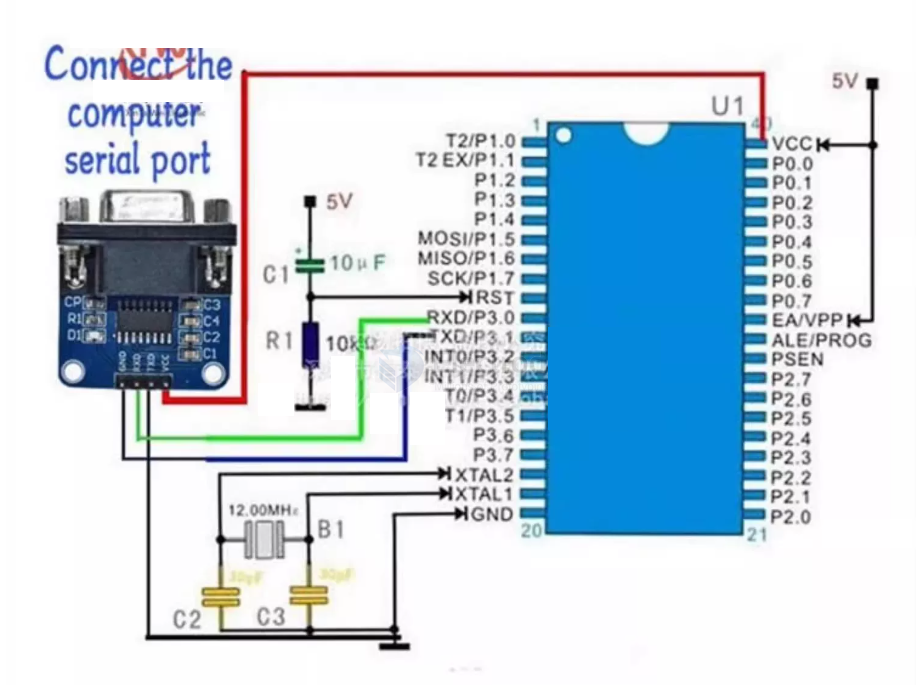

# STC-SDK-dat.md

- [[STC-SOP8-dat]] - [[STC-dat]]

- [[STC-SDK-dat]] - [[MDK-ARM-dat]] - [[Keil-C51-dat]] 

- [[programmer-dat]]

## SDK 

### STC ISP programming software 

-  (v6.96S) - https://www.stcmicro.com/rar/stc-isp6.96s.rar

download from https://www.stcmicro.com/rjxz.html

STC ISP programming software (v6.95U)

install keil header files 

## programming 

## repo 

- https://github.com/Edragon/MCU-STC

## ref 

