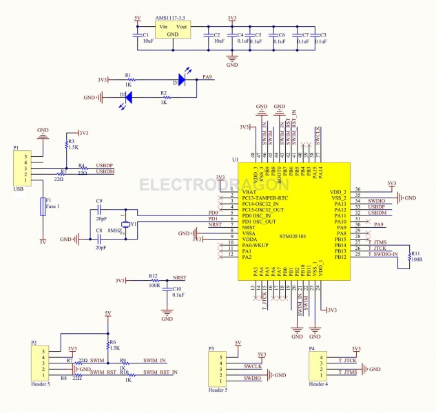
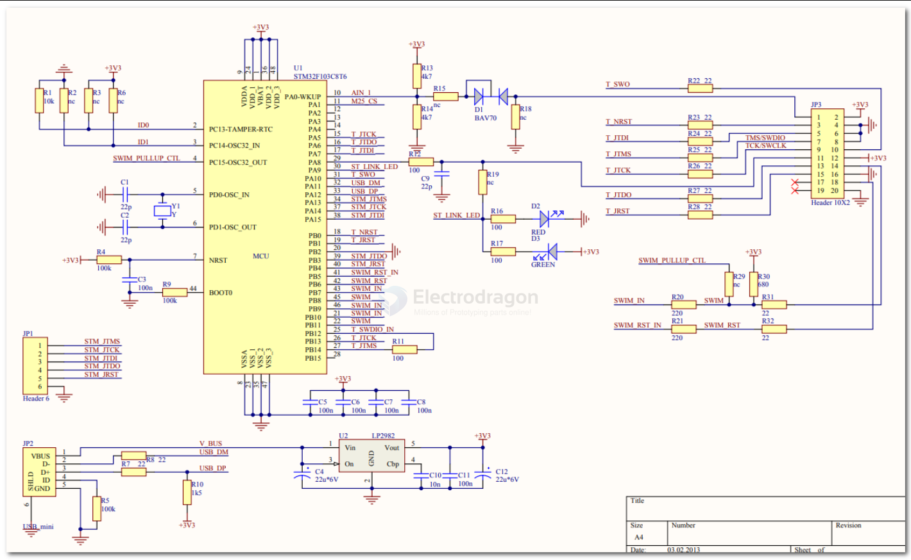
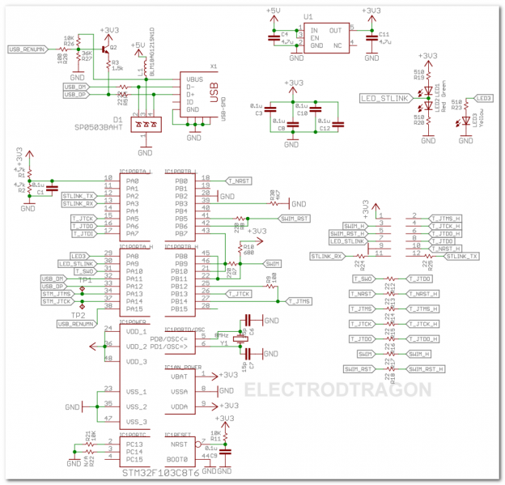
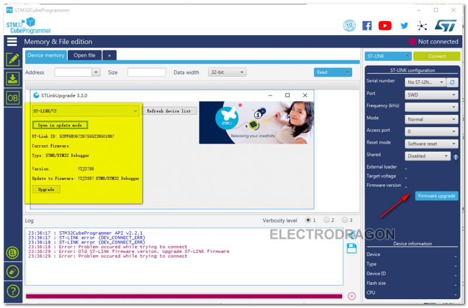
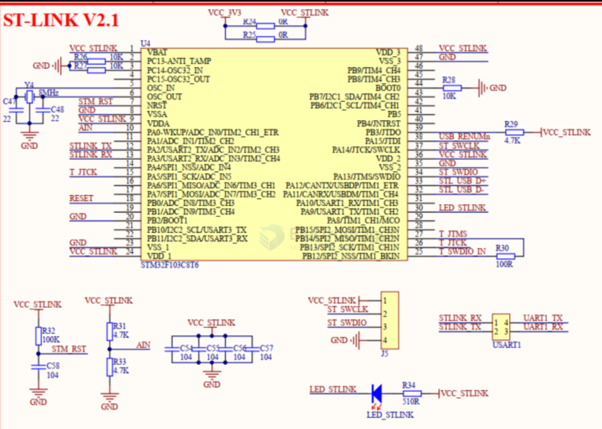
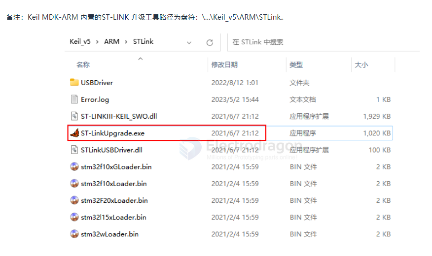

# ST-LINK-dat

[official version description link](https://www.st.com/content/ccc/resource/technical/document/technical_note/group0/30/c8/1d/0f/15/62/46/ef/DM00290229/files/DM00290229.pdf/jcr:content/translations/en.DM00290229.pdf)

general 

ST-Link/V2: Supports STM32 and STM8 debugging, does not have a virtual serial port. Most of those sold on Taobao are this version. I currently have several of this version of ST-Link on hand. This version will be used for programming later.

ST-LinkV2-1: Supports STM32 debugging, has a virtual serial port and virtual USB disk download. The ST-Link onboard the official Nucleo series evaluation boards from ST is this version.

### ST-link V2-1 

version based on capacity 

ST-link V2-1 出厂主控使用的是FLASH 容量为64K的STM32F103C8T6，但是ST-link V2-1最新的固件已经超过了64K，芯片容量不足。 因此本项目主控选择的是FLASH容量为128KB的STM32F103CBT6（商品编号：C8304），这是C8T6的大容量版本，可以直接PIN to PIN 替换。

STM32F103C8T6 == 64K
STM32F103CBT6 == 128KB

## Boards 

- [[DPR1004-dat]]

## Driver and Software 

Download

* direct - https://my.st.com/content/ccc/resource/technical/software/utility/51/c4/6a/b0/e2/0f/47/e5/stsw-link004.zip/files/stsw-link004.zip/_jcr_content/translations/en.stsw-link004.zip
* page - https://my.st.com/content/my_st_com/zh/products/development-tools/software-development-tools/stm32-software-development-tools/stm32-programmers/stsw-link004.license=1536118374709.html
* Compile code in Hex

## Schematic 

## Firmware management 

Firmware
* ST-LINK upgrade - [[St-link_upgrade.zip]]
* ST-LINK firmware - [[STLinkV2.J16.S4.hex.zip]]
* Reference from - https://www.amobbs.com/forum.php?mod=viewthread&tid=5518690&highlight=%E6%94%BB%E5%85%8B

## Upgrade firmware
* If error st-link is not DFU mode -> connect ST-link, do not operate anythings, click upgrade firwmare directly

## Projects

* STLink + UART - https://github.com/Edragon/stlink-uart

## HDK 

- [[USB-STM32-dat]] 

- [[LED-dat]] LED part 

Since ST-LINK/V2, all ST-LINK boards have a LED labeled "COM" (on the case or PCB).

Regardless of the connection type, this LED indicates the ST-LINK status:
- LED flashing red: Performing initial USB enumeration with the PC.
- LED solid red: Communication between PC and ST-LINK established (enumeration complete).
- LED alternately flashing green and red: Data is being exchanged between the target and the PC.
- LED solid green: Last communication was successful.
- LED solid orange: Communication with the target via ST-LINK failed.

In this project, following the design of the Pandora development board which integrates ST-LINK V2-1, a single red LED is used to replace the original red-green dual-color COM indicator. Therefore, this project also uses a single red LED for the COM indicator.

V2-1 core part 

## firmware 

Since the official source code for ST-Link is not open, and the firmware is not directly provided (read-protected), there are now (as of July 2020) several versions of the firmware circulating online.

Version 1: STLink V2.J16.S4 firmware: Standard V2 version, supports SWD and SWIM interfaces. This firmware version is attached.

Version 2: STLink V2.J28.M18 firmware: Used for ST-LINK/V2-1, ST-LINK/V2-A, and ST-LINK/V2-B boards (with STM32 debug interface, mass storage interface, and virtual COM port). This firmware version is attached.

## firwmare upgrade 

There are three methods to update the firmware:

### Download the official firmware upgrade application

[STSW-LINK007: Firmware upgrade for ST-LINK, ST-LINK/V2, ST-LINK/V2-1, and STLINK‑V3 boards](https://www.st.com/content/st_com/en/products/development-tools/software-development-tools/stm32-software-development-tools/stm32-programmers/stsw-link007.html)

[The official RN0093 release note (attached) provides detailed information about the versions of the released upgrade tool.](https://www.st.com/content/ccc/resource/technical/document/release_note/98/de/c7/1b/08/82/44/38/DM00107009.pdf/files/DM00107009.pdf/jcr:content/translations/en.DM00107009.pdf)

### Use the upgrade tool included with STM32CubeProg or STM32 ST-LINK Utility

### Use the built-in upgrade tool in Keil MDK-ARM

When the ST-Link version is lower than the version built into MDK, you will be prompted to upgrade.

The firmware upgrade version built into Keil MDK-ARM v5.31 is the same as that in STM32CubeProg V2.4.0, both are V2.J35.M26.

## Test and Debug

- Test programming function: Use Keil-MDK to download the program successfully, indicating programming works correctly.
- Test debug function: Use Keil-MDK for debugging, and if debugging works, the debug function is normal.
- Test USB disk drag-and-drop programming: Generate a bin file (see bin file generation method), drag the bin file into the ST-Link simulated USB disk, and if programming succeeds, the virtual USB disk function is normal.
- Test serial communication: Connect TX and RX of ST-LINK V2-1 with DuPont wires, open a serial assistant, send data, and if the received data matches, the serial communication is normal.

## ref 

- [[stm32-dat]] - [[STM32-SDK-dat]]

- [[USB-dat]]