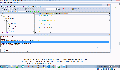

# STM32-SDK-HAL-dat

## Main 

### Vaiables 

    /* Private variables ---------------------------------------------------------*/
    ADC_HandleTypeDef hadc;

    I2C_HandleTypeDef hi2c1;
    I2C_HandleTypeDef hi2c2;

    SPI_HandleTypeDef hspi1;
    SPI_HandleTypeDef hspi2; 

    UART_HandleTypeDef huart1;
    UART_HandleTypeDef huart2;

### Prototype 

    /* Private function prototypes -----------------------------------------------*/
    void SystemClock_Config(void);
    static void MX_GPIO_Init(void);
    static void MX_ADC_Init(void);
    static void MX_I2C1_Init(void);
    static void MX_I2C2_Init(void);
    static void MX_SPI1_Init(void);
    static void MX_SPI2_Init(void);
    static void MX_USART1_UART_Init(void);
    static void MX_USART2_UART_Init(void);

### Main Init 
  MX_GPIO_Init();
  MX_ADC_Init();
  MX_I2C1_Init();
  MX_I2C2_Init();
  MX_SPI1_Init();
  MX_SPI2_Init();
  MX_USART1_UART_Init();
  MX_USART2_UART_Init();

### Clock RCC 

    void SystemClock_Config(void)
    {
    RCC_OscInitTypeDef RCC_OscInitStruct = {0};
    RCC_ClkInitTypeDef RCC_ClkInitStruct = {0};
    RCC_PeriphCLKInitTypeDef PeriphClkInit = {0};

    /** Initializes the CPU, AHB and APB busses clocks 
    */
    RCC_OscInitStruct.OscillatorType = RCC_OSCILLATORTYPE_HSI|RCC_OSCILLATORTYPE_HSI14;
    RCC_OscInitStruct.HSIState = RCC_HSI_ON;
    RCC_OscInitStruct.HSI14State = RCC_HSI14_ON;
    RCC_OscInitStruct.HSICalibrationValue = RCC_HSICALIBRATION_DEFAULT;
    RCC_OscInitStruct.HSI14CalibrationValue = 16;
    RCC_OscInitStruct.PLL.PLLState = RCC_PLL_NONE;
    if (HAL_RCC_OscConfig(&RCC_OscInitStruct) != HAL_OK)
    {
    Error_Handler();
    }
    /** Initializes the CPU, AHB and APB busses clocks 
    */
    RCC_ClkInitStruct.ClockType = RCC_CLOCKTYPE_HCLK|RCC_CLOCKTYPE_SYSCLK
                                |RCC_CLOCKTYPE_PCLK1;
    RCC_ClkInitStruct.SYSCLKSource = RCC_SYSCLKSOURCE_HSI;
    RCC_ClkInitStruct.AHBCLKDivider = RCC_SYSCLK_DIV1;
    RCC_ClkInitStruct.APB1CLKDivider = RCC_HCLK_DIV1;

    if (HAL_RCC_ClockConfig(&RCC_ClkInitStruct, FLASH_LATENCY_0) != HAL_OK)
    {
    Error_Handler();
    }
    PeriphClkInit.PeriphClockSelection = RCC_PERIPHCLK_USART1|RCC_PERIPHCLK_I2C1;
    PeriphClkInit.Usart1ClockSelection = RCC_USART1CLKSOURCE_PCLK1;
    PeriphClkInit.I2c1ClockSelection = RCC_I2C1CLKSOURCE_HSI;
    if (HAL_RCCEx_PeriphCLKConfig(&PeriphClkInit) != HAL_OK)
    {
    Error_Handler();
    }
    }

### ADC 

    static void MX_ADC_Init(void)
    {

    /* USER CODE BEGIN ADC_Init 0 */

    /* USER CODE END ADC_Init 0 */

    ADC_ChannelConfTypeDef sConfig = {0};

    /* USER CODE BEGIN ADC_Init 1 */

    /* USER CODE END ADC_Init 1 */
    /** Configure the global features of the ADC (Clock, Resolution, Data Alignment and number of conversion) 
    */
    hadc.Instance = ADC1;
    hadc.Init.ClockPrescaler = ADC_CLOCK_ASYNC_DIV1;
    hadc.Init.Resolution = ADC_RESOLUTION_12B;
    hadc.Init.DataAlign = ADC_DATAALIGN_RIGHT;
    hadc.Init.ScanConvMode = ADC_SCAN_DIRECTION_FORWARD;
    hadc.Init.EOCSelection = ADC_EOC_SINGLE_CONV;
    hadc.Init.LowPowerAutoWait = DISABLE;
    hadc.Init.LowPowerAutoPowerOff = DISABLE;
    hadc.Init.ContinuousConvMode = DISABLE;
    hadc.Init.DiscontinuousConvMode = DISABLE;
    hadc.Init.ExternalTrigConv = ADC_SOFTWARE_START;
    hadc.Init.ExternalTrigConvEdge = ADC_EXTERNALTRIGCONVEDGE_NONE;
    hadc.Init.DMAContinuousRequests = DISABLE;
    hadc.Init.Overrun = ADC_OVR_DATA_PRESERVED;
    if (HAL_ADC_Init(&hadc) != HAL_OK)
    {
    Error_Handler();
    }
    /** Configure for the selected ADC regular channel to be converted. 
    */
    sConfig.Channel = ADC_CHANNEL_8;
    sConfig.Rank = ADC_RANK_CHANNEL_NUMBER;
    sConfig.SamplingTime = ADC_SAMPLETIME_1CYCLE_5;
    if (HAL_ADC_ConfigChannel(&hadc, &sConfig) != HAL_OK)
    {
    Error_Handler();
    }
    /* USER CODE BEGIN ADC_Init 2 */

    /* USER CODE END ADC_Init 2 */

    }

### I2C 
 
    /**
    * @brief I2C1 Initialization Function
    * @param None
    * @retval None
    */
    static void MX_I2C1_Init(void)
    {

    /* USER CODE BEGIN I2C1_Init 0 */

    /* USER CODE END I2C1_Init 0 */

    /* USER CODE BEGIN I2C1_Init 1 */

    /* USER CODE END I2C1_Init 1 */
    hi2c1.Instance = I2C1;
    hi2c1.Init.Timing = 0x2000090E;
    hi2c1.Init.OwnAddress1 = 0;
    hi2c1.Init.AddressingMode = I2C_ADDRESSINGMODE_7BIT;
    hi2c1.Init.DualAddressMode = I2C_DUALADDRESS_DISABLE;
    hi2c1.Init.OwnAddress2 = 0;
    hi2c1.Init.OwnAddress2Masks = I2C_OA2_NOMASK;
    hi2c1.Init.GeneralCallMode = I2C_GENERALCALL_DISABLE;
    hi2c1.Init.NoStretchMode = I2C_NOSTRETCH_DISABLE;
    if (HAL_I2C_Init(&hi2c1) != HAL_OK)
    {
    Error_Handler();
    }
    /** Configure Analogue filter 
    */
    if (HAL_I2CEx_ConfigAnalogFilter(&hi2c1, I2C_ANALOGFILTER_ENABLE) != HAL_OK)
    {
    Error_Handler();
    }
    /** Configure Digital filter 
    */
    if (HAL_I2CEx_ConfigDigitalFilter(&hi2c1, 0) != HAL_OK)
    {
    Error_Handler();
    }
    /* USER CODE BEGIN I2C1_Init 2 */

    /* USER CODE END I2C1_Init 2 */

    }

    /**
    * @brief I2C2 Initialization Function
    * @param None
    * @retval None
    */
    static void MX_I2C2_Init(void)
    {

    /* USER CODE BEGIN I2C2_Init 0 */

    /* USER CODE END I2C2_Init 0 */

    /* USER CODE BEGIN I2C2_Init 1 */

    /* USER CODE END I2C2_Init 1 */
    hi2c2.Instance = I2C2;
    hi2c2.Init.Timing = 0x2000090E;
    hi2c2.Init.OwnAddress1 = 0;
    hi2c2.Init.AddressingMode = I2C_ADDRESSINGMODE_7BIT;
    hi2c2.Init.DualAddressMode = I2C_DUALADDRESS_DISABLE;
    hi2c2.Init.OwnAddress2 = 0;
    hi2c2.Init.OwnAddress2Masks = I2C_OA2_NOMASK;
    hi2c2.Init.GeneralCallMode = I2C_GENERALCALL_DISABLE;
    hi2c2.Init.NoStretchMode = I2C_NOSTRETCH_DISABLE;
    if (HAL_I2C_Init(&hi2c2) != HAL_OK)
    {
    Error_Handler();
    }
    /** Configure Analogue filter 
    */
    if (HAL_I2CEx_ConfigAnalogFilter(&hi2c2, I2C_ANALOGFILTER_ENABLE) != HAL_OK)
    {
    Error_Handler();
    }
    /** Configure Digital filter 
    */
    if (HAL_I2CEx_ConfigDigitalFilter(&hi2c2, 0) != HAL_OK)
    {
    Error_Handler();
    }
    /* USER CODE BEGIN I2C2_Init 2 */

    /* USER CODE END I2C2_Init 2 */

    }

### SPI 

    /**
    * @brief SPI1 Initialization Function
    * @param None
    * @retval None
    */
    static void MX_SPI1_Init(void)
    {

    /* USER CODE BEGIN SPI1_Init 0 */

    /* USER CODE END SPI1_Init 0 */

    /* USER CODE BEGIN SPI1_Init 1 */

    /* USER CODE END SPI1_Init 1 */
    /* SPI1 parameter configuration*/
    hspi1.Instance = SPI1;
    hspi1.Init.Mode = SPI_MODE_MASTER;
    hspi1.Init.Direction = SPI_DIRECTION_2LINES;
    hspi1.Init.DataSize = SPI_DATASIZE_4BIT;
    hspi1.Init.CLKPolarity = SPI_POLARITY_LOW;
    hspi1.Init.CLKPhase = SPI_PHASE_1EDGE;
    hspi1.Init.NSS = SPI_NSS_HARD_OUTPUT;
    hspi1.Init.BaudRatePrescaler = SPI_BAUDRATEPRESCALER_2;
    hspi1.Init.FirstBit = SPI_FIRSTBIT_MSB;
    hspi1.Init.TIMode = SPI_TIMODE_DISABLE;
    hspi1.Init.CRCCalculation = SPI_CRCCALCULATION_DISABLE;
    hspi1.Init.CRCPolynomial = 7;
    hspi1.Init.CRCLength = SPI_CRC_LENGTH_DATASIZE;
    hspi1.Init.NSSPMode = SPI_NSS_PULSE_ENABLE;
    if (HAL_SPI_Init(&hspi1) != HAL_OK)
    {
    Error_Handler();
    }
    /* USER CODE BEGIN SPI1_Init 2 */

    /* USER CODE END SPI1_Init 2 */

    }

    /**
    * @brief SPI2 Initialization Function
    * @param None
    * @retval None
    */
    static void MX_SPI2_Init(void)
    {

    /* USER CODE BEGIN SPI2_Init 0 */

    /* USER CODE END SPI2_Init 0 */

    /* USER CODE BEGIN SPI2_Init 1 */

    /* USER CODE END SPI2_Init 1 */
    /* SPI2 parameter configuration*/
    hspi2.Instance = SPI2;
    hspi2.Init.Mode = SPI_MODE_SLAVE;
    hspi2.Init.Direction = SPI_DIRECTION_2LINES;
    hspi2.Init.DataSize = SPI_DATASIZE_4BIT;
    hspi2.Init.CLKPolarity = SPI_POLARITY_LOW;
    hspi2.Init.CLKPhase = SPI_PHASE_1EDGE;
    hspi2.Init.NSS = SPI_NSS_HARD_INPUT;
    hspi2.Init.FirstBit = SPI_FIRSTBIT_MSB;
    hspi2.Init.TIMode = SPI_TIMODE_DISABLE;
    hspi2.Init.CRCCalculation = SPI_CRCCALCULATION_DISABLE;
    hspi2.Init.CRCPolynomial = 7;
    hspi2.Init.CRCLength = SPI_CRC_LENGTH_DATASIZE;
    hspi2.Init.NSSPMode = SPI_NSS_PULSE_DISABLE;
    if (HAL_SPI_Init(&hspi2) != HAL_OK)
    {
    Error_Handler();
    }
    /* USER CODE BEGIN SPI2_Init 2 */

    /* USER CODE END SPI2_Init 2 */

    }

### USART 

    /**
    * @brief USART1 Initialization Function
    * @param None
    * @retval None
    */
    static void MX_USART1_UART_Init(void)
    {

    /* USER CODE BEGIN USART1_Init 0 */

    /* USER CODE END USART1_Init 0 */

    /* USER CODE BEGIN USART1_Init 1 */

    /* USER CODE END USART1_Init 1 */
    huart1.Instance = USART1;
    huart1.Init.BaudRate = 9600;
    huart1.Init.WordLength = UART_WORDLENGTH_8B;
    huart1.Init.StopBits = UART_STOPBITS_1;
    huart1.Init.Parity = UART_PARITY_NONE;
    huart1.Init.Mode = UART_MODE_TX_RX;
    huart1.Init.HwFlowCtl = UART_HWCONTROL_NONE;
    huart1.Init.OverSampling = UART_OVERSAMPLING_16;
    huart1.Init.OneBitSampling = UART_ONE_BIT_SAMPLE_DISABLE;
    huart1.AdvancedInit.AdvFeatureInit = UART_ADVFEATURE_NO_INIT;
    if (HAL_UART_Init(&huart1) != HAL_OK)
    {
    Error_Handler();
    }
    /* USER CODE BEGIN USART1_Init 2 */

    /* USER CODE END USART1_Init 2 */

    }

    /**
    * @brief USART2 Initialization Function
    * @param None
    * @retval None
    */
    static void MX_USART2_UART_Init(void)
    {

    /* USER CODE BEGIN USART2_Init 0 */

    /* USER CODE END USART2_Init 0 */

    /* USER CODE BEGIN USART2_Init 1 */

    /* USER CODE END USART2_Init 1 */
    huart2.Instance = USART2;
    huart2.Init.BaudRate = 115200;
    huart2.Init.WordLength = UART_WORDLENGTH_8B;
    huart2.Init.StopBits = UART_STOPBITS_1;
    huart2.Init.Parity = UART_PARITY_NONE;
    huart2.Init.Mode = UART_MODE_TX_RX;
    huart2.Init.HwFlowCtl = UART_HWCONTROL_NONE;
    huart2.Init.OverSampling = UART_OVERSAMPLING_16;
    huart2.Init.OneBitSampling = UART_ONE_BIT_SAMPLE_DISABLE;
    huart2.AdvancedInit.AdvFeatureInit = UART_ADVFEATURE_NO_INIT;
    if (HAL_UART_Init(&huart2) != HAL_OK)
    {
    Error_Handler();
    }
    /* USER CODE BEGIN USART2_Init 2 */

    /* USER CODE END USART2_Init 2 */

    } 

### GPIO 

    /**
    * @brief GPIO Initialization Function
    * @param None
    * @retval None
    */
    static void MX_GPIO_Init(void)
    {
    GPIO_InitTypeDef GPIO_InitStruct = {0};

    /* GPIO Ports Clock Enable */
    __HAL_RCC_GPIOA_CLK_ENABLE();
    __HAL_RCC_GPIOB_CLK_ENABLE();

    /*Configure GPIO pin Output Level */
    HAL_GPIO_WritePin(GPIOB, GPIO_PIN_1, GPIO_PIN_RESET);

    /*Configure GPIO pin : PB1 */
    GPIO_InitStruct.Pin = GPIO_PIN_1;
    GPIO_InitStruct.Mode = GPIO_MODE_OUTPUT_PP;
    GPIO_InitStruct.Pull = GPIO_NOPULL;
    GPIO_InitStruct.Speed = GPIO_SPEED_FREQ_LOW;
    HAL_GPIO_Init(GPIOB, &GPIO_InitStruct);

    /*Configure GPIO pin : PB2 */
    GPIO_InitStruct.Pin = GPIO_PIN_2;
    GPIO_InitStruct.Mode = GPIO_MODE_INPUT;
    GPIO_InitStruct.Pull = GPIO_NOPULL;
    HAL_GPIO_Init(GPIOB, &GPIO_InitStruct);

    /*Configure GPIO pin : PA8 */
    GPIO_InitStruct.Pin = GPIO_PIN_8;
    GPIO_InitStruct.Mode = GPIO_MODE_AF_PP;
    GPIO_InitStruct.Pull = GPIO_NOPULL;
    GPIO_InitStruct.Speed = GPIO_SPEED_FREQ_LOW;
    GPIO_InitStruct.Alternate = GPIO_AF2_TIM1;
    HAL_GPIO_Init(GPIOA, &GPIO_InitStruct);

    }

## stm32f0xx_hal_msp.c 

void HAL_I2C_MspInit 

    void HAL_I2C_MspInit(I2C_HandleTypeDef* hi2c)
    {
    GPIO_InitTypeDef GPIO_InitStruct = {0};
    if(hi2c->Instance==I2C1)
    {
    /* USER CODE BEGIN I2C1_MspInit 0 */

    /* USER CODE END I2C1_MspInit 0 */

    __HAL_RCC_GPIOB_CLK_ENABLE();
    /**I2C1 GPIO Configuration    
    PB7     ------> I2C1_SDA
    PB8     ------> I2C1_SCL 
    */
    GPIO_InitStruct.Pin = GPIO_PIN_7|GPIO_PIN_8;
    GPIO_InitStruct.Mode = GPIO_MODE_AF_OD;
    GPIO_InitStruct.Pull = GPIO_PULLUP;
    GPIO_InitStruct.Speed = GPIO_SPEED_FREQ_HIGH;
    GPIO_InitStruct.Alternate = GPIO_AF1_I2C1;
    HAL_GPIO_Init(GPIOB, &GPIO_InitStruct);

    /* Peripheral clock enable */
    __HAL_RCC_I2C1_CLK_ENABLE();
    /* USER CODE BEGIN I2C1_MspInit 1 */

    /* USER CODE END I2C1_MspInit 1 */
    }
    else if(hi2c->Instance==I2C2)
    {
    /* USER CODE BEGIN I2C2_MspInit 0 */

    /* USER CODE END I2C2_MspInit 0 */

    __HAL_RCC_GPIOB_CLK_ENABLE();
    /**I2C2 GPIO Configuration    
    PB10     ------> I2C2_SCL
    PB11     ------> I2C2_SDA 
    */
    GPIO_InitStruct.Pin = GPIO_PIN_10|GPIO_PIN_11;
    GPIO_InitStruct.Mode = GPIO_MODE_AF_OD;
    GPIO_InitStruct.Pull = GPIO_PULLUP;
    GPIO_InitStruct.Speed = GPIO_SPEED_FREQ_HIGH;
    GPIO_InitStruct.Alternate = GPIO_AF1_I2C2;
    HAL_GPIO_Init(GPIOB, &GPIO_InitStruct);

    /* Peripheral clock enable */
    __HAL_RCC_I2C2_CLK_ENABLE();
    /* USER CODE BEGIN I2C2_MspInit 1 */

    /* USER CODE END I2C2_MspInit 1 */
    }

    }

## USART 

### Setup 

* Global interrupt
* DMA on TX / channel 4 / priority high

### Use DMA 

    HAL_StatusTypeDef HAL_UART_Transmit_DMA(UART_HandleTypeDef *huart, uint8_t *pData, uint16_t Size)

## IIC 

HAL_StatusTypeDef HAL_I2C_Mem_Write(I2C_HandleTypeDef *hi2c, uint16_t DevAddress, uint16_t MemAddress, uint16_t MemAddSize, uint8_t *pData, uint16_t Size, uint32_t Timeout)

HAL_I2C_Mem_Write(&hi2c1,0xA0,100,I2C_MEMADD_SIZE_16BIT,i2cWriteBuf,10,10)

## MDK-ARM Setup by STM32CubeMx 

* Install MDK-ARM lastest version
* Install software pack for platform, for example STM32F030xxx
* Install STM32Cube
* Follow the following animation, open to watch

[[Stm32_quick_build_for_blink.gif]] 
Quick blink IO 

[[Upload_code_STM32.gif]]
Upload code to board use MDK-ARM or ST-Utility

Code add this two lines for blinking IO in user code 1 area:
    HAL_GPIO_TogglePin(LED_GPIO_Port,LED_Pin);               
    HAL_Delay(1000);

    HAL_GPIO_TogglePin(GPIOC, GPIO_PIN_13);
    HAL_Delay(1000);

### Note

* Default frequency is 8Mhz
* Choose to output hex compilied file.
* In STM32Cube, only copy necessary files, otherwise will be very big project folder

[[category: STM32 SDK]]
