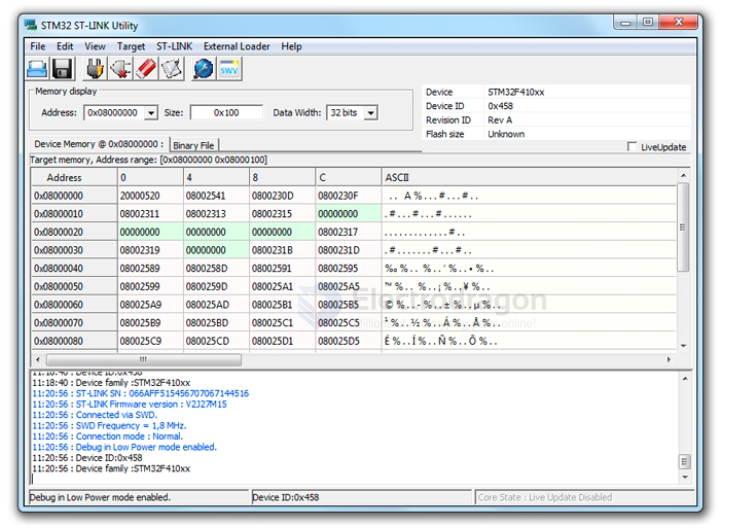

# STM32-SDK-dat.md

- [[STM32-CubeMX-dat]] - [[STM32-CubeIDE-dat]]

- [[STM32-HDK-dat]]

- [[STM32-SDK-hal-dat]]

- [[STM32flash-dat]] == Since release 1.6.0 of the STM32 core, STM32CubeProgrammer is used to flash and replaced this tool. == https://github.com/stm32duino/stm32flash

- STM32 Flash loader demonstrator (UM0462) (replaced by STM32CubeProgrammer)

## programmer 

- [[STM32-Cube-programmer-dat]]

STM32 ST-LINK Utility的功能比STM32CubeProg要稍微简单一些，其主要功能也是编程（下载）。

## IDE 

- [[keil-dat]] - [[MDK-ARM-dat]]

- [[IAR-dat]] - [[STM32cubeide-dat]] - [[GCC-dat]]

## ref 

- [[STM32-dat]] - [[Info/info]]