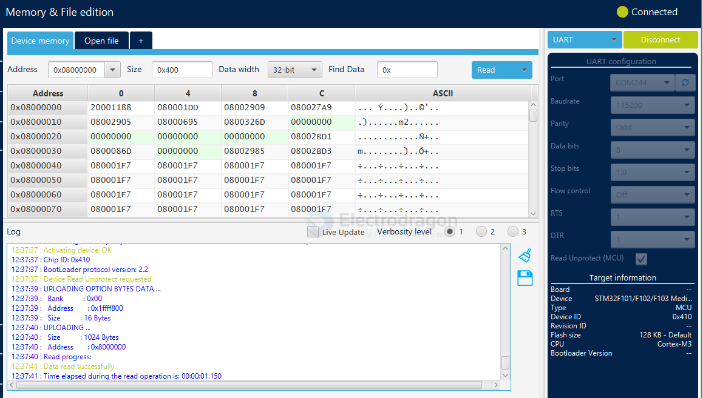

# stm32-cube-programmer-dat

## Programmer 
* X64 2.6 - https://my.st.com/content/ccc/resource/technical/software/utility/group0/d5/9b/ea/a8/cd/2d/4e/3c/stm32cubeprg-win64_v2-6-0/files/stm32cubeprg-win64_v2-6-0.zip/jcr:content/translations/en.stm32cubeprg-win64_v2-6-0.zip
- STM32cubeprog 2.2.1 - https://my.st.com/content/ccc/resource/technical/software/utility/group0/e1/74/6e/13/97/d4/48/98/stm32cubeprog/files/stm32cubeprog.zip/jcr:content/translations/en.stm32cubeprog.zip 

* Require https://w.electrodragon.com/w/Java - [[JAVA-dat]]
* Support [[DFU-dat]]

## error log 

Error: Activating device: KO. Please, verify the boot mode configuration and check the serial port configuration.

Reset your device then try again.

## Connect to Chip 

## UART Connecting 

### UART configuration

based on the APP [[lora-HDK-dat]]

flash USB LORA 

| config               | value  |
| -------------------- | ------ |
| PortCOM              | 244    |
| Baudrate             | 115200 |
| Parily               | Odd    |  
| Data bits            | 8      |
| Stop bits            | 1.0    |
| Flow control         | off    |
| RTS                  | 1      |
| DTR                  | 1      |
| Read Unprotect (MCU) | check  |

    12:38:58 : RTS High
    12:38:58 : DTR High
    12:38:58 : Serial Port COM244 is successfully opened.
    12:38:58 : Port configuration: parity = odd, baudrate = 115200, data-bit = 8,                     stop-bit = 1.0, flow-control = off
    12:39:00 : Timeout error occured while waiting for acknowledgement.
    12:39:00 : Activating device: OK
    12:39:00 : Chip ID: 0x410 
    12:39:00 : BootLoader protocol version: 2.2
    12:39:00 : Device Read Unprotect requested
    12:39:02 : UPLOADING OPTION BYTES DATA ...
    12:39:02 :   Bank          : 0x00
    12:39:02 :   Address       : 0x1ffff800
    12:39:02 :   Size          : 16 Bytes
    12:39:03 : UPLOADING ...
    12:39:03 :   Size          : 1024 Bytes
    12:39:03 :   Address       : 0x8000000
    12:39:03 : Read progress:
    12:39:04 : Data read successfully
    12:39:04 : Time elapsed during the read operation is: 00:00:01.150

## apps 

- [[lora-hdk-dat]]

## ref

- [[stm32-cube-programmer]]