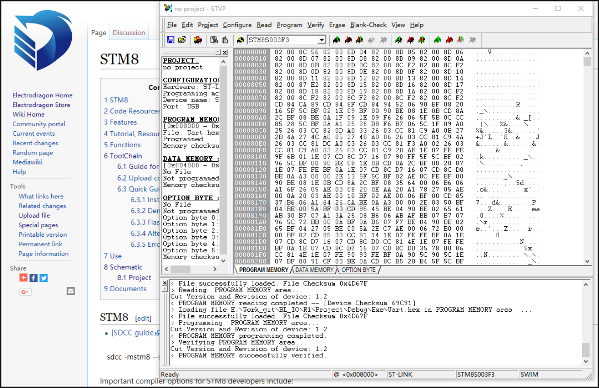

# STM8-SDK-dat

https://w.electrodragon.com/w/STM8_Program

## Program

### Upload code 

* Install ST toolset, which include ST visual programmer
* Connect your ST-LINK, SWIM, RST, VCC better 3.3V, GND.
* select and open hex file, select menu program -> current tap and done.

### Use 
* programming via SWIM port, ST link programmer can be found on our store
* When power up, LED should flashing, this is programmed for testing purpose

## ToolChain 

### Guide for IAR STM8 

* Download standard stm8 library via google search, on st website.
* Install st toolset (STVD + programmer ). Current version we provided is [http://dl.electrodragon.com/k/index.php?share/folder&user=1&sid=JMyabvNR sttoolset_pack29] (pass electrodragon0428)
* Alternative install ST-link driver

