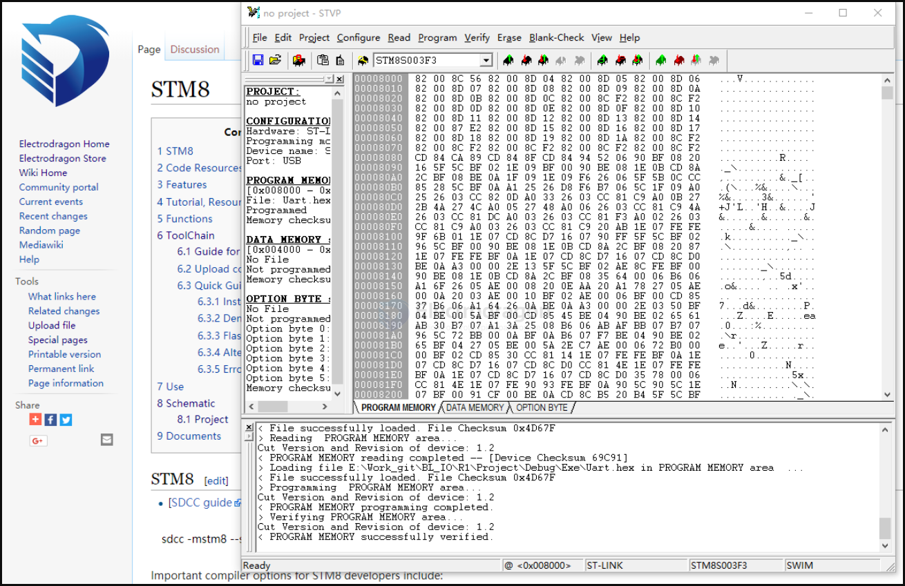

# STM8-SDK-dat

- [[STM8-SDK-dat]] - [[STM32-SDK-dat]]

- [[SWIM-dat]] - 18 PD1 (HS)/`SWIM` - [[SDK-dat]] - [[ST-dat]] - [[STM8-SDK-dat]]

[legacy wiki page](https://w.electrodragon.com/w/STM8_Program)

- [[STM32-cube-programmer-dat]]

## Program

[ST Visual Programmer STM32 (replaced by STM32CubeProgrammer)](https://www.st.com/en/development-tools/stvp-stm32.html)

### Upload code via SWIM 

* Install `ST toolset`, which include `ST visual programmer`
* Connect your ST-LINK, `SWIM`, `RST`, `VCC` better 3.3V, `GND`.
* select and open hex file, select menu program -> current tap and done.

### Use 
* programming via SWIM port, ST link programmer can be found on our store
* When power up, LED should flashing, this is programmed for testing purpose

## ToolChain 

- [[SDCC-dat]] - [[IAR-dat]] - [[MDK-ARM-dat]] - [[SDK-dat]]

- better == [[MDK-ARM-dat]]

Guide for IAR STM8 

* Download standard stm8 library via google search, on st website.
* Install st toolset (STVD + programmer ). Current version we provided is [http://dl.electrodragon.com/k/index.php?share/folder&user=1&sid=JMyabvNR sttoolset_pack29] (pass electrodragon0428)
* Alternative install ST-link driver

## repo 

https://github.com/btc520/STM8-APP

https://github.com/Edragon/stm8

https://github.com/Edragon/STM8_SDK

https://github.com/Edragon/STM8_DOCS

https://github.com/Edragon/STM8-Tools

https://github.com/Edragon/STM8_IAR

https://github.com/Edragon/STM8_STVD

STM8L152

https://github.com/Edragon/STM8L152

https://github.com/Edragon/stm8l152_stvd

https://github.com/Edragon/STM8L_151

## ref 

