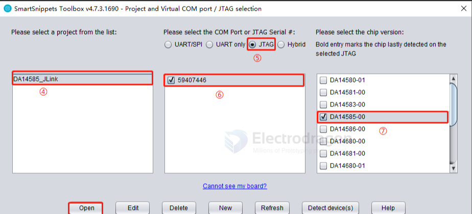
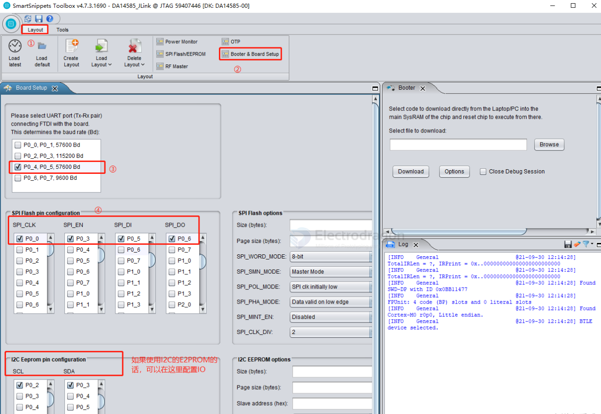
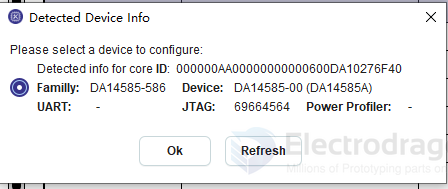
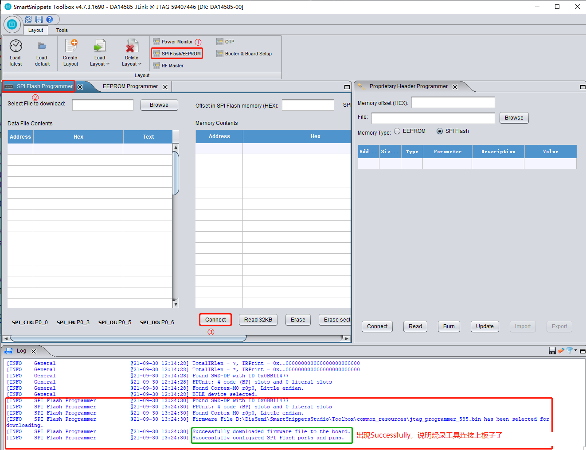
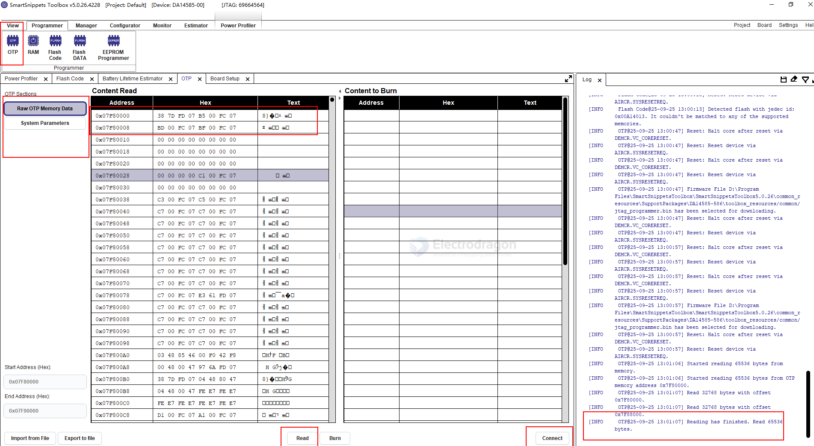
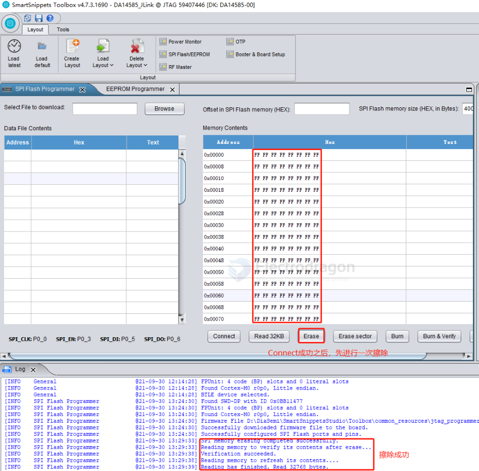
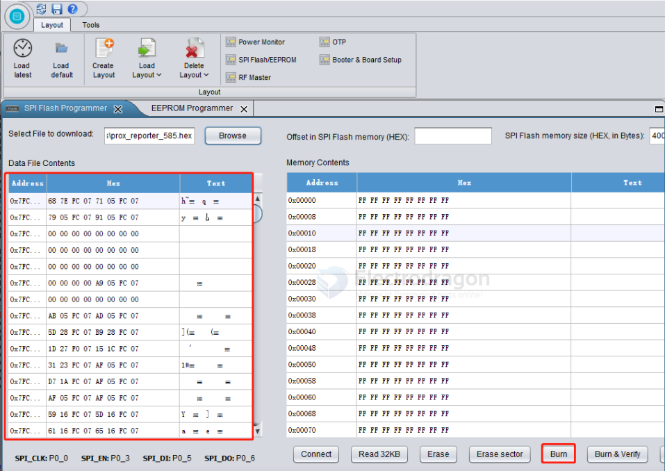
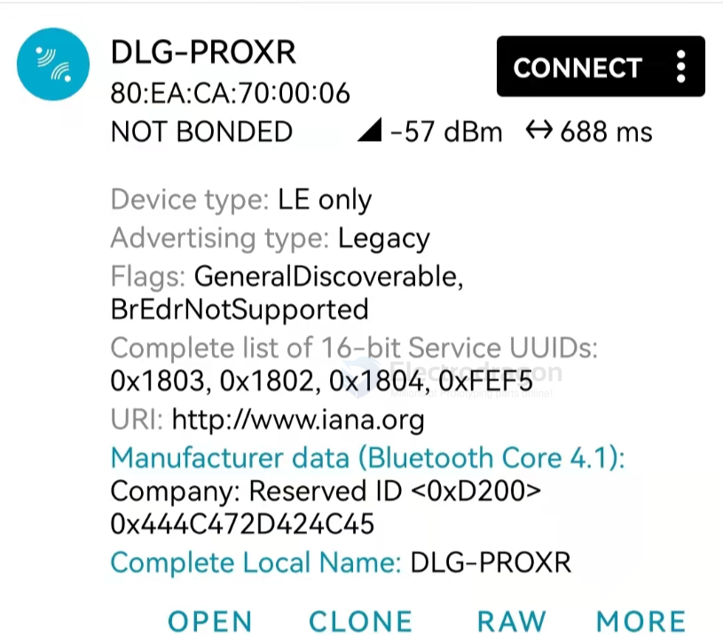

# SmartSnippets-Toolbox-dat

## install 

- [] Dialog SmartSnippets Studio v2.0.20

- [x] [SmartSnippets Toolbox V5.0.26 for Windows OS](https://www.renesas.com/en/document/sws/smartsnippets-toolbox-v5026-windows-os?r=1618132)

specific the jlink location == [[jlink-dat]]

- [[java-dat]]

- [[DA14585-dat]]

## usage 

4. Click "Open" to enter the configuration interface. Select the "Board Setup" menu, and configure the serial port and SPI FLASH pins in the programming tool according to the schematic (if using I2C EEPROM, select the I2C pins).

### Board Setup

Click "Board Setup" and configure according to the steps below.

### flash setup

Click "SPI Flash/EEPROM" and configure according to the steps below.

[INFO     Flash Code@25-09-25 13:00:13] Detected flash with jedec id: 0x00A14013. It couldn't be matched to any of the supported memories.

### 1. Flash Code

- **Purpose:** Holds the *firmware / executable program* that the CPU runs.
- **Contents:** Compiled application code (`.hex` or `.bin`).
- **Execution:** The system boots from this section (after the BootROM loader copies or maps it).
- **Tools:** When you choose *Flash Code* in SmartSnippets, you are programming your application image into the code region of external SPI/Quad-SPI flash.

### 2. Flash Data

- **Purpose:** Holds *non-volatile data* used by the application, but not executed as code.
- **Contents:** Could be calibration values, device configuration, BLE bonding info, keys, or custom application data.
- **Execution:** The CPU never executes directly from here—it just reads/writes as storage.
- **Tools:** *Flash Data* option is used to program or update only the data section without disturbing the main firmware.

---

### Key Differences

| Feature         | Flash Code | Flash Data |
|-----------------|------------|------------|
| Role            | Executable firmware | Persistent storage |
| Boot usage      | Yes, system boots from here | No, only accessed at runtime |
| File types      | Typically `.hex` or `.bin` firmware image | Often raw data or structured binary blobs |
| Erase/Write     | Usually full image updates | Can be smaller chunks / user-managed |
| Risk if wrong   | Device won’t boot if corrupted | App may misbehave but still boots |

### flash and read OTP 

### flash steps 

7. After the board connects successfully, click "Erase" to erase the Flash once.

在擦除时要确保读回来的数据全为FF.

Next, import the hex firmware to be programmed. Click "Browse", then select the path of the firmware to be programmed, select it, and click "Open".

After programming is complete, power cycle the development board. Open the nRF Connect APP to scan for the device, and you should be able to find it.

## log of flash 

    [INFO     Flash Code@25-09-25 13:07:09] Reading has finished. Read 23852 bytes.
    [INFO     Flash Code@25-09-25 13:07:11] Check if memory empty...
    [INFO     Flash Code@25-09-25 13:07:12] Read 16384 bytes from offset 0x00
    [INFO     Flash Code@25-09-25 13:07:12] Read 7468 bytes from offset 0x4000
    [INFO     Flash Code@25-09-25 13:07:12] Memory empty. Procceed with burn.
    [INFO     Flash Code@25-09-25 13:07:12] Started burning memory with 23852 bytes of data at address 0x00.
    [INFO     Flash Code@25-09-25 13:07:13] Burned chunk with size 16384 bytes at offset 0x00
    [INFO     Flash Code@25-09-25 13:07:13] Memory burning completed successfully.
    [INFO     Flash Code@25-09-25 13:07:13] Reading memory to refresh table contents....
    [INFO     Flash Code@25-09-25 13:07:13] Read 16384 bytes from offset 0x00
    [INFO     Flash Code@25-09-25 13:07:14] Read 7468 bytes from offset 0x4000
    [INFO     Flash Code@25-09-25 13:07:14] Reading has finished. Read 23852 bytes.
    [INFO     Flash Code@25-09-25 13:07:14] Sent reset command. If application won't start replug the board.

## ref 

- [[renesas-dat]]

- [[SDK-dat]]