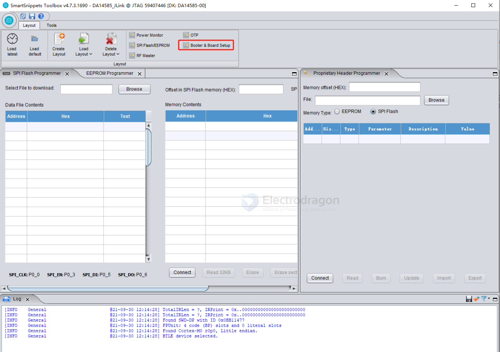

# SmartSnippets-Toolbox-dat

4. Click "Open" to enter the configuration interface. Select the "Board Setup" menu, and configure the serial port and SPI FLASH pins in the programming tool according to the schematic (if using I2C EEPROM, select the I2C pins).

Click "Board Setup" and configure according to the steps below.

Click "SPI Flash/EEPROM" and configure according to the steps below.

7. After the board connects successfully, click "Erase" to erase the Flash once.

Next, import the hex firmware to be programmed. Click "Browse", then select the path of the firmware to be programmed, select it, and click "Open".

After programming is complete, power cycle the development board. Open the nRF Connect APP to scan for the device, and you should be able to find it.

## ref 

- [[renesas-dat]]

- [[SDK-dat]]