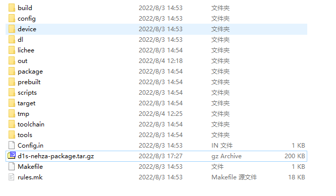

# TINA-dat

https://d1s.docs.aw-ol.com/study/study_1tina/

- [[virtualbox-dat]] - [[repo-dat]] - [[ubuntu-dat]]

虚拟机下载地址如下（较大 有1.6G）：
[可编译Tina的Oraclr VM VirtualBox Ubuntu14.04虚拟机](http://netstorage.allwinnertech.com:5000/sharing/ugXcWLYz5) == pass == 123456

    apt-get install gcc binutils bzip2 flex python perl make ia32-libs find grep diff unzip gawk getopt subversion libz-dev libc headers

    sudo apt-get install build-essential subversion git-core libncurses5-dev zlib1g-dev gawk flex quilt libssl-dev xsltproc libxml-parser-perl mercurial bzr ecj cvs unzip lib32z1 lib32z1-dev lib32stdc++6 libstdc++6 -y

## TINA D1-H

    $ mkdir tina-d1-h
    $ cd tina-d1-h

使用 repo init 命令初始化仓库，tina-d1-h 的仓库地址是 https://sdk.aw-ol.com/git_repo/D1_Tina_Open/manifest.git 需要执行命令：

    $ repo init -u https://sdk.aw-ol.com/git_repo/D1_Tina_Open/manifest.git -b master -m tina-d1-h.xml

如果提示 Username for 'https://sdk.aw-ol.com': 请输入 全志在线开发者论坛 的用户名和密码。（注：需要全志在线开发者论坛LV2等级以上用户才有权限拉取 SDK）

    root@ubuntu14:/home/vb/tina-d1-h# repo init -u https://sdk.aw-ol.com/git_repo/D1_Tina_Open/manifest.git -b master -m tina-d1-h.xml
    Get https://sdk.aw-ol.com/git_repo/D1_Tina_Open/manifest.git
    % Total    % Received % Xferd  Average Speed   Time    Time     Time  Current
                                    Dload  Upload   Total   Spent    Left  Speed
    0     0    0     0    0     0      0      0 --:--:-- --:--:-- --:--:--     0
    curl: (22) The requested URL returned error: 401 Unauthorized
    Server does not provide clone.bundle; ignoring.
    Username for 'https://sdk.aw-ol.com': 

## note 

V1.0 版本硬件安装 D1s Nezha 补丁包

下载下来的 SDK 默认是不支持 D1s Nezha v1.0 开发板的，需要额外安装补丁包以支持 D1s Nezha v1.0 开发板。

## ADB login 

- [[adb-dat]]

    C:\System> adb shell
    * daemon not running. starting it now on port 5037 *
    * daemon started successfully *

    _____  _              __     _
    |_   _||_| ___  _ _   |  |   |_| ___  _ _  _ _
    | |   _ |   ||   |  |  |__ | ||   || | ||_'_|
    | |  | || | || _ |  |_____||_||_|_||___||_,_|
    |_|  |_||_|_||_|_|  Tina is Based on OpenWrt!
    ----------------------------------------------
    Tina Linux
    ----------------------------------------------
    root@TinaLinux:/#

## ref 

- [[allwinner-dat]]

- [[SDK]] - [[TINA]]