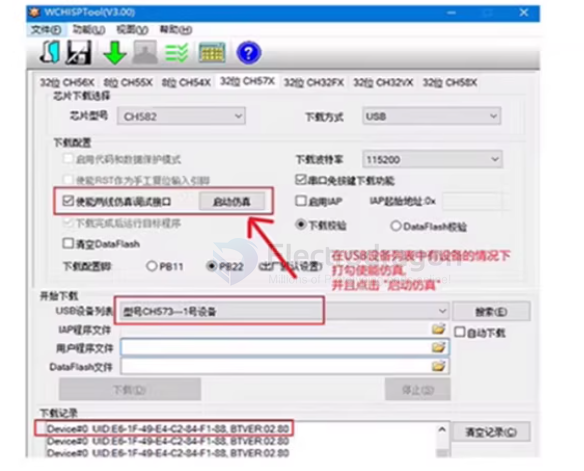
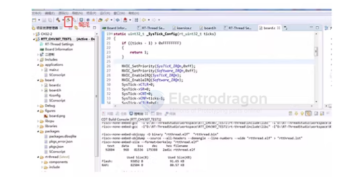

# WCH-sdk-dat 

- [[WCH-PROG-dat]] 

- [[WCHlink-dat]]

- [[SWIO-dat]] 

- [[MounRiver-dat]] - [[SDCC-dat]]

## chips 

- [[CH32V003-dat]]

- [[WCH-MCU-dat]]

## CH582 

调试和下载建议：

调试时建议使用WCH-LINK进行程序调试（例如进行单步调试，断点调试），使用调试功能前需要使用ISP软件解除调试禁止。批量下载加密时建议使用USB线配合官方软件进行下载。
当使用USB线下载时需要进行如下步骤：核心板不上电，按住BOOT按键不放；重新给核心板上电，RST按键不起作用；上电后再松开BOOT按键;
ISP软件便识别到MCU，进行相应的操作；重新上电执行新下载程序。

调试器：

同样是由于MCU内核为RISC-V，就不能再使用ARM单片机的调试器了，好在有更加廉价和便捷的专用调试器WCH-LINK，该调试器可以切换模式既可以给ARM单片机作为DAP-CMSIS调试器进行调试，又可以切换另一种模式到给CH32V系列单片机调试。该调试器可以在MOUNRIVER中进行单步、断点调试。

## ref 

- [[WCH-dat]]